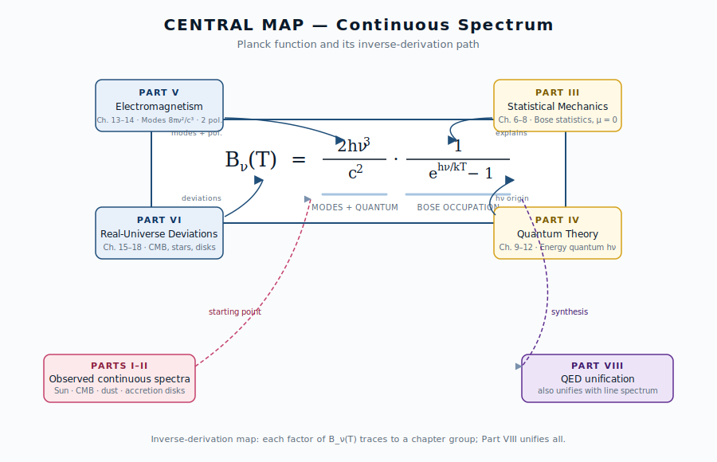

::: {.chapter-overview}
**この章の主題**：宇宙のさまざまな場所に現れる黒体放射の実例を概観する。出発点は理論ではなく、観測されるスペクトルそのものである。本書全体を貫く三原則のうち、本章は「① 逆引き」の入口に当たる。
:::

## この章の中心地図 {#sec-where-blackbody-map .unnumbered}

{#fig-planck-map width=90%}



## この章で答える問い {#sec-where-blackbody-questions .unnumbered}

::: {.callout-question}
- なぜ太陽光のスペクトルは、ある「一つの形」に近いのか（→ 第7-10章で逆引き、§17.1 で応用）
- 同じ「黒体に近い形」が、6000 K の恒星と 2.7 K の宇宙背景放射でなぜ同時に成り立つのか（→ 第3章、第16章）
- 「黒体」というのは観測される実物のことなのか、それとも理想化された概念なのか（→ §1.7、第6章）
- 観測されるスペクトルが「黒体に近い」とは、具体的にどう判定するのか（→ 第15章）
- なぜ降着円盤のような激しい場所でも、局所的には黒体的なスペクトルが見えるのか（→ 第6章 LTE、§18.1）
:::

## 到達目標 {#sec-where-blackbody-goals .unnumbered}

この章を読み終えると、読者は次のことができるようになる：

- 宇宙のさまざまな天体（恒星・惑星・ダスト・CMB・降着円盤）に、どのような形で黒体放射が現れるかを列挙できる
- 「黒体」が観測対象ではなく理想化された概念であることを説明できる
- 観測スペクトルが黒体に「近い」とき、どの量を比較すれば判定できるかを述べられる

---

## 1.1 黒体放射とは何か ― 観測の言葉で {#sec-where-blackbody-definition}

[本文目安：B1]

「黒体放射」（**blackbody radiation**）という言葉は、文脈によって二つの意味で使われる。一つは**観測される現象**、もう一つは**理想化された概念**である。両者は密接に関係しているが、混同すると後の議論で迷いが生じやすい。本書ではまず観測の言葉で導入する。

観測の立場から見れば、黒体放射は次の特徴を持つ**連続スペクトル**（**continuous spectrum**）として現れる：

1. **連続性**：振動数（**frequency**）$\nu$ の関数として滑らかに分布し、特定の振動数に鋭いピークを持たない
2. **温度依存性**：たった一つの量 ― 温度（**temperature**）$T$ ― がスペクトル全体の形を決める
3. **普遍性**：放射する物体の材質・形・履歴に依存しない

これら三つの特徴を持つスペクトルは、宇宙のさまざまな場所で観測される。以下、その実例を一つずつ眺めていく。各事例で重要なのは、「なぜそうなっているか」をすぐ問うのではなく、**まず観測される事実そのものを正確に把握すること**である。なぜそうなるか、つまり「物理」は、第II部以降で逆向きに辿っていく。

::: {.callout-note}
**用語に注意**：「黒体」(black body) という言葉の「黒」は、入射光をすべて吸収する性質に由来する。完全吸収体は同時に最も効率の良い放出体になる（第3章の Kirchhoff の法則）。色が黒いという見た目の話ではない。実際、最も「黒体に近い」太陽は、目には眩しい白〜黄に見える。
:::

## 1.2 太陽の連続スペクトル {#sec-where-blackbody-sun}

[本文目安：B1]

太陽は、地上から最も詳細に観測できる恒星である。可視光から近赤外にかけてのスペクトルを描くと、約 500 nm 付近にピークを持つ滑らかな連続スペクトルが現れる。

観測される事実：

- **ピーク波長**：約 500 nm（可視光の緑〜青緑領域。これは $B_\lambda$ で見たときのピーク。$B_\nu$ で見たときのピーク振動数は別の値に対応する ― 振動数表示と波長表示でピーク位置が違うのが Wien 則のひと癖で、第2章 §2.2-§2.3 で扱う）
- **対応温度**：表面温度 $T_\odot \simeq 5778\ \mathrm{K}$（有効温度。詳細は第17章）
- **細部**：連続スペクトルの上に多数の細い暗線（Fraunhofer 線）が刻まれている

太陽スペクトルは、ピークの位置とスペクトル全体の形状を見るだけなら、温度 5800 K の黒体に非常によく似ている。ところが拡大して見ると、無数の吸収線が走っている。

この「**連続成分と線成分の二重構造**」は、後の章で詳しく扱う。本書では連続成分（黒体に近い側）を第I〜VI部で、線成分を第VII部で並行に追跡する。両者は別物に見えるが、第5章の放射輸送方程式の上では同じ枠組みで記述される（@sec-radiative-transfer-bridge 参照）。

## 1.3 恒星の色と温度 {#sec-where-blackbody-stars}

[本文目安：B1]

太陽以外の恒星も、それぞれ特有の「色」を持つ。スペクトル型（OBAFGKM）の順に温度が下がり、色がシフトする：

| スペクトル型 | 表面温度 [K] | 見た目の色 | 代表的な恒星 |
|---|---|---|---|
| O | 30,000〜50,000 | 青 | $\theta^1$ Ori C（オリオン大星雲の励起源、O7）|
| B | 10,000〜30,000 | 青白 | Rigel |
| A | 7,500〜10,000 | 白 | Sirius |
| F | 6,000〜7,500 | 黄白 | Procyon |
| G | 5,200〜6,000 | 黄 | **太陽** |
| K | 3,700〜5,200 | 橙 | Aldebaran |
| M | 2,400〜3,700 | 赤 | Betelgeuse |

「色」と「温度」が一対一に対応するのは、**すべての恒星が「黒体に近い」連続スペクトルを示すからこそ**成り立つ。温度が高いとピーク波長が短く（青側に）、低いと長く（赤側に）なる。この対応は、Wien の法則として第2章で定量化する。

::: {.callout-note}
**注意（観測）**：実際の恒星は表層大気の組成・電離状態によって、黒体スペクトルからのずれが大きい。それでも、概略的な分類や全体光度の推定には黒体近似が極めて有効である。「**理想からのずれを定量化するために、まず理想がよく定まっている**」という構図に注意したい。
:::

## 1.4 惑星・地球・ダストの熱放射 {#sec-where-blackbody-cool}

[本文目安：B1]

宇宙の「冷たい側」も黒体放射を出す。低温では Wien の法則（第2章）からピークが長波長側に来る：

| 天体 | 温度 [K] | 主な放射帯 |
|---|---|---|
| 地球の昼面 | $\sim 290$ | 中間赤外（10〜15 μm）|
| 木星 | $\sim 130$ | 遠赤外 |
| 太陽系外縁天体 | 30〜50 | 遠赤外 |
| 星間ダスト | 10〜30 | 遠赤外〜サブミリ |
| 原始惑星系円盤 | 100〜数千 | 近赤外〜遠赤外 |

赤外線天文衛星（Herschel・JWST など）は、まさにこの低温熱放射を観測するために設計されている。

ただし、ダストは厳密には黒体ではない。波長によって**放射効率**（**emissivity**）が変化するため、**修正黒体**（**modified blackbody**）と呼ばれる形に従う。修正の仕組み自体は第15章で扱うが、ここでは「現実の天体は、しばしば黒体スペクトルに**スペクトル指数**を掛けた形で見える」ことを覚えておけば十分である。

## 1.5 宇宙マイクロ波背景放射（CMB） {#sec-where-blackbody-cmb}

[本文目安：B1]

宇宙のスペクトルの中で、最も完璧な黒体スペクトルを示すのは ― **宇宙そのもの**である。

宇宙マイクロ波背景放射（CMB）の観測事実：

- **温度**：$T_{\mathrm{CMB}} = 2.725 \pm 0.001\ \mathrm{K}$
- **ピーク波長**：約 1.06 mm（マイクロ波領域。$B_\lambda$ ピーク表示）
- **黒体スペクトルからのずれ（スペクトル歪み）**：全天平均スペクトルが完全黒体形からずれる量で、COBE/FIRAS（1990年代）は rms $\Delta I/I \sim 5 \times 10^{-5}$、ピーク値 $|\Delta I/I| < 10^{-4}$ という上限を与えた

::: {.callout-important}
**二種類の「ずれ」を混同しない**：CMB には性質の異なる二つの「ずれ」がある。

- **スペクトル歪み**：全天平均した**スペクトルの形**（強度 vs 振動数）が、完全黒体からどれだけずれるか。FIRAS の残差や、将来観測が狙う $\mu$ 歪み・$y$ 歪みがこれにあたる。早期宇宙の熱化過程の不完全さを反映する。
- **温度ゆらぎ（異方性）**：観測する**方向ごと**に黒体温度がわずかに違う量で、$\Delta T/T \sim 10^{-5}$。各方向のスペクトルは依然として黒体形であり、形そのもののずれではない。初期密度ゆらぎを反映する（第16章）。

本節で扱うのは前者（スペクトル歪み）である。後者の異方性は §1.9 と第16章で扱う。
:::

CMB の黒体性は驚異的である。観測精度の限界まで、全天平均の CMB スペクトルは理論的な完全黒体スペクトルと一致する。これは「宇宙史上で最も完璧な黒体放射」と呼んでよい。

なぜこれほど完璧な黒体スペクトルが宇宙全体に存在するのか ― この問いは本書全体の重要な動機の一つである。

熱化（thermalization）と自由伝搬の開始を分けて理解する必要がある：

- **熱化**：宇宙誕生から再結合期に至るまでの早い時代に、**二重 Compton 散乱・制動放射・Compton 散乱**などの光子と物質の強い相互作用によって、放射場のスペクトルが Planck 形に整えられた。この過程はもっと早期（典型的には宇宙年齢 $\lesssim 10^7$ 秒）に終わる。
- **再結合期**（宇宙年齢 約 38 万年）：電子と陽子が結合して中性水素になり、光が自由伝搬を始めた時期。これ以降、すでに完成していた黒体スペクトルが膨張で温度を下げながら（形を保ったまま）今日まで届く。

つまり「再結合期に黒体になった」というよりは「**再結合期までに完成した黒体スペクトルが、再結合期に解放された**」と理解するのが正確である。詳しくは第16章で扱う。

::: {.callout-tip}
**観測との対応**：CMB の黒体性は、宇宙が「熱平衡を経た過去」を持つことの直接的証拠である。これは ビッグバン宇宙論の最強の観測的支柱の一つになっている。
:::

::: {.callout-tip appearance="simple"}
**問い**：なぜ CMB だけがこれほど完全な黒体スペクトルになるのか？

**短答**：宇宙が再結合期（誕生後約 38 万年）まで、放射場と物質が密に相互作用し、長時間・高密度の条件下で完璧な熱平衡を達成したから。光学的にきわめて厚い状況が、宇宙という最大スケールで実現していた。

**もう一歩**：再結合以降、放射と物質が分離（decoupling）したあとも、宇宙膨張は黒体スペクトルの「形」を保存する（断熱不変量としての性質）。だから現在の 2.725 K の CMB も完璧な黒体形を保つ。詳しくは第16章。
:::

## 1.6 降着円盤と高温天体の熱的放射 {#sec-where-blackbody-hot}

[本文目安：B2]

激しい現象も、局所的にはしばしば黒体に近い。例：

| 天体 | 温度 [K] | 主な放射帯 |
|---|---|---|
| 白色矮星表面 | $\sim 10^4$ | 紫外〜可視 |
| 中性子星表面 | $10^6$〜$10^7$ | 軟 X 線 |
| 降着円盤（連星系・AGN）| $10^4$〜$10^8$ | 紫外〜硬 X 線 |
| ガンマ線バースト（プロンプト準熱的成分）| $10^9$ 以上 | ガンマ線（解釈は議論中）|

ガンマ線バースト（GRB）の **残光（afterglow）** はシンクロトロン優勢の **非熱的放射** であり、本表の対象外（§1.9 と整合）。本表に含めた GRB プロンプト相は、Band 関数で記述される連続光のうち準熱的成分の解釈に対応する。

降着円盤の場合、半径ごとに異なる温度の黒体スペクトルが合成される。これを **多温度黒体** または **多温度円盤スペクトル** と呼ぶ。各半径では「局所的に黒体近似」が成り立つ、というのが暗黙の仮定であり、第18章で詳しく扱う。

激しい場でも局所的に黒体近似が成り立つのは、**熱化時間**が**流体力学的時間スケール**より短い限り、放射場と物質が十分に相互作用して熱平衡に近づくからである。この「局所熱平衡」（LTE）という概念は、第5章の放射輸送と、第6章の熱平衡で本格的に扱う。

## 1.7 「黒体」とは何が理想化されているのか {#sec-where-blackbody-idealization}

[本文目安：B2]

これまでの例を振り返ると、「黒体に近い」と言われる天体には、いずれも近似が入っていることがわかる。観測対象としての「黒体」と、概念としての「黒体」を、ここで明確に区別しておきたい。

**理想化された黒体に課されている三つの条件**：

1. **完全吸収**：入射するすべての電磁波を、すべての振動数で 100% 吸収する
2. **完全熱化**：内部で十分に物質と光が相互作用し、放射場が単一の温度 $T$ で熱平衡に達している
3. **平衡温度の一意性**：物体全体が同じ温度 $T$ で記述できる

現実の天体は、これらの条件をどこまで満たすかで「黒体に近い」かが決まる：

| 天体 | 条件 1（完全吸収）| 条件 2（熱化）| 条件 3（単一 T）|
|---|---|---|---|
| 太陽 | △（外層は不完全） | ◯（光球は熱化）| △（線吸収あり） |
| 恒星一般 | △ | ◯ | △ |
| ダスト | ✗（修正黒体）| ◯ | △ |
| CMB | ◯ | ◯ | ◯ |
| 降着円盤 | ◯（局所） | ◯（局所） | ✗（多温度） |

つまり、**黒体は実在する物体ではなく、観測スペクトルを比較するための基準**である。本書では各章で、観測スペクトルがこの基準からどれだけ・なぜずれるかを順に解き明かしていく。とりわけ第VI部（第15–18章）は、まさに「黒体からのずれ」を主題にしている。

## 1.8 連続と線 ― 本書が扱う二つの主柱 {#sec-where-blackbody-two-pillars}

[本文目安：B1]

ここまで「連続スペクトル」を中心に話してきたが、上の例（特に 1.2 の太陽）で見たように、観測スペクトルにはしばしば **線スペクトル** が重なっている。両者は本書の二つの主柱である：

- **連続スペクトル**（**continuous spectrum**, 本書の前半・第I〜VI部の主題）
  黒体放射、修正黒体、自由–自由放射（**free-free emission**, bremsstrahlung）、シンクロトロン放射（**synchrotron radiation**）など、振動数 $\nu$ の滑らかな関数として現れる成分
- **線スペクトル**（**line spectrum**, 本書の後半・第VII部の主題）
  特定の振動数 $\nu_0$ にピークを持つ細い線として現れる成分。原子・分子の量子準位間の遷移に由来

両者は別物に見えるが、第II部の放射輸送方程式（第5章）の上では、**同じ枠組み**で記述される。違いは吸収係数 $\alpha_\nu$ の構造だけである：

- 連続吸収（**continuous absorption**）：$\alpha_\nu$ が $\nu$ に対して滑らかに変化
- 線吸収（**line absorption**）：$\alpha_\nu$ が $\nu_0$ の周りに鋭いピーク $\phi(\nu - \nu_0)$ を持つ

詳しくは [@sec-radiative-transfer-bridge] で扱う。本書の最終章（第VIII部）では、QED の言葉で連続と線が同じ電磁場–物質相互作用の二側面であることが明らかになる。

## 1.9 熱的放射と非熱的放射 ― 本書の焦点 {#sec-where-blackbody-thermal}

[本文目安：B1]

連続スペクトルにはもう一つ重要な区別がある。**熱的放射**（thermal radiation）と**非熱的放射**（non-thermal radiation）である。前節で「連続と線」を本書の二本柱として整理したが、その**連続側にもう一つの軸**が走っている。

- **熱的放射**：熱平衡（または LTE）にある物質が出す放射。スペクトル形は物質の温度 $T$ だけで決まる。黒体放射が代表例。他に、Maxwell 分布のプラズマからの**自由–自由放射**（熱的制動放射）、再結合放射、LTE 下の線放射などが含まれる。
- **非熱的放射**：粒子分布が熱平衡から大きく外れた状態 ― 典型的には**べき則分布** $f(E) \propto E^{-p}$ ― の高エネルギー粒子から出る放射。スペクトル形は温度ではなく粒子分布関数で決まる。**シンクロトロン放射**（磁場中の相対論的電子）、逆 Compton 散乱、曲率放射、宇宙線起源の放射などが含まれる。

| 区別 | スペクトル形を決める量 | 代表例 |
|---|---|---|
| **熱的** | 温度 $T$ のみ | 黒体放射、熱的自由–自由、LTE 線 |
| **非熱的** | 粒子分布 $f(E)$ | シンクロトロン、逆 Compton、曲率放射 |

**本書の焦点**：本書は**主として熱的放射**を扱う。プランク分布の三層構造（熱平衡・量子化・モード密度）を逆引きするのが第I〜V部、現実の天体での熱的放射の「ずれ」が第VI部、線スペクトル（多くは LTE / non-LTE の枠で扱う）が第VII部、QED 統合が第VIII部。

非熱的放射は本書の中心テーマではないが、観測スペクトルの解釈に必要な範囲で触れる：

- 第15章 §15.6 で「非熱的放射との区別」として
- 第18章でAGN・降着円盤・コンプトン化・シンクロトロンを軽く

非熱的放射の本格的扱いには、本書を超えた専門書（Rybicki & Lightman の第6章以降、Longair *High Energy Astrophysics* など）に進むのがよい。

::: {.callout-note}
**用語**：「熱的」「非熱的」は astro-dic.jp の標準訳。**LTE / non-LTE** とは別の概念なので注意：

- **熱的 / 非熱的**：粒子の**エネルギー分布**が Maxwell 分布か否か
- **LTE / non-LTE**：原子の**準位占有数**が局所温度だけで決まるか、放射場 $J_\nu$ にも依存するか

非熱的電子（べき則）の集団が出すシンクロトロンの**周りにある原子ガス**は、独立に LTE でも non-LTE でもありうる。両軸は直交する。
:::

::: {.callout-tip appearance="simple"}
**問い**：黒体放射は「熱的」だが、それなら CMB はどう分類すべきか？

**短答**：CMB は完全に熱的。再結合期に光子と物質が完全な熱平衡に達し、その黒体スペクトルが膨張で温度を下げながら（形を保ったまま）今日まで残っている。

**もう一歩**：「2.725 K 黒体スペクトル」が宇宙最大スケールの熱的放射の典型例である。一方、CMB の**温度ゆらぎ**（$\Delta T/T \sim 10^{-5}$）は初期宇宙の量子ゆらぎが膨張で増幅されたもので、**熱平衡の統計ゆらぎ起源ではない**が、各方向の**スペクトル形そのもの**は依然として熱的（プランク分布）のまま。「非熱的（粒子のエネルギー分布がべき則）」とは別の意味で「熱起源でない」点に注意 ― **スペクトル（縦軸：強度 vs 振動数）** と **空間ゆらぎ（方向ごとの温度の違い）** を混同しないことが重要。
:::

## 1.10 この本の読み方 ― 観測から理論へ逆にたどる {#sec-where-blackbody-howto}

[本文目安：B1]

通常の物理教科書は、まず統計力学・量子論・電磁気学を学び、その応用例として黒体放射を最後に扱う。本書はその順序を**反転**させる：

```
通常の教科書：
  基礎物理（統計・量子・電磁気）→ 応用：黒体放射

本書：
  観測：黒体スペクトル → 逆引き → 基礎物理
```

具体的には次の流れになる：

1. **第I部**（本章＋第2–3章）：観測の現象論
2. **第II部**（第4–5章）：放射場の記述
3. **第III部**（第6–8章）：熱平衡と統計力学への逆引き
4. **第IV部**（第9–12章）：量子論への逆引き
5. **第V部**（第13–14章）：電磁気学への逆引き
6. **第VI部**（第15–18章）：現実の宇宙へ戻る
7. **第VII部**（第20–24章）：線スペクトルの逆引き
8. **第VIII部**（第25–26章）：QED で連続と線を統一

各部の冒頭には「**この部で答える問い**」と「**中心地図**」が再掲され、読者は常に自分が中心地図のどの因子を解き明かしている途中かを確認できる。

::: {.callout-tip}
**読み方のコツ**：本書は通読できるが、目的によって読む順序を変えてもよい。表紙ページ（[`index.qmd`](../index.qmd)）の「読者タイプ別ルート」と、[序章 §0.4](../00-prologue.qmd#sec-prologue-reading-routes) を参照。
:::

---

## 計算例：プランク曲線を描いてみる {#sec-where-blackbody-numerical}

[本文目安：B1]

「同じ関数形が温度だけで形を変える」ことを実際に見てみよう。次のコードは、太陽（5800 K）、低温の恒星（3000 K）、人体（310 K）、CMB（2.7 K）のプランク曲線を比較する。

::: {.callout-note}
**注意**：プランク関数 $B_\nu(T)$ の具体的な式は本章では「天下り的には」与えない。式の構造と各因子の意味は第2章で扱う。ここでは、観測される多種多様な「黒体スペクトル」が一つの曲線族にすぎないことを、視覚的に確認するのが目的である。
:::

```{python}
#| label: fig-planck-curves
#| fig-cap: "多様な温度のプランク曲線。温度だけが形を決め、すべて同じ関数族に属する。"
#| code-fold: true

import sys; sys.path.insert(0, "../code")
from planck_curve import plot_planck_with_limits

fig, ax = plot_planck_with_limits(temperatures=(2.7, 310, 3000, 5800))
fig
```

ここで重要なのは、4つの曲線が異なる温度（4桁の範囲）にもかかわらず、すべて同じ関数族 $B_\nu(T)$ に属する、という一点である。本書はこの関数族を「中心地図」として、その背後の物理を逆引きで解き明かしていく。

---

## この章で何がわかったか {#sec-where-blackbody-summary .unnumbered}

::: {.callout-summary}
**中心地図に戻る**

本章では、本書の中心地図であるプランク関数 $B_\nu(T)$ について、その**観測される現れ方**を整理した：

- 太陽・恒星 ― 数千 K
- 惑星・ダスト ― 数十〜数百 K
- CMB ― 2.7 K
- 降着円盤・中性子星 ― 数百万〜数億 K

すべてが同じ「黒体に近い」スペクトル形を示し、温度 $T$ だけが形を決めている。ただし「黒体」は実在する物体ではなく、観測スペクトルを比較するための理想化された基準である。

**次章へ**：第2章では、観測スペクトルから温度・半径・光度をどう読み取るかを、Wien 則・Stefan–Boltzmann 則・色温度などの道具を使って具体的に学ぶ。中心地図プランク関数のどの因子がどの観測量に対応するかが、第2章の中心テーマである。
:::

## 演習問題 {#sec-where-blackbody-exercises .unnumbered}

以下の問題は、本文で省いた式の導出を補う問題（[tag:導出補完]）と、本文で得た道具を別の角度から使って理解を深める問題（[tag:理解を深める]）から成る。各問の **模範解答** は折りたたみを展開して確認できる（オンライン版）。まず自力で解いてから確認すると効果的である。

### 問題 1-1　散らばったデータから Wien 変位定数を逆算する {#ex-1-1 .unnumbered}

[★ 難易度：☆ ] [tag:理解を深める]

本章は §1.2〜§1.5 で温度とピーク波長の組を別々に与えている（太陽 $T_\odot\simeq5778$ K で $\lambda_{\max}\simeq500$ nm、CMB $T=2.725$ K で $\lambda_{\max}\simeq1.06$ mm、地球 $T\simeq290$ K で中間赤外 $\sim10\ \mu$m）。式を使わずに、これらが一つの法則に従うことを確かめる。

1. 3つの組について積 $\lambda_{\max}\cdot T$ を計算し、ほぼ一定値になることを確かめよ。
2. その共通値（経験的な Wien 変位定数）$b$ を概算せよ。
3. 「温度が4桁違う天体が同じ $b$ を共有する」という事実は、第1章の主張「すべて同じ関数族 $B_\nu(T)$」をどう支持するか述べよ。

**関連**：[§1.5 CMB](#sec-where-blackbody-cmb)／変位則の正式な扱いは [§2.3 Wien の変位則](../part1/02-reading-spectra.qmd#sec-reading-spectra-wien)（導出は[演習 2-2](../part1/02-reading-spectra.qmd#ex-2-2)）。

::: {.callout-derive collapse="true"}
## 模範解答（問題 1-1）

**(1)** 単位を m·K に揃える：

| 天体 | $\lambda_{\max}$ | $T$ [K] | $\lambda_{\max}T$ [m·K] |
|---|---|---|---|
| 太陽 | $5.0\times10^{-7}$ m | 5778 | $2.89\times10^{-3}$ |
| CMB | $1.06\times10^{-3}$ m | 2.725 | $2.89\times10^{-3}$ |
| 地球 | $1.0\times10^{-5}$ m | 290 | $2.9\times10^{-3}$ |

3桁の精度で同じ値。

**(2)** $b\approx2.9\times10^{-3}$ m·K。これは §2.3 の Wien 変位定数 $b=2.898\times10^{-3}$ m·K と一致する。

**(3)** もし天体ごとにスペクトルの関数形が違えば、「ピーク波長×温度」が天体ごとにバラバラになるはず。4桁の温度差を超えて単一の $b$ を共有することは、ピーク位置の温度依存が全天体で共通＝同一の関数族 $B_\nu(T)$ が温度だけを変えて現れている、という第1章の主張を定量的に裏づける。

**答え**：$\lambda_{\max}T\approx2.9\times10^{-3}$ m·K で一定。単一の関数族が温度パラメータだけで全天体を記述することの証拠。
:::

### 問題 1-2　理想黒体の3条件で現実天体を採点する {#ex-1-2 .unnumbered}

[★ 難易度：☆☆ ] [tag:理解を深める]

§1.7 は理想黒体に課す3条件（① 完全吸収、② 完全熱化、③ 単一温度）を挙げ、天体ごとの達成度を表にした。各天体について「どの条件が破れ、その結果スペクトルにどんな『ずれ』が現れるか」を結びつける。

1. **CMB** がほぼ完璧な黒体である理由を、3条件すべての観点から述べよ。
2. **降着円盤** が破る条件を1つ挙げ、その帰結である「多温度黒体」とは観測上どういうスペクトルになるか述べよ。
3. **星間ダスト** が破る条件を1つ挙げ、その帰結（修正黒体／放射効率の振動数依存）を述べよ。

**関連**：[§1.7 理想化の3条件](#sec-where-blackbody-idealization)／「ずれ」の整理は [§2.7](../part1/02-reading-spectra.qmd#sec-reading-spectra-deviation)、修正黒体は [第15章](../part6/15-non-blackbody.qmd)、多温度円盤は [第18章](../part6/18-accretion-high-energy.qmd)。

::: {.callout-derive collapse="true"}
## 模範解答（問題 1-2）

**(1)** CMB は ① 再結合期以前に光と物質が密に相互作用して完全吸収・完全熱化に相当する状況を達成、② 長時間・高密度で完璧な熱平衡に到達、③ 宇宙全体が単一温度 2.725 K で記述できる ― 3条件すべてを最もよく満たす。だから $\Delta I/I<10^{-4}$ という観測精度の限界まで黒体形からずれない。

**(2)** 降着円盤は条件③（単一温度）を破る。半径ごとに温度が異なり、各半径の $B_\nu(T(r))$ が重なる。観測スペクトルは単一の $T$ では再現できず、ピークが鈍り高振動数側に裾を引く「多温度黒体（多温度円盤スペクトル）」になる。各半径では局所的に黒体近似が成り立つことが前提。

**(3)** ダストは条件①（完全吸収）を破る。波長によって放射効率 $\epsilon_\nu<1$ が変化するため、黒体に振動数依存のスペクトル指数を掛けた「修正黒体」として観測される。

**答え**：CMB＝3条件すべて満たす。円盤＝③単一温度を破る→多温度合成。ダスト＝①完全吸収を破る→修正黒体。
:::

### 問題 1-3　熱的/非熱的 と LTE/非LTE は直交する {#ex-1-3 .unnumbered}

[★ 難易度：☆☆ ] [tag:理解を深める]

§1.9 は「熱的/非熱的」（粒子のエネルギー分布が Maxwell 分布か）と「LTE/非LTE」（準位占有が局所温度だけで決まるか）が別概念で直交すると強調した。

1. 「熱的 vs 非熱的」を分ける物理量と、「LTE vs 非LTE」を分ける物理量をそれぞれ一言で述べよ。
2. 次の各放射を「熱的/非熱的」で分類せよ：熱的制動放射、シンクロトロン放射、CMB、LTE 線放射。
3. CMB の温度ゆらぎ $\Delta T/T\sim10^{-5}$ は「非熱的」放射ではない。なぜか。スペクトル（強度 vs 振動数）と空間ゆらぎ（方向ごとの温度差）の違いに触れて説明せよ。

**関連**：[§1.9 熱的放射と非熱的放射](#sec-where-blackbody-thermal)／非熱的放射の応用は [第18章](../part6/18-accretion-high-energy.qmd)、LTE/非LTE は [§3.2](../part1/03-universality.qmd#sec-universality-thermal-equilibrium)。

::: {.callout-derive collapse="true"}
## 模範解答（問題 1-3）

**(1)** 熱的/非熱的を分けるのは **粒子のエネルギー分布**（Maxwell 分布なら熱的、べき則など非Maxwellなら非熱的）。LTE/非LTE を分けるのは **原子の準位占有数**（局所温度 $T$ だけで決まれば LTE、放射場 $J_\nu$ にも依存すれば非LTE）。

**(2)** 熱的制動放射＝熱的（Maxwell 分布プラズマ）。シンクロトロン＝非熱的（べき則の相対論的電子）。CMB＝熱的（完全な熱平衡）。LTE 線放射＝熱的。

**(3)** CMB は各方向で見ると依然として完全なプランク分布（熱的スペクトル）。温度ゆらぎとは「方向ごとに黒体温度がわずかに違う」という **空間的** な差であって、各点の **スペクトル形** が非熱的（べき則）になっているわけではない。「非熱的」は強度 vs 振動数のスペクトル形の話、ゆらぎは方向ごとの温度の話で、軸が異なる。ゆらぎの起源（初期宇宙の量子ゆらぎ）も熱平衡の統計ゆらぎとは別物。

**答え**：分布関数 vs 準位占有という別軸。制動・CMB・LTE線＝熱的、シンクロトロン＝非熱的。CMB ゆらぎはスペクトルでなく空間温度差なので非熱的とは無関係。
:::

### 問題 1-4　CMB の黒体性：「熱化」と「自由伝搬の開始」を分ける {#ex-1-4 .unnumbered}

[★ 難易度：☆☆ ] [tag:理解を深める]

§1.5 は「再結合期に黒体になった」という言い方は不正確で、「再結合期 **までに** 完成した黒体スペクトルが再結合期に解放された」と理解せよ、と注意している。

1. 「熱化（thermalization）」と「自由伝搬の開始（再結合・脱結合）」は、それぞれ宇宙史のいつ起き、何を担う過程か区別して述べよ。
2. 熱化を担った物理過程を §1.5 から挙げよ。
3. 再結合以降、宇宙膨張で温度が下がってもスペクトルが黒体形を保つのはなぜか（断熱不変としての性質に触れて）述べよ。

**関連**：[§1.5 CMB](#sec-where-blackbody-cmb)／本格的扱いは [第16章 CMB](../part6/16-cmb.qmd)、熱平衡の条件は [§3.6](../part1/03-universality.qmd#sec-universality-real-objects)。

::: {.callout-derive collapse="true"}
## 模範解答（問題 1-4）

**(1)** **熱化**：宇宙ごく初期（典型的に宇宙年齢 $\lesssim10^7$ 秒）に、放射場のスペクトルを Planck 形へ整える過程。**自由伝搬の開始（再結合期、約38万年）**：電子と陽子が結合して中性水素になり、光が散乱されずに直進できるようになる過程。前者がスペクトルの形を作り、後者がそれを「解放」する。両者は時代も役割も別。

**(2)** 二重 Compton 散乱、制動放射、Compton 散乱など、光子と物質の強い相互作用。これらが早期の高密度環境でスペクトルを Planck 形に整えた。

**(3)** 宇宙膨張は黒体スペクトルの「形」を保存する（断熱不変量としての性質）。膨張で各光子の振動数が一様に赤方偏移し、温度パラメータ $T$ が下がるだけで、プランク分布の関数形 $B_\nu(T)$ はそのまま保たれる。だから現在 2.725 K でも完璧な黒体形を示す。

**答え**：熱化＝初期にスペクトルを作る、再結合＝それを解放する、で別過程。膨張は形を保存（断熱不変）するので低温でも黒体のまま。
:::

## さらに学ぶための参考文献 {#sec-where-blackbody-further .unnumbered}

- 太陽スペクトルの詳細な観測：Stix, *The Sun* (Springer, 2nd ed., 2004)
- 恒星のスペクトル分類の歴史：Kaler, *Stars and their Spectra* (Cambridge, 2nd ed., 2011)
- CMB の黒体性の発見：Partridge, *3K: The Cosmic Microwave Background Radiation* (Cambridge, 1995)
- 観測天文学全般の入門：縣 秀彦・嶺重 慎 編『シリーズ現代の天文学』各巻
