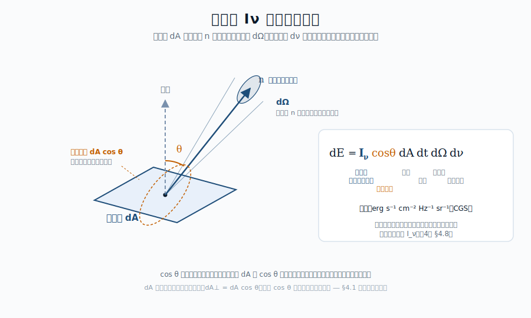

::: {.chapter-overview}
**この章の主題**：放射場を記述するための基本量を、観測装置で何を測っているのかという視点から整理する。比強度・立体角・エネルギー密度・フラックス・それらのモーメント。これらは連続スペクトルにも線スペクトルにも共通の言語を与え、第II部全体の土台となる。

本章は第I部で扱ってきた「観測されるスペクトル」を、これから定量的に扱うための**記述の枠組み**を整える章であり、本書の哲学に立ち返れば「① 逆引き」の橋渡し位置にある。
:::

## この章の中心地図 {#sec-radiation-field-map .unnumbered}

（この章は地図の再掲なし。第II部全体は、観測されるスペクトルを記述するための言語を整える章）

::: {.callout-note}
**方針**：本章で導入する記号と定義は、第III部以降のすべての逆引きで使い続ける。本章は概念定義の章なので、難易度は基本的に ☆☆ で統一する。
:::

## この章で答える問い {#sec-radiation-field-questions .unnumbered}

::: {.callout-question}
- 「明るさ」と「光度」と「フラックス」と「比強度」は何がどう違うのか
- 観測装置（望遠鏡＋検出器）が直接測っているのは、放射場のどの量なのか
- なぜ立体角という概念が、放射の記述に必須なのか
- 同じ放射場を表す量が、振動数表示と波長表示で形が変わるのはなぜか
- 連続スペクトルも線スペクトルも、同じ基本量（$I_\nu$, $J_\nu$ など）で記述できるのか
:::

## 到達目標 {#sec-radiation-field-goals .unnumbered}

この章を読み終えると、読者は次のことができるようになる：

- エネルギー密度・フラックス・比強度・モーメントの定義と相互関係を述べられる
- 観測量がこれらのどれに対応するかを判別できる
- 同じ枠組みが連続スペクトルにも線スペクトルにも適用できることを説明できる

---

## 4.1 比強度 ― 放射場の最も基本的な量 {#sec-radiation-field-intensity}

[本文目安：B3]

放射場を記述する基本量はいくつもあるが、本書ではそのうちの一つ ― **比強度** $I_\nu$（**specific intensity**）― を出発点とする。比強度は次のように定義される：

> ある位置 $\mathbf{r}$ で、ある方向 $\mathbf{n}$ に向かって、ある立体角内に、ある振動数帯にわたって、単位面積・単位時間あたりに通過するエネルギー

形式的には、空間に固定された面要素 $dA$（法線方向 $\hat{\mathbf{k}}$）、時間素 $dt$、$\hat{\mathbf{k}}$ から角度 $\theta$ の方向に開いた立体角素 $d\Omega$、振動数素 $d\nu$ あたりのエネルギー $dE$ として：

$$
dE = I_\nu(\mathbf{r}, \mathbf{n}, t)\, \cos\theta\, dA\, dt\, d\Omega\, d\nu
$$ {#eq-specific-intensity-def}

単位は erg s$^{-1}$ cm$^{-2}$ Hz$^{-1}$ sr$^{-1}$（CGS）。

{#fig-specific-intensity width=85%}

::: {.callout-note}
**用語**：$\cos\theta$ という**射影因子**は、「面要素 $dA$ を通過する光線の有効面積は $dA \cos\theta$」という幾何の帰結である。$dA$ の取り方を**光線方向に垂直**にする流儀（$dA_\perp = dA \cos\theta$）もあり、その場合は $\cos\theta$ が定義式から消える。両流儀は等価だが、本書では「空間に固定された面」を使う前者を採る。これによりフラックスの定義式 [@eq-flux-def] に $\cos\theta$ が自然に引き継がれる。
:::

::: {.callout-note}
**方針**：$I_\nu$ は **位置・方向・時刻・振動数の関数**である。第I部で見たプランク関数 $B_\nu(T)$ は、この $I_\nu$ の一つの特別な場合 ― 「**温度 $T$ の熱平衡放射場の比強度**」 ― にほかならない。本書を通じて、観測量と物理を結ぶ橋として $I_\nu$ を最も基本的な量として扱う。
:::

なぜ $I_\nu$ を出発点にするか。理由は次の三つ：

1. **観測装置との対応が明快**：望遠鏡が空のある方向を見て、ある振動数帯のエネルギーを単位時間に拾うとき、その値は本質的に $I_\nu$ である。
2. **保存則として性質がよい**：何もない真空中を伝播する間、$I_\nu$ は経路に沿って一定に保たれる（**比強度の保存則**）。これは観測の基本前提になる。
3. **他のすべての量が $I_\nu$ から導ける**：フラックス・エネルギー密度・放射圧などはすべて $I_\nu$ の角度モーメントとして表される（@sec-radiation-field-moments 参照）。

::: {.callout-tip appearance="simple"}
**問い**：比強度は真空中の伝播でなぜ保存されるのか？

**短答**：「光線一本あたりのエネルギーが、伝播方向に何もぶつからない限り変わらない」というシンプルな保存則。位相空間体積の保存（Liouville の定理の光学版）の帰結でもある。

**もう一歩**：これにより、距離 $d$ の遠方の天体から地球で観測する比強度 $I_\nu$ は、天体表面での比強度と等しい。「遠くの星ほど暗く見える」と感じるのは、距離で減衰する**フラックス** $F_\nu = I_\nu \cdot \Omega$ の方であって（立体角 $\Omega \propto 1/d^2$）、$I_\nu$ そのものではない。表面輝度は距離によらないという表現と等価である。
:::

## 4.2 立体角 ― 観測装置との橋渡し {#sec-radiation-field-solid-angle}

[本文目安：B2]

比強度の定義に **立体角**（**solid angle**）$d\Omega$ が現れる以上、これを正確に扱えないと放射場の記述はできない。立体角は二次元球面上の「面積」に相当する量で、極座標で

$$
d\Omega = \sin\theta\, d\theta\, d\varphi
$$ {#eq-solid-angle-element}

と書ける。全球面の立体角は $4\pi$ sr である。

天文学で出会う代表的な立体角の見積もり：

| 天体 | 視直径 $\theta$ | 立体角 $\Omega \simeq \pi(\theta/2)^2$ |
|---|---|---|
| 太陽（地球から）| 約 32 arcmin | $\sim 6.8 \times 10^{-5}$ sr |
| 月 | 約 31 arcmin | $\sim 6.4 \times 10^{-5}$ sr |
| 木星 | 約 50 arcsec | $\sim 4.6 \times 10^{-8}$ sr |
| アルファ・ケンタウリ A（最近傍恒星）| 約 9 mas | $\sim 1.5 \times 10^{-15}$ sr |
| 全天 | $4\pi$ sr | $\simeq 12.57$ sr |

（各立体角は円形視野 $\Omega = \pi(\theta/2)^2$ で計算した。視直径から立体角を求める統一公式である。）

立体角がないと「強度」と「フラックス」が混乱する。**点光源**（立体角が限りなく小さい）と**広がった光源**（立体角が有限）では、観測装置との関係が本質的に違う。

::: {.callout-note}
**用語**：天文学では「立体角」「ビーム角」「視野角」など類義語が並ぶ。詳しい用語は [astro-dic.jp](https://astro-dic.jp) の標準訳を参照。本書では「立体角」（solid angle）を統一して用いる。
:::

## 4.3 エネルギー密度 ― 放射場のエネルギー含有量 {#sec-radiation-field-energy-density}

[本文目安：B3]

ある場所での放射場の**単位体積あたりのエネルギー**を、振動数別に表したのが**エネルギー密度**（**energy density**）$u_\nu$ である。比強度 $I_\nu$ と次の関係で結ばれる：

$$
u_\nu(\mathbf{r}, t) = \frac{1}{c} \oint I_\nu(\mathbf{r}, \mathbf{n}, t)\, d\Omega
$$ {#eq-energy-density-def}

ここで積分は全立体角 $4\pi$ にわたる。意味は単純で、$I_\nu/c$ が「ある方向から単位立体角あたりに供給されるエネルギー密度」になっており、それを全方向に足し上げている。

**等方放射場**（**isotropic radiation field**, $I_\nu$ が方向に依らない）の場合、@eq-energy-density-def は

$$
u_\nu = \frac{4\pi}{c} I_\nu
$$ {#eq-energy-density-isotropic}

となる。たとえば熱平衡の放射場 ― 黒体放射 ― では $I_\nu = B_\nu(T)$ なので、

$$
u_\nu^{\text{BB}}(T) = \frac{4\pi}{c} B_\nu(T)
$$ {#eq-energy-density-bb}

である。これを全振動数で積分すると、放射場の全エネルギー密度 $u = \int u_\nu d\nu$ が $a T^4$ となる（$a = 4\sigma/c$）。これは Stefan-Boltzmann 則の別表現で、第6章で詳しく扱う。

::: {.callout-tip}
**目安**：CMB（$T = 2.725$ K）の全エネルギー密度は $u = aT^4 \simeq 4.2 \times 10^{-13}$ erg cm$^{-3}$。これは銀河系内の宇宙線や星間磁場のエネルギー密度（いずれも $\sim 10^{-12}$ erg cm$^{-3}$）と同程度のスケールで、宇宙物理の重要な「ベースライン」になる。
:::

## 4.4 フラックス ― 観測される「明るさ」 {#sec-radiation-field-flux}

[本文目安：B3]

ある面を**正味で**通過する単位面積・単位時間あたりのエネルギーを表すのが **フラックス**（**flux**）$F_\nu$ である。$I_\nu$ から次のように構成される：

$$
F_\nu(\mathbf{r}, t) = \oint I_\nu(\mathbf{r}, \mathbf{n}, t) \cos\theta\, d\Omega
$$ {#eq-flux-def}

ここで $\theta$ は面の法線と方向ベクトル $\mathbf{n}$ の間の角。重要なのは $\cos\theta$ の符号：法線方向に出ていく光は正、戻ってくる光は負を寄与する。

**完全に等方的な放射場**では、$\oint \cos\theta\, d\Omega = 0$ なので $F_\nu = 0$。つまり熱平衡で閉じている空洞の内部からは、正味のフラックスは出ない。

**観測者から見た天体のフラックス**：地球から距離 $d$ の場所にある光度 $L_\nu$ の天体からは、

$$
F_\nu^{\text{obs}} = \frac{L_\nu}{4\pi d^2}
$$ {#eq-flux-observed}

が観測される。これが「明るさ」と俗に呼ばれる量である。

::: {.callout-note}
**観測との対応**：望遠鏡が口径 $A$ で立体角 $\Omega_{\text{beam}}$ のビームを持つとき：

- **点光源**（角度サイズ $< \Omega_{\text{beam}}$）の場合：装置が拾うエネルギーは $F_\nu \cdot A \cdot d\nu$
- **広がった光源**（角度サイズ $> \Omega_{\text{beam}}$）の場合：拾うエネルギーは $I_\nu \cdot A \cdot \Omega_{\text{beam}} \cdot d\nu$

つまり**点光源ではフラックスが、広がった光源では比強度が**、それぞれの場で意味を持つ。観測の現場で「何を測っているか」を意識すると、この区別が常に問題になる。
:::

::: {.callout-tip appearance="simple"}
**問い**：点光源と広がった光源の境界はどこで切り替わるのか？

**短答**：観測装置の角度分解能（ビーム角 $\Omega_\text{beam}$）と天体の角度サイズ $\Omega_\text{source}$ の比較で決まる。$\Omega_\text{source} \ll \Omega_\text{beam}$ なら点光源として扱える。

**もう一歩**：同じ天体でも装置によって扱いが変わる。たとえばアルファ・ケンタウリ A は通常の地上望遠鏡では点光源だが、VLTI 干渉計（角度分解能 $\sim 1$ mas）では円盤として分解される。「点光源か広がった光源か」は天体固有の性質ではなく、**観測装置との関係**である。
:::

## 4.5 比強度のモーメント ― $J$, $F$, $P$ {#sec-radiation-field-moments}

[本文目安：B3]

比強度 $I_\nu$ から導かれる重要な量は、次の三つの**角度モーメント**として統一的に扱える。

$$
J_\nu = \frac{1}{4\pi} \oint I_\nu\, d\Omega \quad \text{（平均強度、0 次モーメント）}
$$ {#eq-mean-intensity}

$$
F_\nu = \oint I_\nu \cos\theta\, d\Omega \quad \text{（フラックス、1 次モーメント）}
$$ {#eq-flux-moment}

$$
P_\nu = \frac{1}{c} \oint I_\nu \cos^2\theta\, d\Omega \quad \text{（放射圧、2 次モーメント）}
$$ {#eq-radiation-pressure}

これらの幾何学的意味は明快である：

- $J_\nu$（**平均強度**, **mean intensity**）は、$I_\nu$ の全方向平均。エネルギー密度との関係は $u_\nu = (4\pi/c) J_\nu$。
- $F_\nu$（**フラックス**, **flux**）は、方向性をもったエネルギーの正味流。観測量。
- $P_\nu$（**放射圧**, **radiation pressure**）は、面の単位面積あたりの運動量フラックス。恒星内部や降着円盤で重要。

::: {.callout-note}
**方針**：本書では特に断らない限り「**フラックス**」を $F_\nu$ で書く。文献によっては $H_\nu = F_\nu/(4\pi)$ や $\pi F_\nu$ という記法も使われるので、別文献を読むときは定義の確認が必要。
:::

熱平衡（等方）の場合、これらは簡単に：

| 量 | 等方放射場での値 |
|---|---|
| $J_\nu$ | $B_\nu(T)$ |
| $F_\nu$ | $0$ |
| $P_\nu$ | $\frac{1}{3} u_\nu = \frac{4\pi}{3c} B_\nu(T)$ |

放射圧が $u/3$ になるのは光子気体の状態方程式 $P = u/3$（光子は質量ゼロで等方的）を反映している。第6章・第8章で詳しく扱う。

## 4.6 振動数表示と波長表示の変換 {#sec-radiation-field-nu-lambda}

[本文目安：B3]

第2章 §2.2 でプランク関数について見たのと同じ理屈で、**任意のスペクトル量**は振動数表示と波長表示で関数形が異なる。鍵は**同じエネルギーを異なる変数で表す**という事実：

$$
I_\nu\, |d\nu| = I_\lambda\, |d\lambda|
$$ {#eq-nu-lambda-equivalence}

これと $\nu = c/\lambda$ から $|d\nu/d\lambda| = c/\lambda^2$、よって

$$
I_\lambda = I_\nu \cdot \frac{c}{\lambda^2}, \qquad I_\nu = I_\lambda \cdot \frac{\lambda^2}{c}
$$ {#eq-nu-lambda-conversion-i}

同様にフラックスでも

$$
F_\lambda = F_\nu \cdot \frac{c}{\lambda^2}
$$ {#eq-nu-lambda-conversion-f}

である。エネルギー密度・モーメント全般について同じ関係が成り立つ。

::: {.callout-note}
**注意（観測）**：観測装置の波長分解能・振動数分解能の区別は、本質的にここから来る。電波天文学（GHz 帯）では振動数表示が、光学天文学（nm 帯）では波長表示が、それぞれ自然に好まれる。
:::

## 4.7 異方性と等方性 ― 放射場の方向依存 {#sec-radiation-field-anisotropy}

[本文目安：B3]

放射場が**等方的**であるとは、$I_\nu$ が方向ベクトル $\mathbf{n}$ に依らないということ。これは強い理想化条件で、現実の天体放射ではほぼ常に破られる。

実例で比較：

| 場 | 異方性の程度 |
|---|---|
| 不透明体内部（深部）| 完全等方（LTE） |
| CMB | $\Delta I / I \sim 10^{-5}$（ほぼ等方）|
| 太陽の表面光球から見る放射場 | 中心と縁で異なる（縁減光）|
| 地球から見た太陽光 | 一方向に集中（点光源近似）|

**等方放射場の特性**：等方なら $F_\nu = 0$、$J_\nu = I_\nu$、$P_\nu = (1/3)(4\pi/c) I_\nu$ となり、量の間の関係が極端に単純になる。逆に言えば、**異方性こそが「方向性のあるエネルギー流」を生み出す**。観測される放射は必ず異方的である。

::: {.callout-tip}
**観測との対応**：CMB の $10^{-5}$ という小さな異方性は、宇宙論的に巨大な情報量を持つ。本書では第16章で扱う。一方で、太陽光の高度な異方性は、地球で日射量を一方向のフラックスとして計算できることを意味する。
:::

## 4.8 観測で何が測られるか ― 装置と放射場の対応 {#sec-radiation-field-observation}

[本文目安：B3]

最後に、観測装置で実際に何が測られているかを整理する。これは本章全体を、観測の言葉に翻訳し直す節である。

**点光源**（角度サイズが装置のビームより小さい）の場合：

- 観測される量は **フラックス** $F_\nu$（あるいはその波長表示 $F_\lambda$）
- 単位エネルギー量は $F_\nu \cdot d\nu \cdot A_\text{eff}$（$A_\text{eff}$ は望遠鏡の有効集光面積）
- 例：遠方銀河、QSO、恒星

**広がった光源**（角度サイズが装置のビームより大きい）の場合：

- 観測される量は **比強度** $I_\nu$（あるいは輝度温度 $T_b$、第2章 §2.6 で導入）
- 装置の角度分解能で空間的に分解できる
- 例：CMB、HII 領域、星間ダスト、銀河系

**スペクトロスコピー**：

- 入射光を振動数（あるいは波長）に分解する装置を使う
- 各振動数チャンネルで $F_\nu$ または $I_\nu$ を測る
- 線スペクトルと連続スペクトルの双方が同じ装置で観測できる

本書を通じて、観測スペクトルの量と物理量を結ぶ橋を見ていくが、その橋はすべて $I_\nu$ から派生した量を介して張られる。

---

## この章で何がわかったか {#sec-radiation-field-summary .unnumbered}

::: {.callout-summary}
**中心地図に戻る**

本章で、放射場を記述する**共通の言語**が整った：

- **比強度** $I_\nu$：放射場の最も基本的な量、方向と振動数に依存
- **モーメント**（$J_\nu$, $F_\nu$, $P_\nu$）：物理的状況ごとに使い分け
- **エネルギー密度** $u_\nu$：体積あたりのエネルギー含量
- **観測量**：点光源ではフラックス、広がった光源では比強度

中心地図のプランク関数 $B_\nu(T)$ は、これらの記述枠組みの中で「**熱平衡の比強度**」として位置づけられた。今後第III部以降では、なぜ熱平衡で $I_\nu = B_\nu(T)$ になるのか（光子統計・量子化・モード密度）を逆引きしていく。

**次章へ**：第5章では、これらの量がどう時間・空間的に変化するか ― つまり光が物質と相互作用しながら伝播するときの**放射輸送方程式** ― を扱う。この方程式は、観測スペクトルを「天体内部の歴史」と結びつける鍵であり、連続スペクトル（第VI部）と線スペクトル（第VII部）の両方の土台となる。
:::

## 演習問題 {#sec-radiation-field-exercises .unnumbered}

以下の問題は、本文で省いた式の導出を補う問題（[tag:導出補完]）と、本文で得た道具を別の角度から使って理解を深める問題（[tag:理解を深める]）から成る。各問の **解答例** は章末「解答例」にまとめてある（オンライン版では各問のボタンから開く）。まず自力で解いてから確認すると効果的である。

### 問題 4-1　等方場で uν=(4π/c)Iν、Fν=0、Pν=uν/3 {#ex-4-1 .unnumbered}

[★ 難易度：☆☆ ] [tag:導出補完]

§4.3〜4.5 は等方放射場での値を表で与えた。定義から自分で導く。立体角要素 $d\Omega=\sin\theta\,d\theta\,d\varphi$。等方なら $I_\nu$ は方向に依らず積分の外へ出せる。

1. $u_\nu=\dfrac{1}{c}\displaystyle\oint I_\nu\,d\Omega$ から、等方場で $u_\nu=\dfrac{4\pi}{c}I_\nu$ を示せ。
2. $F_\nu=\displaystyle\oint I_\nu\cos\theta\,d\Omega$ が等方場でゼロになることを示せ。
3. $P_\nu=\dfrac{1}{c}\displaystyle\oint I_\nu\cos^2\theta\,d\Omega$ を計算し、$\displaystyle\oint\cos^2\theta\,d\Omega=\dfrac{4\pi}{3}$ を使って $P_\nu=\dfrac{1}{3}u_\nu$ を導け。これは光子気体の状態方程式 $P=u/3$ に対応する。

**関連**：[§4.3 エネルギー密度](#sec-radiation-field-energy-density)、[§4.5 モーメント](#sec-radiation-field-moments)／$P=u/3$ の光子気体としての扱いは[第8章](../part3/08-photon-statistics.qmd)。

::: {.content-visible when-format="html"}
[解答例を見る（問題 4-1）](#sol-4-1){.btn .btn-outline-secondary .btn-sm data-bs-toggle="offcanvas" role="button"}
:::

### 問題 4-2　表面輝度は距離によらない ― Iν 不変、Fν は 1/d² に従う {#ex-4-2 .unnumbered}

[★ 難易度：☆☆ ] [tag:理解を深める]

§4.1 は「遠くの星が暗く見えるのは比強度ではなくフラックスが減るから」と述べた。これを定量的に確かめる。

1. 真空中で比強度 $I_\nu$ が経路に沿って保存することを前提に、距離 $d$ にある半径 $R$ の一様な円盤天体について、観測される比強度 $I_\nu$ が $d$ に依らないことを述べよ。
2. その天体が張る立体角が $\Omega\simeq\pi R^2/d^2\propto1/d^2$ であることを示し、観測フラックス $F_\nu\simeq I_\nu\,\Omega\propto1/d^2$ を導け。
3. 点光源の式 $F_\nu^\mathrm{obs}=L_\nu/4\pi d^2$ と (2) が整合することを、$L_\nu$ を $I_\nu$ と $R$ で表して確かめよ。

**関連**：[§4.1 比強度（保存則）](#sec-radiation-field-intensity)、[§4.4 フラックス](#sec-radiation-field-flux)／立体角は[§4.2](#sec-radiation-field-solid-angle)、光度の定義は[§2.4](../part1/02-reading-spectra.qmd#sec-reading-spectra-stefan-boltzmann)。

::: {.content-visible when-format="html"}
[解答例を見る（問題 4-2）](#sol-4-2){.btn .btn-outline-secondary .btn-sm data-bs-toggle="offcanvas" role="button"}
:::

### 問題 4-3　CMB のエネルギー密度を見積もる {#ex-4-3 .unnumbered}

[★ 難易度：☆ ] [tag:理解を深める]

§4.3 は熱平衡で $u=\displaystyle\int u_\nu\,d\nu=aT^4$（$a=4\sigma/c$）になると述べ、CMB で $u\simeq4.2\times10^{-13}$ erg cm$^{-3}$ と見積もった。これを確かめる。

1. 放射定数を CGS で $a=7.566\times10^{-15}$ erg cm$^{-3}$ K$^{-4}$ とし、$T_\mathrm{CMB}=2.725$ K で $u=aT^4$ を計算せよ。
2. 等方黒体場では $u_\nu=\dfrac{4\pi}{c}B_\nu(T)$、$J_\nu=B_\nu(T)$ となる。なぜ $J_\nu=B_\nu$ なのに $u_\nu$ には $4\pi/c$ が付くのか、定義の違いから一言で述べよ。
3. 得られた $u$ が、銀河系内の宇宙線・星間磁場のエネルギー密度（$\sim10^{-12}$ erg cm$^{-3}$）と同程度であることを確認し、その含意を一言。

**関連**：[§4.3 エネルギー密度](#sec-radiation-field-energy-density)、[§4.5 平均強度](#sec-radiation-field-moments)／$u=aT^4$ の導出は[演習 10-3](../part4/10-planck-quantum.qmd#ex-10-3)、[第6章](../part3/06-thermal-equilibrium.qmd)。

::: {.content-visible when-format="html"}
[解答例を見る（問題 4-3）](#sol-4-3){.btn .btn-outline-secondary .btn-sm data-bs-toggle="offcanvas" role="button"}
:::

### 問題 4-4　点光源か広がった光源か ― 装置との関係で決まる {#ex-4-4 .unnumbered}

[★ 難易度：☆☆ ] [tag:理解を深める]

§4.4・4.8 は「点光源か広がった光源か」は天体固有でなく観測装置との関係で決まると述べた。$\alpha$ Cen A（視直径 $\sim9$ mas）を例に確かめる。

1. $\alpha$ Cen A を円盤とみて立体角 $\Omega_\mathrm{src}\simeq\pi(\theta/2)^2$ を sr で概算せよ（$\theta=9$ mas）。
2. 通常の地上望遠鏡（シーイング $\sim1$ arcsec）のビーム立体角 $\Omega_\mathrm{beam}\simeq\pi(0.5'')^2$ と比べ、点光源として扱える理由を述べよ。
3. VLTI 干渉計（分解能 $\sim1$ mas）ではどうなるか。同じ天体で扱いが変わることが何を意味するか、観測される量（$F_\nu$ か $I_\nu$ か）の観点から述べよ。

**関連**：[§4.4 フラックス（点光源/広がった光源）](#sec-radiation-field-flux)、[§4.8 装置と放射場](#sec-radiation-field-observation)／立体角の見積りは[§4.2](#sec-radiation-field-solid-angle)。

::: {.content-visible when-format="html"}
[解答例を見る（問題 4-4）](#sol-4-4){.btn .btn-outline-secondary .btn-sm data-bs-toggle="offcanvas" role="button"}
:::

## 解答例 {#sec-radiation-field-solutions .unnumbered}

各問の「解答例を見る」ボタンを押すと、右側のパネルに解答例が表示され、問題文と見比べられる（背景は暗くならず本文はそのまま読める）。印刷版・EPUB版では下に順に掲載される。

::: {.content-visible when-format="html"}
[問題 4-1](#sol-4-1){.btn .btn-outline-primary .btn-sm data-bs-toggle="offcanvas" role="button"} [問題 4-2](#sol-4-2){.btn .btn-outline-primary .btn-sm data-bs-toggle="offcanvas" role="button"} [問題 4-3](#sol-4-3){.btn .btn-outline-primary .btn-sm data-bs-toggle="offcanvas" role="button"} [問題 4-4](#sol-4-4){.btn .btn-outline-primary .btn-sm data-bs-toggle="offcanvas" role="button"}
:::

::: {#sol-4-1 .offcanvas .offcanvas-end tabindex="-1" data-bs-backdrop="false" data-bs-scroll="true" aria-labelledby="sol-4-1-label"}
::: {.offcanvas-header}
[**解答例（問題 4-1）**]{#sol-4-1-label .offcanvas-title}
[ ]{.btn-close data-bs-dismiss="offcanvas" aria-label="閉じる"}
:::
::: {.offcanvas-body}
**(1)** $I_\nu$ を外に出すと $u_\nu=\dfrac{I_\nu}{c}\displaystyle\oint d\Omega=\dfrac{I_\nu}{c}\cdot4\pi=\dfrac{4\pi}{c}I_\nu$。

**(2)** $\displaystyle\oint\cos\theta\,d\Omega=\int_0^{2\pi}d\varphi\int_0^{\pi}\cos\theta\sin\theta\,d\theta=2\pi\left[\dfrac{\sin^2\theta}{2}\right]_0^{\pi}=2\pi\cdot0=0$。（上半球の正と下半球の負が打ち消す。）よって $F_\nu=I_\nu\cdot0=0$。

**(3)** $\displaystyle\oint\cos^2\theta\,d\Omega=\int_0^{2\pi}d\varphi\int_0^{\pi}\cos^2\theta\sin\theta\,d\theta=2\pi\left[-\dfrac{\cos^3\theta}{3}\right]_0^{\pi}=2\pi\cdot\dfrac{2}{3}=\dfrac{4\pi}{3}$。よって

$$
P_\nu=\frac{I_\nu}{c}\cdot\frac{4\pi}{3}=\frac{1}{3}\cdot\frac{4\pi}{c}I_\nu=\frac{1}{3}u_\nu.
$$

**答え**：等方場で $u_\nu=\frac{4\pi}{c}I_\nu$、$F_\nu=0$、$P_\nu=\frac13 u_\nu$。最後は光子気体の状態方程式 $P=u/3$。
:::
:::

::: {#sol-4-2 .offcanvas .offcanvas-end tabindex="-1" data-bs-backdrop="false" data-bs-scroll="true" aria-labelledby="sol-4-2-label"}
::: {.offcanvas-header}
[**解答例（問題 4-2）**]{#sol-4-2-label .offcanvas-title}
[ ]{.btn-close data-bs-dismiss="offcanvas" aria-label="閉じる"}
:::
::: {.offcanvas-body}
**(1)** 比強度は真空伝播で保存する（光線一本あたりのエネルギーが不変、位相空間体積保存の帰結）。よって天体表面の比強度と、遠方で観測する比強度は等しく、距離 $d$ に依らない（表面輝度の距離不変）。

**(2)** 半径 $R$ の円盤を距離 $d$ から見ると、見込む角の半径は $\theta\simeq R/d$（$R\ll d$）。立体角は $\Omega\simeq\pi\theta^2=\pi R^2/d^2\propto1/d^2$。観測フラックスは「比強度×天体の立体角」なので $F_\nu\simeq I_\nu\Omega=\pi I_\nu R^2/d^2\propto1/d^2$。

**(3)** 表面フラックス $F_\nu^\mathrm{surf}=\pi I_\nu$（半球射出、§2.4）、光度 $L_\nu=4\pi R^2\cdot F_\nu^\mathrm{surf}=4\pi R^2\cdot\pi I_\nu=4\pi^2 R^2 I_\nu$。点光源式に入れると

$$
F_\nu^\mathrm{obs}=\frac{L_\nu}{4\pi d^2}=\frac{4\pi^2R^2 I_\nu}{4\pi d^2}=\frac{\pi I_\nu R^2}{d^2},
$$

これは (2) と完全に一致する。$I_\nu$ は不変、$F_\nu$ だけが $1/d^2$ で落ちる。

**答え**：$I_\nu$ は距離不変、$\Omega\propto1/d^2$ ゆえ $F_\nu=\pi I_\nu R^2/d^2\propto1/d^2$。点光源式とも一致。
:::
:::

::: {#sol-4-3 .offcanvas .offcanvas-end tabindex="-1" data-bs-backdrop="false" data-bs-scroll="true" aria-labelledby="sol-4-3-label"}
::: {.offcanvas-header}
[**解答例（問題 4-3）**]{#sol-4-3-label .offcanvas-title}
[ ]{.btn-close data-bs-dismiss="offcanvas" aria-label="閉じる"}
:::
::: {.offcanvas-body}
**(1)** $T^4=(2.725)^4=55.1$ K$^4$。よって

$$
u=aT^4=7.566\times10^{-15}\times55.1\simeq4.2\times10^{-13}\ \mathrm{erg\,cm^{-3}}.
$$

本文の値と一致。

**(2)** $J_\nu$ は比強度の**方向平均**（$\frac{1}{4\pi}\oint I_\nu d\Omega$）なので等方場で $J_\nu=I_\nu=B_\nu$。一方 $u_\nu$ は単位体積あたりの**エネルギー**（$\frac1c\oint I_\nu d\Omega$）で、全立体角の積分 $4\pi$ と $1/c$ が付く。平均か総和か、という定義の違い。実際 $u_\nu=\frac{4\pi}{c}J_\nu$。

**(3)** $4.2\times10^{-13}$ と $10^{-12}$ erg cm$^{-3}$ はオーダーで同程度。CMB・宇宙線・星間磁場のエネルギー密度が拮抗していることは、銀河系の星間媒質がこれらの間でエネルギーをやりとりする「準平衡」的な系であることを示唆する（重要なベースライン）。

**答え**：$u\simeq4.2\times10^{-13}$ erg cm$^{-3}$。$J_\nu$＝方向平均、$u_\nu$＝体積エネルギー（$4\pi/c$ 倍）。宇宙線・磁場と同オーダー。
:::
:::

::: {#sol-4-4 .offcanvas .offcanvas-end tabindex="-1" data-bs-backdrop="false" data-bs-scroll="true" aria-labelledby="sol-4-4-label"}
::: {.offcanvas-header}
[**解答例（問題 4-4）**]{#sol-4-4-label .offcanvas-title}
[ ]{.btn-close data-bs-dismiss="offcanvas" aria-label="閉じる"}
:::
::: {.offcanvas-body}
**(1)** $\theta=9$ mas $=9\times10^{-3}$ arcsec。1 arcsec $=4.85\times10^{-6}$ rad なので $\theta=9\times10^{-3}\times4.85\times10^{-6}=4.4\times10^{-8}$ rad。半径 $\theta/2=2.2\times10^{-8}$ rad。立体角

$$
\Omega_\mathrm{src}\simeq\pi(2.2\times10^{-8})^2\simeq1.5\times10^{-15}\ \mathrm{sr}.
$$

（本文の表の値と一致。）

**(2)** シーイング 1 arcsec のビーム半径 $0.5''=2.4\times10^{-6}$ rad、$\Omega_\mathrm{beam}\simeq\pi(2.4\times10^{-6})^2\simeq1.8\times10^{-11}$ sr。$\Omega_\mathrm{src}/\Omega_\mathrm{beam}\sim10^{-4}\ll1$。天体はビームよりはるかに小さく、空間的に分解できない＝点光源。測れるのはフラックス $F_\nu$ のみ。

**(3)** VLTI の分解能 $\sim1$ mas は天体視直径 9 mas より小さいので、円盤を空間的に分解できる＝広がった光源として扱え、面上の比強度 $I_\nu$（表面輝度分布）が測れる。同じ天体が装置の分解能次第で点光源にも広がった光源にもなる。すなわち「点か広がりか」は天体の性質でなく装置との関係で決まる。

**答え**：$\Omega_\mathrm{src}\simeq1.5\times10^{-15}$ sr。シーイング1″では $\ll\Omega_\mathrm{beam}$ ゆえ点光源（$F_\nu$ を測る）。VLTI 1 masでは分解でき広がった光源（$I_\nu$）。装置依存。
:::
:::

## さらに学ぶための参考文献 {#sec-radiation-field-further .unnumbered}

- Rybicki & Lightman, *Radiative Processes in Astrophysics* (Wiley, 1979) — 第1章「Fundamentals of Radiative Transfer」
- Mihalas, *Stellar Atmospheres* (Freeman, 2nd ed., 1978) — 放射場の量の体系的整理
- Chandrasekhar, *Radiative Transfer* (Dover, 1960) — 古典的だが現在も標準
