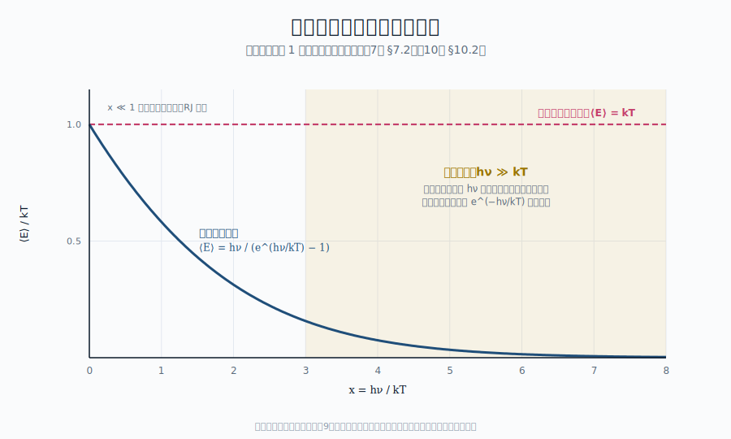

::: {.chapter-overview}
**この章の主題**：第6章で立ち上げた「最大エントロピー状態が熱平衡」という原理を、具体的な計算道具として整える。状態数・分配関数・Boltzmann 分布・揺らぎ ― これらは古典統計力学の中心的な道具立てであり、第8章で光子の統計（Bose–Einstein）へ拡張するための土台となる。最後に、古典統計を放射場にそのまま適用すると何が起きるかを予告する。これは第IV部・第9章「古典論ではなぜ失敗するのか」への入口でもある。
:::

## この章の中心地図 {#sec-statistical-mechanics-map .unnumbered}



::: {.callout-note}
**方針**：本章で扱う **Boltzmann 分布** は、プランク分布の親戚であり、量子効果が無視できる極限では Boltzmann 分布に近づく。中心地図の指数関数因子 $1/(e^{h\nu/kT}-1)$ の「指数の中身」がここで準備される。
:::

## この章で答える問い {#sec-statistical-mechanics-questions .unnumbered}

::: {.callout-question}
- なぜ多数の粒子の集団は、熱力学量（温度・圧力）のような少数の変数で記述できてしまうのか
- 分配関数を計算すると、なぜ観測されるスペクトル形が出てくるのか
- 古典統計を放射場にそのまま適用すると、何が起こるのか（→ 第9章への伏線）
- 揺らぎは観測スペクトルにどんな形で現れるのか
:::

## 到達目標 {#sec-statistical-mechanics-goals .unnumbered}

この章を読み終えると、読者は次のことができるようになる：

- 状態数・分配関数・Boltzmann 分布の論理を整理して述べられる
- 平均値と揺らぎが熱力学量とどう結びつくかを説明できる
- 古典統計を放射場に適用したときに何が起こるかを予告的に把握できる

---

## 7.1 状態数と確率 ― 等確率の原理 {#sec-statistical-mechanics-states}

[本文目安：B3]

統計力学の出発点は、ミクロ状態に対する**等確率の仮定**である：

> 孤立系のミクロ状態のうち、与えられたエネルギー $E$ を満たすものは、すべて等しい確率で実現する。

これだけで多くの結果が出る。粒子数 $N$、体積 $V$、エネルギー $E$ が指定されたマクロ状態に対応するミクロ状態の数 $\Omega(E, V, N)$ を計算すれば、エントロピー $S = k_B \ln \Omega$（@eq-entropy-boltzmann）からすべての熱力学量が導かれる。

これを **ミクロカノニカル分布** と呼ぶ。

しかし実用上はもう一段使いやすい設定が便利である。系を**熱浴**（温度 $T$ で固定）と接触させた状況を考える。エネルギー $E_i$ のミクロ状態が実現する確率は

$$
P_i = \frac{1}{Z}\, e^{-E_i / k_B T}
$$ {#eq-boltzmann-prob}

となる。これが **Boltzmann 分布**（**Boltzmann distribution**, あるいは canonical distribution）で、$Z$ は規格化定数：

$$
Z = \sum_i e^{-E_i / k_B T}
$$ {#eq-partition-function}

これが **分配関数**（**partition function**, あるいは独語 *Zustandssumme*「状態和」）。$Z$ は系のすべての情報を含む量で、ここから物理量がすべて引き出せる。

::: {.callout-note}
**用語**：「分配関数」は英語 partition function の和訳だが、原語ともに物理的意味が直接には汲み取りにくい。ドイツ語の Zustandssumme（**状態和**）の方が明快で、エネルギー重み $e^{-E_i/k_B T}$ を全状態にわたって足し上げた量、という意味がそのまま読み取れる。
:::

## 7.2 分配関数 ― すべての熱力学量を生成する母関数 {#sec-statistical-mechanics-partition}

[本文目安：B3]

分配関数 $Z(T, V, N)$ から、平均エネルギーは

$$
\langle E \rangle = -\frac{\partial \ln Z}{\partial \beta}
$$ {#eq-mean-energy}

ただし $\beta = 1/k_B T$。同様に他の熱力学量も：

| 物理量 | 分配関数からの計算式 |
|---|---|
| 平均エネルギー $\langle E \rangle$ | $-\partial \ln Z / \partial \beta$ |
| Helmholtz 自由エネルギー $F$ | $-k_B T \ln Z$ |
| エントロピー $S$ | $-\partial F / \partial T$ |
| 圧力 $P$ | $-\partial F / \partial V$ |
| 比熱 $C_V$ | $\partial \langle E \rangle / \partial T$ |

つまり、**分配関数を計算できれば熱力学はほぼ完結する**。逆に言えば、計算の本丸はミクロ状態の和 @eq-partition-function を実行する点にある。

**例：N 個の独立な調和振動子**

エネルギー $\epsilon_n = (n + 1/2)\hbar\omega$ を持つ独立な振動子 $N$ 個の系では、

$$
Z = \prod_{i=1}^N Z_1, \quad Z_1 = \sum_{n=0}^\infty e^{-\beta(n + 1/2)\hbar\omega} = \frac{e^{-\beta\hbar\omega/2}}{1 - e^{-\beta\hbar\omega}}
$$ {#eq-partition-oscillator}

ここから平均エネルギー：

$$
\langle E \rangle = N \left( \frac{\hbar\omega}{2} + \frac{\hbar\omega}{e^{\beta\hbar\omega} - 1} \right)
$$ {#eq-mean-energy-oscillator}

{#fig-quantum-freezeout width=88%}

第二項に **$1/(e^{\hbar\omega/k_B T} - 1)$** という形が現れていることに注意。これがプランク分布の占有因子に他ならない。プランクが量子仮説でこの式に辿り着いたのは、第10章で本格的に扱う。

::: {.callout-note}
**零点エネルギー $\hbar\omega/2$ の扱いについて**：本章では $\epsilon_n = (n+1/2)\hbar\omega$ と書いて零点項を残したが、Planck の原論文（1900）は $\epsilon_n = n h\nu$ と書いた（第10章でこの形を再現する）。零点項の有無は **観測量である占有因子 $1/(e^{\hbar\omega/k_BT}-1)$ には影響しない**（零点エネルギーは温度によらない定数で、温度微分・分配関数の対数微分で消える）。両者の物理的意味（古典的振動子の量子化 vs エネルギー量子の数え上げ）と、零点項が観測可能になる場面（真空揺らぎ、Casimir 効果、自発放出、§24.3）は第IV部と第VIII部で扱う
:::

::: {.callout-warning}
**先取りについて**：本節では「エネルギーが $\hbar\omega$ の整数倍に **量子化されている**」という前提を、第IV部（第9〜10章）の逆引きより **先に** 使っている。これは「観測されるプランク分布の指数因子を、最も簡潔に再現できる仮定として一度受け入れる」立場であり、**第8章のモード密度の借用**（§8.5）と同じ精神の先取りである。なぜ量子化されなくてはならないか（古典統計の破綻 → Rayleigh-Jeans の紫外発散 → Planck 仮説）は第9-10章で逆引きされる。第7章で先取りした分は、第10章で必ず回収される
:::

::: {.callout-tip appearance="simple"}
**問い**：いま導いた振動子の式 @eq-mean-energy-oscillator は、プランク分布そのものではないのか？

**短答**：構造はほぼ同じだが、まだプランク分布ではない。@eq-mean-energy-oscillator は「ある **一つの** モードの平均エネルギー」を与える式である。プランク分布 $B_\nu(T)$ は、これに「振動数 $\nu$ 近傍にどれだけのモードがあるか」（モード密度）を掛けたもの。

**もう一歩**：モード密度の話は第V部・第14章で扱う。中心地図のプランク関数の **指数関数因子**（占有因子）が本章で説明され、**前因子** $2h\nu^3/c^2$ は第V部で説明される、という構造になっている。
:::

::: {.callout-note}
**使えるようになった道具**（§7.1〜7.2）：

- 分配関数 $Z$ から、平均エネルギー・自由エネルギー・エントロピー・圧力・比熱までを微分一発で取り出せる
- 量子化された調和振動子の平均エネルギー @eq-mean-energy-oscillator に、観測されるプランク分布の指数関数因子 $1/(e^{\hbar\omega/k_BT}-1)$ がすでに現れる ― 観測される高振動数の指数減衰の起源がここに芽生えている
:::

## 7.3 Boltzmann 分布 ― 古典統計の中心定理 {#sec-statistical-mechanics-boltzmann}

[本文目安：B3]

@eq-boltzmann-prob を観測量で表すと、$N$ 個の同種粒子のうち、エネルギー $E_i$ の状態 $i$ にある粒子数の平均は

$$
\langle n_i \rangle = N \cdot \frac{g_i e^{-E_i/k_B T}}{\sum_j g_j e^{-E_j/k_B T}}
$$ {#eq-boltzmann-distribution}

ここで $g_i$ は状態 $i$ の**縮退度**（**degeneracy**）。これが（古典）**Boltzmann 分布** である。

**例：水素原子の準位占有数**

水素原子の主量子数 $n$ の準位は、エネルギー $E_n = -13.6 \text{ eV} / n^2$ をもち、縮退度は $g_n = 2 n^2$（電子スピン込み）。温度 $T$ の熱浴と平衡にあるとき、

$$
\frac{n_2}{n_1} = \frac{g_2}{g_1} e^{-(E_2 - E_1)/k_B T}
$$ {#eq-boltzmann-hydrogen}

この比は、第VII部で線スペクトルの強度比から温度を求める基本式になる。

::: {.callout-note}
**対応（観測）**：観測される線スペクトル強度比から温度を読むのは、まさにこの Boltzmann 分布が成り立っているという仮定（LTE）に基づいている。LTE が破れる場面（non-LTE、第5章 §5.5）では @eq-boltzmann-hydrogen は使えない。
:::

::: {.callout-note}
**使えるようになった道具**（§7.3）：Boltzmann 分布 @eq-boltzmann-distribution は、観測される複数の線の強度比から温度を読み出す「**励起温度**」推定の基礎式である。第VII部・第23章で本格的に応用する。
:::

## 7.4 平均値と揺らぎ {#sec-statistical-mechanics-fluctuations}

[本文目安：B3]

統計力学は平均値だけでなく、**揺らぎ**（**fluctuations**, 統計的なばらつき）も予言する。揺らぎは温度・密度・エネルギー・光子数などのあらゆる量に現れる。

エネルギー揺らぎは分配関数からこう求まる：

$$
\langle (\Delta E)^2 \rangle = \langle E^2 \rangle - \langle E \rangle^2 = k_B T^2 \frac{\partial \langle E \rangle}{\partial T} = k_B T^2 C_V
$$ {#eq-energy-fluctuation}

$C_V$ は定積熱容量。$N \sim 10^{23}$ では、相対的な揺らぎは $\Delta E / \langle E \rangle \sim 1/\sqrt{N} \sim 10^{-11}$ で、観測に出てこない（マクロ熱力学が成り立つ理由）。

しかし**少数粒子系**や**特定の振動数帯**では揺らぎが重要になる。

**CMB のスペクトル歪み**：CMB の黒体スペクトルは完璧だが、初期宇宙の様々な過程（粒子崩壊、再結合、Compton 散乱の不完全さ）がスペクトルに微小な歪みを残しうる。これらの歪みは「光子数の揺らぎ」「エネルギーの揺らぎ」を反映する量であり、第16章で扱う。

::: {.callout-tip appearance="simple"}
**問い**：揺らぎが小さいのは、なぜ「自然法則」のように見えるのか？

**短答**：$N$ が大きいから。揺らぎは $1/\sqrt{N}$ で減衰するので、アボガドロ数規模の系では事実上ゼロに見える。

**もう一歩**：宇宙論的スケールの観測では話が違う。空間的に異なる場所の CMB 温度ゆらぎは $\Delta T / T \sim 10^{-5}$ で観測されているが、これは「熱平衡の揺らぎ」ではなく、初期宇宙の量子ゆらぎが膨張で増幅された結果である（第16章）。両者は混同しないこと。
:::

## 7.5 熱力学関数とのつながり {#sec-statistical-mechanics-thermodynamics}

[本文目安：B3-B4｜導出：M1]

ここまで導入した分配関数 $Z$ は、熱力学の標準的関数とすべて対応している。鍵となる関係：

$$
F = -k_B T \ln Z
$$ {#eq-free-energy}

ここから

$$
S = -\frac{\partial F}{\partial T}, \quad P = -\frac{\partial F}{\partial V}, \quad \mu = \frac{\partial F}{\partial N}
$$

**化学ポテンシャル**（**chemical potential**）$\mu$ は粒子数に対する Lagrange 乗数で、@eq-lagrange の $\alpha = -\mu/k_B T$ に対応する。

**化学ポテンシャルの物理的意味**：粒子を一つ加えたときの自由エネルギーの変化。「粒子数を保存しないといけない系」では化学ポテンシャルが現れ、保存しない系（光子のように）では $\mu = 0$ になる。

なぜ光子は粒子数を保存しないか。電磁場のモードと物質の相互作用（吸収・放出）で光子は生成・消滅し、その数は決まっていない。エネルギーは保存するが個数は保存しない。これが**光子の化学ポテンシャルがゼロ**になる物理的理由で、第8章で詳しく扱う。

## 7.6 古典統計の限界 ― 放射場での破綻 {#sec-statistical-mechanics-classical-limit}

[本文目安：B3]

古典統計力学を放射場にそのまま適用すると、本書が逆引きで辿る**最初の決定的な失敗**に遭遇する。

**古典の結論（Rayleigh–Jeans）**：振動数 $\nu$ あたりのモード数を $g(\nu)$ とすると、エネルギー等分配定理から各モードには平均エネルギー $k_B T$ が配分される。よって振動数 $\nu$ あたりの放射エネルギー密度は

$$
u_\nu^\text{RJ} = g(\nu) \cdot k_B T = \frac{8\pi \nu^2}{c^3} k_B T
$$ {#eq-rj-classical}

これは振動数の二乗に比例して増加し、全エネルギー $\int u_\nu d\nu$ は発散する。

**観測との矛盾**：実際の黒体スペクトルは、高振動数で指数関数的に減衰し、全エネルギー $u = aT^4$ は有限である。古典統計は決定的に間違っている。

**何が問題か**：

- 古典統計の**エネルギー等分配定理**（**equipartition theorem**, 各自由度に $k_B T$）は、エネルギーが**連続的に**やりとりされる前提に立つ
- 高振動数のモード（$h\nu \gg k_B T$）では、エネルギー $h\nu$ という大きな単位でしかエネルギーが分配されえない → 等分配が成り立たない

これを正確に取り扱うには、**量子的な性質**（エネルギー量子化＋粒子の区別不能性）が必要である。第8章で「光子の統計」として導入し、これがプランク分布の占有因子 $1/(e^{h\nu/kT}-1)$ を生む。

::: {.callout-note}
**注意（理論）**：古典統計の破綻は「**紫外線破綻**」（**ultraviolet catastrophe**）と呼ばれる。これは決定的な歴史的契機で、量子論誕生（Planck 1900, Einstein 1905）に直結した。第9章で本格的に扱う。
:::

::: {.callout-tip appearance="simple"}
**問い**：Rayleigh–Jeans 則は完全に間違いなのか？

**短答**：いいえ、低振動数極限（$h\nu \ll k_B T$）では正しい。電波天文学ではほぼ常にこの極限で観測しており、Rayleigh–Jeans は実用的に最も使われる近似である（第2章 §2.5）。

**もう一歩**：プランク分布の物理を学ぶときは、「古典で完全に間違っている」ではなく「**低振動数では古典が正しく、高振動数で量子効果が効く**」というニュアンスで理解するのが正確である。これが第IV部全体の論点になる。
:::

::: {.callout-note}
**使えるようになった道具**（§7.4〜7.6）：

- 揺らぎ $\Delta E / \langle E \rangle \sim 1/\sqrt{N}$ から、観測上いつ熱力学的決定論が信用できるかを判断できる
- 古典統計の枠組みでは観測される Rayleigh–Jeans 形（低振動数）は説明できる。観測される高振動数の指数減衰は古典では出ない ― これが量子論を要請する観測上の根拠
:::

---

## この章で何がわかったか {#sec-statistical-mechanics-summary .unnumbered}

::: {.callout-summary}
**中心地図に戻る**

本章で、古典統計力学の主要道具 ― 分配関数 $Z$、Boltzmann 分布 $\langle n_i \rangle \propto g_i e^{-E_i/k_B T}$、揺らぎ、熱力学関数 ― が整った。

中心地図 $B_\nu(T)$ の **「式が成り立つ条件」**（第6章）に続き、本章では **「指数の中身 $E/k_B T$」が温度の正体である**ことが言語化された。

しかし古典統計をそのまま放射場に適用しようとすると、Rayleigh–Jeans 則の発散という決定的な破綻に出会う。**指数関数因子 $1/(e^{h\nu/kT}-1)$ が出てこない**のである。

**次章へ**：第8章で「光子の統計」 ― 区別できない Bose 粒子の統計力学 ― を扱う。ここで初めて、プランク分布の指数関数因子（占有因子）が必然として現れる。光子の化学ポテンシャルがなぜゼロかも、ここで明らかになる。これが第III部全体のクライマックスである。
:::

## 演習問題 {#sec-statistical-mechanics-exercises .unnumbered}

以下の問題は、本文で省いた式の導出を補う問題（[tag:導出補完]）と、本文で得た道具を別の角度から使って理解を深める問題（[tag:理解を深める]）から成る。各問の **模範解答** は折りたたみを展開して確認できる（オンライン版）。まず自力で解いてから開くこと。

### 問題 7-1　熱浴との接触から Boltzmann 確率を導く {#ex-7-1 .unnumbered}

[★ 難易度：☆☆ ] [tag:導出補完]

§7.1 は $P_i=e^{-E_i/k_BT}/Z$ を結果として与えた。系を温度 $T$ の大きな熱浴と接触させた設定から導く。

1. 系がエネルギー $E_i$ の状態にある確率は、熱浴が残りのエネルギー $E_{\rm tot}-E_i$ を取る多重度に比例する：$P_i\propto\Omega_{\rm bath}(E_{\rm tot}-E_i)$。これを $S_{\rm bath}=k_B\ln\Omega_{\rm bath}$ で書き換えよ。
2. $E_i\ll E_{\rm tot}$ として $S_{\rm bath}(E_{\rm tot}-E_i)$ を $E_i$ について1次まで展開し、$1/T=\partial S_{\rm bath}/\partial E$ を使って $P_i\propto e^{-E_i/k_BT}$ を導け。
3. 規格化して $Z=\sum_i e^{-E_i/k_BT}$ が現れることを示せ。

**関連**：[§7.1 状態数と確率](#sec-statistical-mechanics-states)／温度の定義は[§6.3](../part3/06-thermal-equilibrium.qmd#sec-thermal-equilibrium-entropy)（[演習 6-2](../part3/06-thermal-equilibrium.qmd#ex-6-2)）。

::: {.callout-derive collapse="true"}
## 模範解答（問題 7-1）

**(1)** 系が状態 $i$（エネルギー $E_i$）にあるとき、全体のミクロ状態数は熱浴の多重度 $\Omega_{\rm bath}(E_{\rm tot}-E_i)$ に等しい。等確率の原理から $P_i\propto\Omega_{\rm bath}(E_{\rm tot}-E_i)=e^{S_{\rm bath}(E_{\rm tot}-E_i)/k_B}$。

**(2)** $E_i\ll E_{\rm tot}$ で Taylor 展開：

$$
S_{\rm bath}(E_{\rm tot}-E_i)\simeq S_{\rm bath}(E_{\rm tot})-E_i\frac{\partial S_{\rm bath}}{\partial E}=S_{\rm bath}(E_{\rm tot})-\frac{E_i}{T}.
$$

よって $P_i\propto e^{S_{\rm bath}(E_{\rm tot})/k_B}e^{-E_i/k_BT}\propto e^{-E_i/k_BT}$。

**(3)** $\sum_i P_i=1$ より $P_i=\dfrac{e^{-E_i/k_BT}}{\sum_j e^{-E_j/k_BT}}=\dfrac{e^{-E_i/k_BT}}{Z}$、$Z=\sum_j e^{-E_j/k_BT}$。

**答え**：$P_i\propto\Omega_{\rm bath}(E_{\rm tot}-E_i)$ を1次展開し $1/T=\partial S/\partial E$ を使うと $P_i=e^{-E_i/k_BT}/Z$。
:::

### 問題 7-2　振動子の分配関数と、零点項が占有因子に効かないこと {#ex-7-2 .unnumbered}

[★ 難易度：☆☆ ] [tag:導出補完]

§7.2 は調和振動子の $Z_1$ と $\langle E\rangle$ を与え、零点項が観測量に影響しないと注記した。これを確かめる。準位 $\epsilon_n=(n+\tfrac12)\hbar\omega$。

1. $Z_1=\displaystyle\sum_{n=0}^\infty e^{-\beta(n+1/2)\hbar\omega}=\dfrac{e^{-\beta\hbar\omega/2}}{1-e^{-\beta\hbar\omega}}$ を示せ。
2. $\langle\epsilon\rangle=-\partial\ln Z_1/\partial\beta=\dfrac{\hbar\omega}{2}+\dfrac{\hbar\omega}{e^{\beta\hbar\omega}-1}$ を導け。
3. 零点項 $\hbar\omega/2$ は (i) 占有因子 $1/(e^{\beta\hbar\omega}-1)$ と (ii) 比熱 $C=\partial\langle\epsilon\rangle/\partial T$ のどちらにも影響しないことを示せ。なぜ Planck の $\epsilon_n=nh\nu$ と Schrödinger の $\epsilon_n=(n+\tfrac12)\hbar\omega$ が同じスペクトルを与えるのか。

**関連**：[§7.2 分配関数](#sec-statistical-mechanics-partition)／Planck の量子仮説からの導出は[§10.2](../part4/10-planck-quantum.qmd#sec-planck-quantum-oscillator)（[演習 10-1](../part4/10-planck-quantum.qmd#ex-10-1)）、零点エネルギーは[§12.2](../part4/12-quantum-foundations.qmd#sec-quantum-foundations-oscillator)。

::: {.callout-derive collapse="true"}
## 模範解答（問題 7-2）

**(1)** 共通因子 $e^{-\beta\hbar\omega/2}$ を括り出すと等比級数：

$$
Z_1=e^{-\beta\hbar\omega/2}\sum_{n=0}^\infty e^{-\beta n\hbar\omega}=e^{-\beta\hbar\omega/2}\cdot\frac{1}{1-e^{-\beta\hbar\omega}}.
$$

**(2)** $\ln Z_1=-\dfrac{\beta\hbar\omega}{2}-\ln(1-e^{-\beta\hbar\omega})$。$\beta$ で微分：

$$
\langle\epsilon\rangle=-\frac{\partial\ln Z_1}{\partial\beta}=\frac{\hbar\omega}{2}+\frac{\hbar\omega e^{-\beta\hbar\omega}}{1-e^{-\beta\hbar\omega}}=\frac{\hbar\omega}{2}+\frac{\hbar\omega}{e^{\beta\hbar\omega}-1}.
$$

**(3)** (i) 第二項 $1/(e^{\beta\hbar\omega}-1)$ が占有因子で、零点項 $\hbar\omega/2$ とは独立に現れる。(ii) $\hbar\omega/2$ は温度に依らない定数なので $C=\partial\langle\epsilon\rangle/\partial T$ で微分すると消える。よって観測量（占有因子・比熱・放射スペクトル）は零点項に依らない。Planck（$nh\nu$）と Schrödinger（$(n+\tfrac12)\hbar\omega$）は零点という定数オフセットだけが違い、温度微分・対数微分で消えるので、同じ占有因子＝同じスペクトルを与える。

**答え**：$Z_1=e^{-\beta\hbar\omega/2}/(1-e^{-\beta\hbar\omega})$、$\langle\epsilon\rangle=\tfrac12\hbar\omega+\hbar\omega/(e^{\beta\hbar\omega}-1)$。零点項は定数ゆえ占有因子・比熱に効かず、$nh\nu$ と $(n+\tfrac12)\hbar\omega$ は同じスペクトル。
:::

### 問題 7-3　エネルギー揺らぎ $\langle(\Delta E)^2\rangle=k_BT^2C_V$ {#ex-7-3 .unnumbered}

[★ 難易度：☆☆ ] [tag:導出補完]

§7.4 は揺らぎの式を結果として与えた。分配関数から導く。$\beta=1/k_BT$。

1. $\langle E\rangle=-\dfrac{\partial\ln Z}{\partial\beta}$、$\langle E^2\rangle=\dfrac{1}{Z}\dfrac{\partial^2 Z}{\partial\beta^2}$ を使い、$\langle(\Delta E)^2\rangle=\dfrac{\partial^2\ln Z}{\partial\beta^2}=-\dfrac{\partial\langle E\rangle}{\partial\beta}$ を示せ。
2. $\dfrac{\partial}{\partial\beta}=-k_BT^2\dfrac{\partial}{\partial T}$ を使い、$\langle(\Delta E)^2\rangle=k_BT^2 C_V$ を導け（$C_V=\partial\langle E\rangle/\partial T$）。
3. $\langle E\rangle\propto N$、$C_V\propto N$ から相対揺らぎ $\sqrt{\langle(\Delta E)^2\rangle}/\langle E\rangle\propto1/\sqrt N$ を示せ。

**関連**：[§7.4 平均値と揺らぎ](#sec-statistical-mechanics-fluctuations)／多重度の揺らぎ幅は[演習 6-1](../part3/06-thermal-equilibrium.qmd#ex-6-1)、CMB スペクトル歪みは[第16章](../part6/16-cmb.qmd)。

::: {.callout-derive collapse="true"}
## 模範解答（問題 7-3）

**(1)** $\langle E^2\rangle-\langle E\rangle^2$ を計算する。$\langle E\rangle=-\partial_\beta\ln Z=-\dfrac{1}{Z}\partial_\beta Z$。もう一度微分：

$$
\frac{\partial^2\ln Z}{\partial\beta^2}=\frac{1}{Z}\frac{\partial^2 Z}{\partial\beta^2}-\left(\frac{1}{Z}\frac{\partial Z}{\partial\beta}\right)^2=\langle E^2\rangle-\langle E\rangle^2=\langle(\Delta E)^2\rangle.
$$

また $\partial^2\ln Z/\partial\beta^2=-\partial\langle E\rangle/\partial\beta$。

**(2)** $\partial_\beta=-k_BT^2\partial_T$（$\beta=1/k_BT$ より $d\beta=-dT/k_BT^2$）。よって

$$
\langle(\Delta E)^2\rangle=-\frac{\partial\langle E\rangle}{\partial\beta}=k_BT^2\frac{\partial\langle E\rangle}{\partial T}=k_BT^2 C_V.
$$

**(3)** $\langle E\rangle\propto N$、$C_V\propto N$ なので $\langle(\Delta E)^2\rangle\propto N$、$\sqrt{\langle(\Delta E)^2\rangle}\propto\sqrt N$。相対揺らぎは $\sqrt N/N=1/\sqrt N$。マクロ系で揺らぎが消える理由。

**答え**：$\langle(\Delta E)^2\rangle=\partial^2\ln Z/\partial\beta^2=k_BT^2C_V$。相対揺らぎ $\propto1/\sqrt N$。
:::

### 問題 7-4　水素準位の Boltzmann 占有と Balmer 線の温度依存 {#ex-7-4 .unnumbered}

[★ 難易度：☆☆☆ ] [tag:理解を深める]

§7.3 の Boltzmann 分布 $n_2/n_1=(g_2/g_1)e^{-(E_2-E_1)/k_BT}$ を水素に応用する。$E_n=-13.6/n^2$ eV、$g_n=2n^2$、$k_B=8.617\times10^{-5}$ eV/K。

1. $n=1\to2$ の励起エネルギー $E_2-E_1$ と縮退度比 $g_2/g_1$ を求めよ。
2. $T=5800$ K（太陽光球）と $T=10000$ K（A 型星）で占有数比 $n_2/n_1$ を計算し、何桁違うか述べよ。
3. Balmer 線（$n=2$ から始まる可視吸収線）が低温の太陽で弱く、A 型星（$\sim10000$ K）で強くなる理由を述べよ。さらに高温では弱まる（電離が効く）ことに一言触れよ。

**関連**：[§7.3 Boltzmann 分布](#sec-statistical-mechanics-boltzmann)／恒星の色と温度は[§1.3](../part1/01-where-blackbody.qmd#sec-where-blackbody-stars)、線強度からの温度推定は[第23章](../part7/23-line-applications.qmd)、原子準位は[第21章](../part7/21-atomic-physics.qmd)。

::: {.callout-derive collapse="true"}
## 模範解答（問題 7-4）

**(1)** $E_2-E_1=-13.6/4-(-13.6/1)=-3.4+13.6=10.2$ eV。$g_2/g_1=2\cdot2^2/(2\cdot1^2)=8/2=4$。

**(2)** $T=5800$ K：$k_BT=8.617\times10^{-5}\times5800=0.500$ eV。指数 $-10.2/0.500=-20.4$、$e^{-20.4}=1.37\times10^{-9}$。$n_2/n_1=4\times1.37\times10^{-9}\approx5.5\times10^{-9}$。
$T=10000$ K：$k_BT=0.862$ eV。指数 $-10.2/0.862=-11.8$、$e^{-11.8}=7.2\times10^{-6}$。$n_2/n_1=4\times7.2\times10^{-6}\approx2.9\times10^{-5}$。
比は $2.9\times10^{-5}/5.5\times10^{-9}\approx5300$ 倍。約3〜4桁違う。

**(3)** Balmer 線は $n=2$ にいる原子が吸収して生じる。太陽（5800 K）では $n=2$ の占有が $\sim10^{-9}$ と極めて少なく、Balmer 線は弱い。A 型星（$\sim10000$ K）では $n=2$ 占有が数千倍に増え、Balmer 線が最強になる。さらに高温（O・B 型）では水素が電離して中性水素自体が減り、Balmer 線は再び弱まる（電離は Saha 式、本問の Boltzmann だけでは表せない別効果）。

**答え**：$E_2-E_1=10.2$ eV、$g_2/g_1=4$。$n_2/n_1\approx5.5\times10^{-9}$（5800 K）→$2.9\times10^{-5}$（10000 K）で約5300倍。Balmer 線は A 型で最強、さらに高温では電離で弱まる。
:::

## さらに学ぶための参考文献 {#sec-statistical-mechanics-further .unnumbered}

- Reif, *Fundamentals of Statistical and Thermal Physics* (McGraw-Hill, 1965) — Boltzmann 分布と分配関数の標準教科書
- Pathria & Beale, *Statistical Mechanics* (Academic Press, 3rd ed., 2011) — より現代的な体系化
- 久保亮五『大学演習　熱学・統計力学』（裳華房, 1961）— 古典的な日本の教科書、演習豊富
