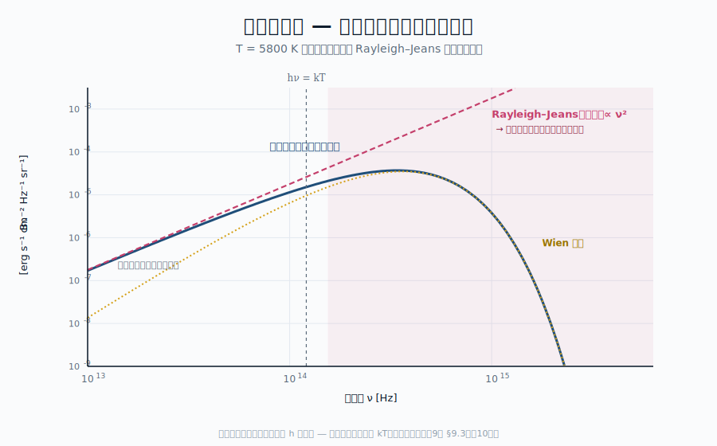

::: {.chapter-overview}
**この章の主題**：第III部までで、観測される黒体スペクトルが熱平衡にある光子気体の **Bose 統計** から導かれることを見た。しかし、その手前で **古典論（古典電磁気＋古典統計）だけで黒体スペクトルを説明しようとすると、なぜ失敗するのか** を本章で明示的に追体験する。「紫外線破綻」（**ultraviolet catastrophe**）と呼ばれる発散現象が、観測スペクトルとどう決定的に矛盾するのかを示し、量子論を要請せざるを得なくなった歴史的・論理的な瞬間を再現する。第10章のプランクの量子仮説、第11章の Einstein の方法は、いずれもこの破綻から出発する。
:::

## この章の中心地図 {#sec-classical-failure-map .unnumbered}



::: {.callout-note}
**方針**：本章では、強調された **Planck 定数 $h$** を**まだ持っていない**という設定で議論を進める。つまり「古典電磁気＋古典統計」だけで放射場のスペクトルを計算してみる。結果として、観測との決定的な矛盾が出る ― それが量子論を要請する観測上の根拠である。
:::

## この章で答える問い {#sec-classical-failure-questions .unnumbered}

::: {.callout-question}
- 空洞中の電磁波を古典統計で扱うと、なぜ全エネルギーが発散してしまうのか
- Rayleigh–Jeans 則が低振動数側ではよく合うのに、高振動数側で失敗するのはなぜか
- 「紫外線破綻」と呼ばれる現象は、観測スペクトルのどの形と矛盾するのか
- この破綻を回避するために、何を変えなければならなかったのか
:::

## 到達目標 {#sec-classical-failure-goals .unnumbered}

この章を読み終えると、読者は次のことができるようになる：

- 古典電磁気＋古典統計で Rayleigh–Jeans 則が導かれる筋道をたどれる
- 紫外線破綻の物理的起源を、エネルギー等分配定理から説明できる
- 量子仮説の必然性を、観測との矛盾から論じられる

---

## 9.1 空洞モードの数え上げ ― 古典電磁気の準備 {#sec-classical-failure-modes}

[本文目安：B3]

古典の議論を始めるには、まず**空洞中にどんな電磁波（モード, mode）が存在できるか**を数える必要がある。

辺長 $L$ の立方体空洞を考え、壁が完全導体だと仮定する。電場が壁面で消えるという境界条件から、許される定在波の波数は

$$
\mathbf{k} = \frac{\pi}{L} (n_x, n_y, n_z), \qquad n_x, n_y, n_z = 1, 2, 3, \ldots
$$ {#eq-cavity-wavevector}

の形に制限される。波数 $k = |\mathbf{k}|$ が $k$ 未満であるモード数を数えると、立体角を考慮した結果として、**波数空間の体積**を使って数えられる。

詳細は第V部・第14章で本格的に導く（**本章では結果だけ借用する**）。**振動数 $\nu$ あたりの単位体積あたりのモード数**は

$$
g(\nu) = \frac{8\pi \nu^2}{c^3}
$$ {#eq-mode-density-borrowed}

である。係数 $8\pi$ には電磁波の**偏光自由度 $\times 2$** が入っている。この $\nu^2$ という振動数の冪が、本章の議論の核心になる。

::: {.callout-note}
**方針**：@eq-mode-density-borrowed の導出には**量子論は一切要らない**。古典電磁気と境界条件だけで出る幾何的な数え上げである。第V部・第14章で本格的に導出するが、本章では「古典電磁気が許す結果」として受け入れる。
:::

::: {.callout-tip appearance="simple"}
**問い**：なぜ三次元空間でモード密度が $\nu^2$ に比例するのか？

**短答**：波数空間の球殻 $4\pi k^2 dk$ に許されるモードがあるから。$k = 2\pi\nu/c$ なので $k^2 dk \propto \nu^2 d\nu$。

**もう一歩**：一般に $d$ 次元では $g(\nu) \propto \nu^{d-1}$。三次元の宇宙では $\nu^2$、二次元なら $\nu$、一次元なら定数。この幾何的事実が、観測される黒体スペクトルの低振動数側 $B_\nu \propto \nu^2$ の振る舞いを直接決定している。
:::

## 9.2 エネルギー等分配定理と Rayleigh–Jeans 則 {#sec-classical-failure-rayleigh-jeans}

[本文目安：B3]

次に、各モードに**平均でどれだけのエネルギー**が分配されるかを古典統計で求める。

古典統計力学の中心定理 ― **エネルギー等分配定理**（**equipartition theorem**, 第7章 §7.6）― によれば、二次形式で書ける自由度ひとつあたりに $\frac{1}{2} k_B T$ が分配される。電磁波の各モードは調和振動子と等価で、$E = \frac{1}{2}(p^2/m) + \frac{1}{2}(m\omega^2 q^2)$ という **二つの二次形式の和**（運動量項と位置項）― あるいは電磁場の言葉では電場と磁場のエネルギー密度 $\frac{\epsilon_0}{2}|\mathbf{E}|^2 + \frac{1}{2\mu_0}|\mathbf{B}|^2$ の二つ ― として書ける。それぞれに $\frac{1}{2}k_B T$ が分配されるので、**各モードに合計 $k_B T$ が分配される**：

$$
\langle E_\text{mode} \rangle_\text{classical} = k_B T
$$ {#eq-equipartition-mode}

これと @eq-mode-density-borrowed を組み合わせると、振動数 $\nu$ あたりのエネルギー密度は

$$
u_\nu^\text{RJ}(T) = g(\nu) \cdot \langle E_\text{mode} \rangle = \frac{8\pi \nu^2}{c^3} \cdot k_B T
$$ {#eq-rayleigh-jeans-energy-density}

そして比強度に直すと

$$
B_\nu^\text{RJ}(T) = \frac{c}{4\pi} u_\nu^\text{RJ} = \frac{2\nu^2}{c^2} k_B T
$$ {#eq-rayleigh-jeans-bnu}

これが **Rayleigh–Jeans 則**（**Rayleigh–Jeans law**）である。古典電磁気＋古典統計だけから出た、放射場のスペクトルの予言である。

::: {.callout-note}
**対応（観測）**：第2章 §2.5 で見たように、@eq-rayleigh-jeans-bnu は**観測されるプランク分布の低振動数極限 $h\nu \ll k_B T$ と一致する**。電波天文学はほぼ常にこの極限で観測しており、Rayleigh–Jeans は実用的に正しい。問題は次節で見るように、**高振動数側で破綻する**こと。
:::

## 9.3 紫外線破綻 ― 全エネルギーの発散 {#sec-classical-failure-uv-catastrophe}

[本文目安：B3]

{#fig-uv-catastrophe width=90%}

@eq-rayleigh-jeans-energy-density を**全振動数で積分**して、放射場の全エネルギー密度 $u$ を計算しようとすると

$$
u_\text{classical} = \int_0^\infty u_\nu^\text{RJ} \, d\nu = \frac{8\pi k_B T}{c^3} \int_0^\infty \nu^2 \, d\nu = \infty
$$ {#eq-uv-catastrophe}

積分は高振動数（紫外〜X線〜ガンマ線）側で**発散**する。これが **紫外線破綻**（**ultraviolet catastrophe**）である。

物理的にこれが意味するのは、「温度 $T$ の空洞は無限大のエネルギー密度を持つ」「電球を点けたら無限の紫外線・X 線が出る」 ― 観測される現実とまったく合わない結論である。

観測との矛盾を具体的に見ると：

| 量 | 観測 | 古典予言 |
|---|---|---|
| 全エネルギー密度 $u(T)$ | $aT^4$（有限）| 無限大 |
| ピーク振動数 | $\nu_\text{peak} \propto T$（Wien 則）| ピーク自体が存在しない |
| 高振動数側の振る舞い | $e^{-h\nu/k_B T}$ で指数減衰 | $\nu^2$ で単調増加 |

特に「ピークが存在しない」「指数減衰がない」という二点は、第1章で見た**観測される黒体スペクトル**と決定的に矛盾する。

::: {.callout-tip appearance="simple"}
**問い**：紫外線破綻はどの観測事実から致命的に証明されるのか？

**短答**：恒星のスペクトルがピークを持つこと、CMB が完全な黒体形を取ること、地上で測られる空洞放射のスペクトル形 ― いずれも有限のピークと指数減衰を示す。古典論ではこれらが一切説明できない。

**もう一歩**：歴史的には Rubens & Kurlbaum (1900) の長波長黒体スペクトルの精密測定が決め手となった。Planck はこのデータを再現するために量子仮説を立てた（第10章）。観測が理論を駆動した古典的な例である。
:::

## 9.4 何が足りなかったのか ― 等分配の物理的前提 {#sec-classical-failure-missing}

[本文目安：B3]

紫外線破綻はどこから来たか。@eq-equipartition-mode の「各モードに $k_B T$」という等分配定理に**穴がある**。等分配定理が成立する前提は：

1. **エネルギーが連続的にやりとりできる**：粒子間の衝突や相互作用で、任意の小さなエネルギー単位でやりとりが起きる
2. **エネルギーが Maxwell-Boltzmann 分布に従う**：状態数密度が均一で、状態間の遷移が自由

ここで重要なのは前提 1 である。古典物理では「エネルギーは連続量」と暗黙に仮定している。しかしもしエネルギーが**離散単位** $\epsilon$ でしかやりとりできず、しかも $\epsilon \gg k_B T$ となる場面では：

- そのモードを励起するために必要なエネルギー $\epsilon$ がほとんど常に手に入らない
- 平均してそのモードに行くエネルギーは $k_B T$ よりも遥かに小さくなる
- 高振動数側のモードが「凍結」（freeze out）する

これが**紫外線破綻を救う鍵**である。すなわち、放射のエネルギーがある離散単位 $\epsilon(\nu)$ でやりとりされ、しかも $\epsilon(\nu)$ が振動数 $\nu$ とともに増える ― 具体的には $\epsilon \propto \nu$ ― なら、高振動数側のモードが熱力学的に届かなくなる。これが Planck (1900) のたどり着いた仮説で、第10章で本格的に扱う。

::: {.callout-note}
**注意（理論）**：「等分配が破綻する」という現象は、黒体放射以外にも現れる。低温での**固体の比熱**（Debye/Einstein モデル）、二原子分子の**回転・振動自由度の凍結**、Bose–Einstein 凝縮など、量子効果が顔を出すすべての場面で同じ構造が現れる。黒体放射は最も歴史的に重要な例である。
:::

## 9.5 量子仮説の必然性 ― 第10・11章への入口 {#sec-classical-failure-necessity}

[本文目安：B3]

ここまでの議論をまとめると、観測される黒体スペクトルを古典論で説明できない理由は次のように要約される：

1. 空洞の電磁モード密度 $g(\nu) \propto \nu^2$ そのものは古典電磁気で正しく出る（第V部）
2. 各モードの平均エネルギーを古典統計で $k_B T$ と置く（等分配定理）と、$u_\nu \propto \nu^2$ が出てしまう
3. これを全振動数で積分すると $u = \infty$（紫外線破綻）
4. 観測される高振動数の指数減衰を再現するには、**等分配を破る何か**が必要

ここから出る論理的選択肢は限られる。一つは**エネルギー単位の離散化**（Planck の量子仮説、第10章）。もう一つは**光が粒子としてふるまう**こと（Einstein の光量子、第11章）。両者は等価で、結局は同じプランク分布に至るが、思考の出発点が違う。

両方のルートは、本書の三原則のうち「② 背景物理を曖昧にしない」を実装する重要な複線である。第10章でプランクの方法を、第11章で Einstein の方法をたどることで、プランク分布の **占有因子 $1/(e^{h\nu/k_B T}-1)$** がどちらのルートからも必然として出ることを確認する。第8章では Bose 統計から導いた占有因子が、二つの別の角度からも再導出される。

::: {.callout-note}
**使えるようになった道具**（§9.1〜9.5）：

- 空洞の電磁モード密度 $g(\nu) = 8\pi\nu^2/c^3$ は古典電磁気の結果として理解できる（第V部で本格導出）
- Rayleigh–Jeans 則 @eq-rayleigh-jeans-bnu は等分配定理から出る古典の結果で、低振動数極限では観測と合う
- 紫外線破綻は等分配定理が高振動数モードに無条件で適用されることに由来する。これを救う鍵は **エネルギーの離散化**
:::

---

## この章で何がわかったか {#sec-classical-failure-summary .unnumbered}

::: {.callout-summary}
**中心地図に戻る**

本章で、中心地図プランク関数の前因子に現れる $\nu^2$ が**古典電磁気のモード密度に由来する**ことを確認した。一方で、各モードの平均エネルギーを古典統計で $k_B T$ と置くと**観測スペクトルが再現できない**（紫外線破綻）。

中心地図の指数関数因子 $1/(e^{h\nu/k_B T}-1)$（占有因子）には、古典では出てこない**離散的なエネルギー量子 $h\nu$** が含まれる。この $h$ こそが、本部で逆引きする対象である。

**次章へ**：第10章で Planck の量子仮説 ― 振動子のエネルギーが $h\nu$ の整数倍に限られるという思い切った仮定 ― を導入し、これがプランク分布を再現することを示す。歴史的には Planck (1900) の論文に当たる。
:::

## 演習問題 {#sec-classical-failure-exercises .unnumbered}

以下の問題は、本文で省いた式の導出を補う問題（[tag:導出補完]）と、本文で得た道具を別の角度から使って理解を深める問題（[tag:理解を深める]）から成る。各問の **模範解答** は折りたたみを展開して確認できる（オンライン版）。まず自力で解いてから開くこと。

### 問題 9-1　空洞モード密度 $g(\nu)=8\pi\nu^2/c^3$ の数え上げ {#ex-9-1 .unnumbered}

[★ 難易度：☆☆ ] [tag:導出補完]

本文 §9.1 はモード密度 $g(\nu)=8\pi\nu^2/c^3$ を「第14章で本格導出する結果」として借用している。この幾何的な数え上げを自分で再現せよ。辺長 $L$ の立方体（完全導体壁）で許される波数は

$$
\mathbf{k}=\frac{\pi}{L}(n_x,n_y,n_z),\qquad n_x,n_y,n_z=1,2,3,\dots
$$

1. 波数の大きさが $k$ 未満のモード総数 $N(k)$ を、$\mathbf{k}$ 空間の「格子セル体積」と「正の八分球の体積」から求めよ。偏光自由度 $\times 2$ を忘れぬこと。
2. $k=2\pi\nu/c$ を使って単位体積あたりのモード数を $\nu$ の関数で表し、$g(\nu)=dN/(L^3\,d\nu)=8\pi\nu^2/c^3$ を示せ。
3. 係数 $8\pi$ のうち、どの因子が「3次元」に、どの因子が「偏光」に由来するか説明せよ。

**関連**：[§9.1 空洞モードの数え上げ](#sec-classical-failure-modes)／本格導出は[第14章 空洞モード](../part5/14-cavity-modes.qmd)。

::: {.callout-derive collapse="true"}
## 模範解答（問題 9-1）

**(1)** 各 $(n_x,n_y,n_z)$ は正の整数なので、許される波数ベクトルは $\mathbf{k}$ 空間で間隔 $\pi/L$ の格子点を、第1八分象限（すべて正）に限って占める。1モードあたりの格子セル体積は $(\pi/L)^3$。大きさ $k$ 未満の領域は半径 $k$ の球の正の八分の一、体積 $\frac{1}{8}\cdot\frac{4}{3}\pi k^3$。偏光2状態を掛けて

$$
N(k)=2\times\frac{\frac{1}{8}\cdot\frac{4}{3}\pi k^3}{(\pi/L)^3}=2\times\frac{\pi k^3 L^3}{6\pi^3}=\frac{L^3 k^3}{3\pi^2}.
$$

**(2)** 単位体積あたり $n(k)=N/L^3=k^3/(3\pi^2)$。$k=2\pi\nu/c$ を代入すると

$$
n(\nu)=\frac{1}{3\pi^2}\left(\frac{2\pi\nu}{c}\right)^3=\frac{8\pi^3\nu^3}{3\pi^2 c^3}=\frac{8\pi\nu^3}{3c^3}.
$$

$$
g(\nu)=\frac{dn}{d\nu}=\frac{8\pi\nu^2}{c^3}.
$$

**(3)** $\nu^2$ は3次元波数空間の球殻 $4\pi k^2\,dk$（次元 $d$ なら $k^{d-1}$）に由来する幾何因子。係数の $2$（$8\pi=2\times4\pi$ の $2$）は電磁波の横波2偏光に由来する。

**答え**：$N(k)=L^3k^3/3\pi^2$、よって $g(\nu)=8\pi\nu^2/c^3$。$\nu^2$＝3次元の幾何、係数の $2$＝偏光自由度。
:::

### 問題 9-2　古典分配関数から $\langle E_{\rm mode}\rangle=k_BT$ {#ex-9-2 .unnumbered}

[★ 難易度：☆ ] [tag:導出補完]

§9.2 は等分配定理で各モードに $k_BT$ が分配されると述べた。これを古典分配関数から直接導け。モードは調和振動子 $E=\dfrac{p^2}{2m}+\dfrac{1}{2}m\omega^2 q^2$ と等価である。

1. 古典分配関数 $Z=\dfrac{1}{h_0}\displaystyle\int e^{-\beta E}\,dq\,dp$（$\beta=1/k_BT$）を計算し、$Z\propto\beta^{-1}$ を示せ。
2. $\langle E\rangle=-\partial\ln Z/\partial\beta$ から $\langle E\rangle=k_BT$ を導け。
3. この「2つの二次形式に各 $\frac12 k_BT$」という結果を、3次元の自由粒子（並進運動エネルギーのみ）の $\frac32 k_BT$ と対比して、なぜ振動子は $k_BT$ なのかを一言で説明せよ。

**関連**：[§9.2 等分配と Rayleigh–Jeans](#sec-classical-failure-rayleigh-jeans)／等分配定理は[第7章 §7.6](../part3/07-statistical-mechanics.qmd)。この古典結果を量子化したものが[§10.2](../part4/10-planck-quantum.qmd#sec-planck-quantum-oscillator)の[演習 10-1](../part4/10-planck-quantum.qmd#ex-10-1)。

::: {.callout-derive collapse="true"}
## 模範解答（問題 9-2）

**(1)** 位置と運動量の積分が分離する：

$$
Z=\frac{1}{h_0}\int_{-\infty}^{\infty}e^{-\beta p^2/2m}dp\int_{-\infty}^{\infty}e^{-\beta m\omega^2 q^2/2}dq.
$$

ガウス積分 $\int e^{-a x^2}dx=\sqrt{\pi/a}$ を用いると、各因子は $\sqrt{2\pi m/\beta}$ と $\sqrt{2\pi/(\beta m\omega^2)}$。積は

$$
Z=\frac{1}{h_0}\sqrt{\frac{2\pi m}{\beta}}\sqrt{\frac{2\pi}{\beta m\omega^2}}=\frac{2\pi}{h_0\omega}\cdot\frac{1}{\beta}\;\propto\;\beta^{-1}.
$$

**(2)** $\ln Z=-\ln\beta+\text{const}$ なので

$$
\langle E\rangle=-\frac{\partial\ln Z}{\partial\beta}=\frac{1}{\beta}=k_BT.
$$

2つの二次形式（$p^2$ と $q^2$）が各 $\beta^{-1/2}$ を生み、合わせて $\beta^{-1}$ ＝ $k_BT$。

**(3)** 等分配は「ハミルトニアン中の二次形式1つあたり $\frac12 k_BT$」を与える。自由粒子は運動量の二次形式が3つ（$p_x^2,p_y^2,p_z^2$）で $\frac32 k_BT$。振動子は運動量＋位置で二次形式が2つなので $k_BT$。位置に対する復元力（ポテンシャル項）があることが差を生む。

**答え**：$Z\propto\beta^{-1}\Rightarrow\langle E\rangle=k_BT$。二次形式2個（運動＋ポテンシャル）ゆえ自由粒子の $\frac32k_BT$ と異なる。
:::

### 問題 9-3　紫外発散の「次数」とカットオフ依存性 {#ex-9-3 .unnumbered}

[★ 難易度：☆☆ ] [tag:理解を深める]

§9.3 は $u_{\rm classical}=\int_0^\infty u_\nu^{\rm RJ}d\nu=\infty$ を示した。なぜ「紫外線」破綻と呼ぶのかを定量的に確かめる。

1. 人工的な上限 $\nu_{\max}$ を導入し、全エネルギー密度が $u(\nu_{\max})=\dfrac{8\pi k_BT}{3c^3}\nu_{\max}^3$ となることを示せ。発散は $\nu_{\max}\to\infty$ でどんな冪で増えるか。
2. エネルギーがどの振動数帯に集中するかを「$d u/d\nu\propto\nu^2$ が単調増加」という事実から論じ、なぜ高振動数（紫外）側が破綻の原因かを述べよ。
3. プランク分布 $u_\nu\propto\nu^3/(e^{h\nu/k_BT}-1)$ ではこの積分が収束する理由を、被積分関数の $\nu\to\infty$ での振る舞いから説明せよ。

**関連**：[§9.3 紫外線破綻](#sec-classical-failure-uv-catastrophe)／収束する全積分（Stefan–Boltzmann）は[演習 10-3](../part4/10-planck-quantum.qmd#ex-10-3)、本文[§10.3](../part4/10-planck-quantum.qmd#sec-planck-quantum-derivation)。

::: {.callout-derive collapse="true"}
## 模範解答（問題 9-3）

**(1)** $u_\nu^{\rm RJ}=\dfrac{8\pi\nu^2}{c^3}k_BT$ を $0$ から $\nu_{\max}$ まで積分：

$$
u(\nu_{\max})=\frac{8\pi k_BT}{c^3}\int_0^{\nu_{\max}}\nu^2 d\nu=\frac{8\pi k_BT}{3c^3}\nu_{\max}^3.
$$

発散は $\nu_{\max}^3$ の3次冪。カットオフを2倍にすると寄与が8倍になる。

**(2)** エネルギー密度の振動数あたり寄与 $du/d\nu\propto\nu^2$ は $\nu$ とともに単調増加し、上限近傍が積分を支配する。すなわちエネルギーは常に「いちばん高い振動数帯」に集中する。古典論には上限がないので、紫外〜X線〜ガンマ線側がいくらでも寄与を積み増し、発散する。これが「紫外線」破綻の名の由来。

**(3)** プランクでは被積分関数が $\nu\to\infty$ で

$$
\frac{\nu^3}{e^{h\nu/k_BT}-1}\;\sim\;\nu^3 e^{-h\nu/k_BT}\to 0
$$

と指数的に抑えられる。指数減衰は任意の冪 $\nu^3$ に勝つので積分は収束し、有限の $u=aT^4$ を与える（[演習 10-3](../part4/10-planck-quantum.qmd#ex-10-3)）。量子化によるエネルギー単位 $h\nu$ が高振動数モードを「凍結」させることが、収束の物理的理由である。

**答え**：$u\propto\nu_{\max}^3$ で発散、寄与は高振動数に集中（＝紫外破綻）。プランクは $\nu^3e^{-h\nu/k_BT}\to0$ で収束。
:::

### 問題 9-4　破綻の「責任の所在」― モード密度か等分配か {#ex-9-4 .unnumbered}

[★ 難易度：☆☆ ] [tag:理解を深める]

§9.4–9.5 の論理を整理する問いである。

1. Rayleigh–Jeans 則 $u_\nu^{\rm RJ}=g(\nu)\langle E\rangle$ を構成する2因子のうち、量子論で「変えなくてよい」のはどちらで、「変えなければならない」のはどちらか。理由とともに述べよ。
2. 観測される黒体スペクトル（第1章）が古典論を致命的に否定する2つの特徴を挙げよ。
3. もしエネルギー単位が $\epsilon=h\nu$（$\propto\nu$）でなく $\nu$ に依らない定数 $\epsilon_0$ だったら、高振動数モードの凍結は起きるか。簡潔に論ぜよ。

**関連**：[§9.4 等分配の前提](#sec-classical-failure-missing)、[§9.5 量子仮説の必然性](#sec-classical-failure-necessity)／観測の特徴は[第1章](../part1/01-where-blackbody.qmd)。

::: {.callout-derive collapse="true"}
## 模範解答（問題 9-4）

**(1)** **モード密度 $g(\nu)=8\pi\nu^2/c^3$ は変えなくてよい**。これは古典電磁気＋境界条件の幾何的結果で、量子論を要しない（実際プランク分布の前因子 $\nu^2$/$\nu^3$ はこれが起源）。**変えるべきは各モードの平均エネルギー $\langle E\rangle$**。等分配の $k_BT$（エネルギー連続の仮定に依存）を、量子化された $h\nu/(e^{h\nu/k_BT}-1)$ に置き換える必要がある。

**(2)** ① スペクトルに有限のピークが存在する（古典は単調増加でピークなし）。② 高振動数側が指数的に減衰する（古典は $\nu^2$ で増大）。CMB の完全な黒体形や恒星スペクトルがこれを示す。

**(3)** 起きない。凍結は「エネルギー単位 $\epsilon(\nu)$ が高振動数で $k_BT$ を超える」ことで生じる。$\epsilon_0$ が定数なら、$\epsilon_0\ll k_BT$ を満たす限りすべての振動数で等分配 $k_BT$ が回復し、$\nu\to\infty$ でもモードが凍結せず発散は残る。$\epsilon\propto\nu$ という**振動数に比例して増える単位**であることが、高振動数を選択的に止める鍵である。

**答え**：$g(\nu)$ は不変、$\langle E\rangle$ を量子化。否定する観測＝ピークの存在と指数減衰。$\epsilon\propto\nu$ でないと凍結は起きない。
:::

## さらに学ぶための参考文献 {#sec-classical-failure-further .unnumbered}

- Pais, *Subtle is the Lord* (Oxford, 1982) — Planck・Einstein の量子論誕生の歴史的精査
- Rybicki & Lightman, *Radiative Processes in Astrophysics* (Wiley, 1979) — §1.5「Blackbody Radiation」
- Kuhn, *Black-Body Theory and the Quantum Discontinuity, 1894-1912* (Oxford, 1978) — 黒体放射と量子論誕生の科学史
