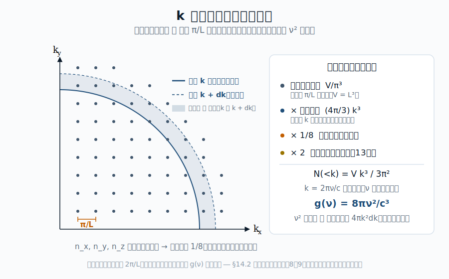

::: {.chapter-overview}
**この章の主題**：第I〜IV部で構築してきた逆引きの **最後のピース**が本章である。第13章で準備した Maxwell 方程式と完全導体壁の境界条件から、空洞中の電磁モードを数え上げ、**モード密度 $g(\nu) = 8\pi\nu^2/c^3$** を本格的に導出する。これが第8〜10章で「借用」してきた式の起源である。導出が終われば、プランク分布

$$B_\nu(T) = \frac{2h\nu^3}{c^2} \cdot \frac{1}{e^{h\nu/k_BT}-1}$$

の**前因子と指数因子の両方**が、観測から逆向きに完全に説明されたことになる。本章は第V部の到達点であると同時に、第I〜V部全体（観測 → 物理）の逆引き総まとめでもある。
:::

## この章の中心地図 {#sec-cavity-modes-map .unnumbered}



::: {.callout-note}
**方針**：本章の結末で、強調された $\nu^3$ が「**モード密度 $\nu^2$（本章で導出）× 光子のエネルギー $h\nu$（第IV部）**」の積として完全に逆引きされる。第I〜V部の物理的逆引きはここで一度閉じる。
:::

## この章で答える問い {#sec-cavity-modes-questions .unnumbered}

::: {.callout-question}
- 空洞中の電磁波には、どんな「許される」状態が何個あるのか
- なぜ三次元空間ではモード密度が $\nu^2$ に比例するのか
- プランク分布の前因子 $2h\nu^3/c^2$ は、モード密度と何の積から来るのか
- 偏光自由度がモードの数え上げにどう効くのか
:::

## 到達目標 {#sec-cavity-modes-goals .unnumbered}

この章を読み終えると、読者は次のことができるようになる：

- 空洞中の電磁モードを境界条件のもとで列挙し、状態密度を導出できる
- モード密度 $\propto \nu^2$ が三次元の幾何から来ることを示せる
- プランク分布の三層構造（熱平衡・量子化・モード密度）の最後のピースを埋められる

---

## 14.1 空洞中の定在波 ― 境界条件と量子化 {#sec-cavity-modes-standing-waves}

[本文目安：B2-B3]

辺長 $L$ の立方体空洞を考える。壁は完全導体（第13章 §13.6）。三軸方向を $x, y, z$ とし、原点を空洞の隅にとる。

第13章の平面波解 @eq-plane-wave をそのまま入れると壁の境界条件を満たさない。代わりに、**定在波**（**standing wave**）の重ね合わせとして電場を書く。電場の $x$ 成分は、壁 $y = 0, L$ と $z = 0, L$ で接線方向（$E_\parallel = 0$）の条件から

$$
E_x(\mathbf{r}, t) \propto \cos(k_x x) \sin(k_y y) \sin(k_z z) \, e^{-i\omega t}
$$ {#eq-Ex-standing-wave}

の形になる（$E_y, E_z$ も同様に対称な形）。境界条件 $\sin(k_i L) = 0$ から、許される波数成分は

$$
k_x = \frac{n_x \pi}{L}, \quad k_y = \frac{n_y \pi}{L}, \quad k_z = \frac{n_z \pi}{L}
$$ {#eq-allowed-k}

ここで $n_x, n_y, n_z$ は**正の整数**（$n_i = 1, 2, 3, \ldots$）。$n_x = n_y = n_z = 0$ では全成分が消えて自明だが、軸成分の一部だけが 0 になる場合（例：$n_x = 0$, $n_y, n_z \ge 1$）は厳密には残る偏光自由度が一つで生き残る。ただし全モード数の中でこれらは「境界の格子点」上の有限個に過ぎず、熱力学極限（$V \to \infty$）でモード密度には寄与しない（次節以降の積分で測度ゼロ）。本書では §14.2 以降の数え上げで $n_i \ge 1$ のみを扱う。

**重要なポイント**：境界条件が、本来連続だった波数 $\mathbf{k}$ を**離散的な格子点**に量子化した。これは Planck の量子化（第10章）とは別の意味の「量子化」 ― 古典電磁気と境界条件だけから出る幾何学的離散化である。

::: {.callout-note}
**用語**：「量子化」という言葉は、本書ではここまで二度の意味で使われている：

1. **エネルギー量子化**（第10〜12章）：エネルギーが $h\nu$ の整数倍に離散化される。**量子論固有**の現象
2. **モード量子化**（本節）：波数 $\mathbf{k}$ が境界条件で離散化される。**古典的幾何**の現象

両者は別物だが、最終的に第VIII部の電磁場の量子化で統合される（各「離散的モード」が「量子化された調和振動子」となり、その励起準位が光子数）。
:::

## 14.2 許される波数の数え上げ ― $k$ 空間の格子 {#sec-cavity-modes-k-counting}

[本文目安：B3]

@eq-allowed-k で許される $(n_x, n_y, n_z)$ の組は、**正の整数の三つ組**である。これらを **波数空間**（**k-space**）にプロットすると、原点付近に格子点が並ぶ。

{#fig-k-space width=88%}

格子間隔は各軸方向に $\pi/L$。したがって、波数空間における**単位体積あたりの格子点密度**は

$$
\rho_{k\text{-space}} = \frac{1}{(\pi/L)^3} = \frac{L^3}{\pi^3} = \frac{V}{\pi^3}
$$ {#eq-k-space-density}

ここで $V = L^3$ は空洞の体積。

**波数の大きさ** $k = |\mathbf{k}| = \sqrt{k_x^2 + k_y^2 + k_z^2}$ が $k$ 未満であるモードの個数は、波数空間で**半径 $k$ の球の体積**を考えればよい。ただし格子点は正の整数のみなので、**第一象限（octant, 1/8 のみ）**を取る：

$$
N_\text{mode}^{(1)}(<k) = \rho_{k\text{-space}} \cdot \frac{1}{8} \cdot \frac{4\pi k^3}{3} = \frac{V k^3}{6\pi^2}
$$ {#eq-mode-count-k-onepol}

ここで指数 (1) は「偏光自由度を考慮していない」ことを表す（次節で考慮）。

::: {.callout-tip appearance="simple"}
**問い**：なぜ「1/8 倍」が必要なのか？ 全球面 $4\pi k^3/3$ で何が間違うのか？

**短答**：許される $\mathbf{k}$ は $n_x, n_y, n_z > 0$ のみ。$\mathbf{k}$ と $-\mathbf{k}$ は同じ定在波を生む（$\cos(k_x x) = \cos(-k_x x)$）ので、両方を独立に数えると過大評価になる。波数空間の第一象限だけが独立なモードを表す。

**もう一歩**：もし周期境界条件（壁ではなく端と端をつなぐ）にすると、$\mathbf{k}$ は正負両方とり、格子間隔は $2\pi/L$ に変わる。両方法は最終的に同じモード密度を与える ― 「壁にどう接続するか」は最終結果に効かない。これは第3章の「黒体放射の普遍性」を逆手にとった計算戦略である。
:::

## 14.3 偏光自由度 ― 横波の2倍 {#sec-cavity-modes-polarization}

[本文目安：B2-B3]

第13章 §13.4 で見たように、与えられた $\mathbf{k}$ ベクトルに対し、独立な偏光方向は**二つ**ある（横波条件）。

@eq-mode-count-k-onepol に偏光自由度を掛けて：

$$
N_\text{mode}(<k) = 2 \cdot \frac{V k^3}{6\pi^2} = \frac{V k^3}{3\pi^2}
$$ {#eq-mode-count-k}

これが波数 $k$ 未満のモードの総数。$V$ に比例するのは、大きな空洞ほどモード数が多いという当然の結果。

::: {.callout-note}
**対応（観測）**：この因子 2 が、プランク分布の前因子 $2h\nu^3/c^2$ の先頭の 2 に直接対応する。観測される黒体スペクトル ― CMB であれ恒星であれ ― は、すべて電磁波が横波であるという**幾何的事実**を反映している。
:::

## 14.4 振動数空間に変換 ― モード密度の正体 {#sec-cavity-modes-frequency}

[本文目安：B3]

波数 $k$ と振動数 $\nu$ は第13章の分散関係 @eq-dispersion-relation で結ばれる：$k = 2\pi\nu/c$。@eq-mode-count-k に代入して

$$
N_\text{mode}(<\nu) = \frac{V}{3\pi^2} \left(\frac{2\pi\nu}{c}\right)^3 = \frac{8\pi V \nu^3}{3 c^3}
$$ {#eq-mode-count-nu}

これが振動数 $\nu$ 未満のモードの総数。微分して **振動数あたり・単位体積あたりのモード密度** を得る：

$$
g(\nu) = \frac{1}{V} \frac{dN_\text{mode}}{d\nu} = \frac{8\pi \nu^2}{c^3}
$$ {#eq-mode-density}

これが第8章 @eq-photon-energy-density と第9章 @eq-mode-density-borrowed で**借用**していた式である。本章で本格的に逆引きが完了した。

**$\nu^2$ の起源を辿る**：

| 因子 | 起源 |
|---|---|
| $\nu^2$ | $k$ 空間の球の体積 $k^3$ を微分（三次元空間） |
| $8\pi$ | $4\pi/3$（球の体積） × $1/8$（第一象限） × $2$（偏光自由度） × $(2\pi)^3/\pi^3$（$k = 2\pi\nu/c$ の三乗が格子密度 $\pi^{-3}$ と打ち消し合い、$2^3$ が残る） |
| $1/c^3$ | 分散関係 $k = 2\pi\nu/c$ から |

::: {.callout-tip appearance="simple"}
**問い**：なぜ三次元空間でモード密度が $\nu^2$ なのか？ 他の次元では？

**短答**：$d$ 次元空間では、$k$ 空間の球の表面積は $\propto k^{d-1}$。これに対応してモード密度は $\nu^{d-1}$。三次元なら $\nu^2$、二次元なら $\nu$、一次元なら定数。

**もう一歩**：もし宇宙が二次元空間だったら、モード密度は $g(\nu) \propto \nu/c^2$ となり（$d$ 次元では $\nu^{d-1}/c^d$）、プランク分布の前因子は $2h\nu^3/c^2$ ではなく $\propto h\nu^2/c^2$ の形をとる。黒体スペクトル全体の形（Rayleigh-Jeans 側のべき・ピーク位置・Wien 側の減衰）は完全に違うものになる。**観測される黒体スペクトルの形には、私たちが三次元空間に住んでいるという情報が組み込まれている**。
:::

## 14.5 プランク分布の前因子への合流 ― 第I〜V部の総まとめ {#sec-cavity-modes-bnu-derivation}

[本文目安：B3｜導出：M1]

モード密度 @eq-mode-density を、第8章で立ち上げた**振動数あたりエネルギー密度**の表式に代入する。第8章 @eq-photon-energy-density から：

$$
u_\nu(T) = g(\nu) \cdot h\nu \cdot \bar{n}(\nu, T) = \frac{8\pi\nu^2}{c^3} \cdot h\nu \cdot \frac{1}{e^{h\nu/k_BT}-1}
$$ {#eq-uvalues}

整理すると

$$
u_\nu(T) = \frac{8\pi h\nu^3}{c^3} \cdot \frac{1}{e^{h\nu/k_BT}-1}
$$ {#eq-planck-energy-final}

比強度に変換する（等方放射場では $B_\nu = c\, u_\nu / 4\pi$、第4章 §4.3）：

$$
\boxed{
B_\nu(T) = \frac{2 h \nu^3}{c^2} \cdot \frac{1}{e^{h\nu/k_BT}-1}
}
$$ {#eq-planck-fully-derived}

**プランク分布が、観測から逆向きに完全に説明された。** 各因子の起源を一覧にまとめる：

| 因子 | 起源 | 章 |
|---|---|---|
| $1/(e^{h\nu/k_BT}-1)$ | 光子の Bose 統計＋ $\mu = 0$ | 第8章 |
| $h\nu$（指数中） | エネルギー量子化（Planck の仮説） | 第10章 |
| $h\nu$（前因子中） | 各モードの光子エネルギー | 第10章 |
| $\nu^2$（前因子中） | 三次元空洞のモード密度 | **本章** |
| $1/c^3$（モード密度から） | Maxwell 方程式の分散関係 | 第13章 |
| $2$（前因子の先頭） | 偏光自由度（横波） | 第13章 |
| 全体 $1/c^2$（$1/c^3 \cdot c$ から） | 光速度 ＋ $u_\nu \to B_\nu$ 変換 | 本章 |

これで第I〜V部の逆引きが完結する。

::: {.callout-tip}
**対応（観測）**：観測される黒体スペクトル ― CMB の 2.725 K の完璧な黒体形、太陽の $T \simeq 5800$ K の連続光、降着円盤の多温度合成、ダストの $30$ K 修正黒体 ― これらすべてが、上の表のすべての物理（電磁気・量子・統計）の**同時の結果**であることが、本章までの逆引きで明らかになった。**観測スペクトルの一本の曲線**から、現代物理学の主要分野が逆向きに再構成された。これが本書の方法論の到達点である。
:::

## 14.6 空洞放射からの「展望」 ― 第VI〜VIII部への橋 {#sec-cavity-modes-bridge}

[本文目安：B3-B4]

第I〜V部で確立した中心地図プランク分布を出発点として、本書は次の三方向に進む。

**第VI部（現実の宇宙へ戻る）**：プランク分布は理想的な完全熱平衡の式。現実の天体スペクトルがどう・なぜずれるかを扱う。修正黒体（ダスト）、灰色大気近似、多温度成分、コンプトン化、非熱的放射の混入 ― 観測スペクトルの解読に必要なすべての「ずれ」の物理。

**第VII部（線スペクトル）**：本書のもう一つの主柱。観測される線スペクトルの逆引き ― 原子物理、線形成、線形、観測応用 ― を、プランク分布と平行な構造で展開する。Einstein 係数（第11章）が二つの地図を結ぶ要として再登場する。

**第VIII部（QED の見通し）**：本章で行った「モード密度 × 量子振動子」を本格的に再定式化する。各電磁モードが**量子化された調和振動子**であり、励起準位が光子数。これにより本書の二つの中心地図（プランク関数と水素線吸収係数）が、同じ電磁場–物質相互作用の二側面として統合される。本章で借用していた **「ν² モード密度 × $h\nu$ エネルギー量子」** という組合せが、第24章で「電磁場の量子化」として整理し直される。

::: {.callout-note}
**使えるようになった道具**（§14.1〜14.6）：

- 空洞内の電磁定在波を境界条件のもとで数え上げる方法（k 空間の格子）
- モード密度 $g(\nu) = 8\pi\nu^2/c^3$ ― 第8〜10章で借用していた式が完全に説明された
- プランク分布の**すべての因子**が、観測から逆向きに既知の物理（電磁気＋統計力学＋量子論）で説明されたという事実
- 中心地図プランク関数を「観測の言葉」と「物理の言葉」のあいだの橋として完全に理解する
:::

---

## この章で何がわかったか {#sec-cavity-modes-summary .unnumbered}

::: {.callout-summary}
**中心地図に戻る・第I〜V部の総まとめ**

本章で、プランク分布の前因子 $2h\nu^3/c^2$ の最後のピース ― モード密度 $\nu^2$ ― が逆引きされた。これで中心地図プランク分布の**すべての因子**が、観測から逆向きに既知の物理で説明された。

第I部で「観測される黒体スペクトル」として現象を確認し、第II部で放射場の記述を整え、第III部で熱平衡と Bose 統計から指数関数因子を、第IV部でエネルギー量子化から $h\nu$ を、第V部で電磁モード密度から $\nu^2/c^3$ を導出した。観測の一本の曲線から、現代物理学の主要分野が逆向きに再構成されたことになる。

**次部以降**：これで第I〜V部の「連続スペクトル（黒体放射）の逆引き」は完結する。

- **第VI部** では、現実の天体でこの理想からどうずれるかを扱う
- **第VII部** では、もう一つの主柱**線スペクトル**の逆引きを展開する
- **第VIII部** では、QED で連続と線の両方の地図を統一する
:::

## 演習問題 {#sec-cavity-modes-exercises .unnumbered}

以下の問題は、本文で省いた式の導出を補う問題（[tag:導出補完]）と、本文で得た道具を別の角度から使って理解を深める問題（[tag:理解を深める]）から成る。各問の **模範解答** は折りたたみを展開して確認できる（オンライン版）。まず自力で解いてから開くこと。

### 問題 14-1　定在波と境界条件からモード密度 $8\pi\nu^2/c^3$ {#ex-14-1 .unnumbered}

[★ 難易度：☆☆☆ ] [tag:導出補完]

§14.1〜14.4 の数え上げを通しで再現する。辺長 $L$ の完全導体立方体。定在波 $E_x\propto\cos(k_xx)\sin(k_yy)\sin(k_zz)$ など。

1. 境界条件 $E_\parallel=0$ から許される波数が $k_i=n_i\pi/L$（$n_i=1,2,\dots$）になることを示せ。
2. $k$ 空間の格子点密度 $V/\pi^3$、第一象限（1/8 球）、偏光2を使い、$|\mathbf k|<k$ のモード数 $N(<k)=\dfrac{Vk^3}{3\pi^2}$ を導け。
3. 分散関係 $k=2\pi\nu/c$ を代入し $N(<\nu)=\dfrac{8\pi V\nu^3}{3c^3}$、微分して $g(\nu)=\dfrac{1}{V}\dfrac{dN}{d\nu}=\dfrac{8\pi\nu^2}{c^3}$ を導け。

**関連**：[§14.1 定在波](#sec-cavity-modes-standing-waves)、[§14.4 モード密度](#sec-cavity-modes-frequency)／同じ式を第9章側から導いたのが[演習 9-1](../part4/09-classical-failure.qmd#ex-9-1)。

::: {.callout-derive collapse="true"}
## 模範解答（問題 14-1）

**(1)** 壁 $y=0,L$ と $z=0,L$ で $E_x$ の接線成分がゼロ。$E_x\propto\sin(k_yy)\sin(k_zz)$ が $y,z=0$ で自動的にゼロ、$y,z=L$ でゼロには $\sin(k_iL)=0\Rightarrow k_iL=n_i\pi$。よって $k_i=n_i\pi/L$（$n_i=1,2,\dots$、各軸独立）。

**(2)** 格子間隔 $\pi/L$ ゆえ $k$ 空間の格子点密度 $1/(\pi/L)^3=V/\pi^3$（$V=L^3$）。$n_i>0$ なので半径 $k$ の球の第一象限（1/8）のみ：$\frac18\cdot\frac{4\pi k^3}{3}$。偏光2を掛けて

$$
N(<k)=2\cdot\frac{V}{\pi^3}\cdot\frac18\cdot\frac{4\pi k^3}{3}=\frac{Vk^3}{3\pi^2}.
$$

**(3)** $k=2\pi\nu/c$：

$$
N(<\nu)=\frac{V}{3\pi^2}\left(\frac{2\pi\nu}{c}\right)^3=\frac{8\pi V\nu^3}{3c^3},\qquad g(\nu)=\frac1V\frac{dN}{d\nu}=\frac{8\pi\nu^2}{c^3}.
$$

**答え**：$k_i=n_i\pi/L$、$N(<k)=Vk^3/3\pi^2$、$g(\nu)=8\pi\nu^2/c^3$。第9章の数え上げ（演習 9-1）と一致。
:::

### 問題 14-2　なぜ「1/8 倍」か ― $\pm\mathbf k$ の同一視 {#ex-14-2 .unnumbered}

[★ 難易度：☆☆ ] [tag:理解を深める]

§14.2 の問いを掘る。全球 $4\pi k^3/3$ をそのまま使うと過大評価になる。

1. なぜ許される $\mathbf k$ は第一象限（$n_x,n_y,n_z>0$）だけなのか。$\mathbf k$ と $-\mathbf k$ が同じ定在波を表すこと（$\cos(k_xx)=\cos(-k_xx)$）を使って説明せよ。
2. 周期境界条件（壁でなく端をつなぐ）にすると格子間隔が $2\pi/L$、$\mathbf k$ は正負両方をとる。この場合も同じ $g(\nu)$ になることを、両効果（間隔 $2$ 倍＝密度 $1/8$、全球を使う＝$\times8$）が打ち消すことから示せ。
3. 「壁にどう接続するか」が最終結果に効かないことが、第3章の黒体放射の普遍性とどう整合するか述べよ。

**関連**：[§14.2 波数の数え上げ](#sec-cavity-modes-k-counting)／普遍性は[§3.3](../part1/03-universality.qmd#sec-universality-cavity)（[演習 3-1](../part1/03-universality.qmd#ex-3-1)）。

::: {.callout-derive collapse="true"}
## 模範解答（問題 14-2）

**(1)** 定在波は $\cos(k_xx)$ や $\sin(k_xx)$ の形で、$k_x$ と $-k_x$ は同じ関数（偶／奇の符号差は振幅に吸収）を与え、物理的に同一のモード。$n_i$ を正負両方数えると同じモードを重複して数えることになる。独立なモードは $n_i>0$ の第一象限のみ。よって全球の 1/8。

**(2)** 周期境界条件では許される $k_i=2\pi n_i/L$（$n_i=0,\pm1,\pm2,\dots$）で格子間隔 $2\pi/L$（壁の場合の2倍）。格子点密度は $(L/2\pi)^3=V/8\pi^3$（壁の $V/\pi^3$ の 1/8）。一方 $\mathbf k$ は正負両方とるので全球 $4\pi k^3/3$（1/8 球の8倍）を使う。密度の $1/8$ と全球の $\times8$ が打ち消し、$N(<k)=2\cdot\frac{V}{8\pi^3}\cdot\frac{4\pi k^3}{3}=\frac{Vk^3}{3\pi^2}$ と同じ。

**(3)** 第3章では「空洞放射のスペクトルは壁の材質によらず一意」（熱力学第二法則）と示した。境界条件の選び方（完全導体壁 vs 周期境界）が $g(\nu)$ を変えないのは、まさにこの普遍性の現れ。計算の便宜でどちらを選んでもよく、これは普遍性を逆手にとった計算戦略。

**答え**：$\pm\mathbf k$ が同一モードゆえ 1/8 球。周期境界では密度 1/8・全球 ×8 が打ち消し同じ $g(\nu)$。境界の選び方に依らないのは黒体の普遍性の現れ。
:::

### 問題 14-3　モード密度の次元依存性 $g(\nu)\propto\nu^{d-1}$ {#ex-14-3 .unnumbered}

[★ 難易度：☆☆ ] [tag:理解を深める]

§14.4 は3次元で $g(\nu)\propto\nu^2$ になる理由が幾何にあると述べた。次元を一般化する。

1. $d$ 次元で $k$ 空間の球の体積 $\propto k^d$ から、$|\mathbf k|<k$ のモード数 $N(<k)\propto k^d$、よって $g(k)\propto k^{d-1}$、$g(\nu)\propto\nu^{d-1}/c^d$ を示せ。
2. 3次元・2次元・1次元でモード密度の振動数依存を書き、それぞれ $\nu^2$・$\nu$・定数になることを確かめよ。
3. もし宇宙が2次元なら、プランク分布のエネルギー密度 $u_\nu=g(\nu)h\nu\bar n$ は $\nu$ の何乗の前因子を持つか。「観測される黒体スペクトルの形に3次元という情報が組み込まれている」という主張を説明せよ。

**関連**：[§14.4 モード密度の正体](#sec-cavity-modes-frequency)／モード密度の幾何は[演習 9-1](../part4/09-classical-failure.qmd#ex-9-1)。

::: {.callout-derive collapse="true"}
## 模範解答（問題 14-3）

**(1)** $d$ 次元の球の体積は $\propto k^d$。格子密度 $\propto V/\pi^d$、象限因子・偏光因子は定数なので $N(<k)\propto Vk^d$。微分して $dN/dk\propto k^{d-1}$。$k=2\pi\nu/c$ より $g(\nu)\propto\nu^{d-1}/c^d$。

**(2)** 3次元：$g\propto\nu^2/c^3$。2次元：$g\propto\nu/c^2$。1次元：$g\propto\nu^0=$ 定数（$\propto1/c$）。これは「$k$ 空間の球殻 $k^{d-1}$」の幾何そのもの。

**(3)** 2次元では $u_\nu=g(\nu)h\nu\bar n\propto\nu\cdot h\nu/(e^{h\nu/kT}-1)=h\nu^2/(e^{h\nu/kT}-1)$、前因子は $\nu^2$（3次元の $\nu^3$ ではない）。スペクトル全体の形（低振動数べき・ピーク位置・全エネルギーの温度依存）が次元で変わる。逆に言えば、観測される黒体スペクトルが $\nu^3$ 前因子を持つこと自体が、我々が3次元空間に住む証拠を含んでいる。

**答え**：$g(\nu)\propto\nu^{d-1}/c^d$。3D→$\nu^2$、2D→$\nu$、1D→定数。2次元なら $u_\nu$ 前因子は $\nu^2$。スペクトル形が空間次元を反映。
:::

### 問題 14-4　プランク分布の全因子の合流 ― 第I〜V部の総まとめ {#ex-14-4 .unnumbered}

[★ 難易度：☆☆☆ ] [tag:導出補完]

§14.5 の総まとめを自分で組み立てる。モード密度 $g(\nu)=8\pi\nu^2/c^3$、各モードの光子エネルギー $h\nu$、平均光子数 $\bar n=1/(e^{h\nu/kT}-1)$。

1. エネルギー密度 $u_\nu=g(\nu)\cdot h\nu\cdot\bar n$ を組み立て、$u_\nu=\dfrac{8\pi h\nu^3}{c^3}\dfrac{1}{e^{h\nu/kT}-1}$ を示せ。
2. 等方場の関係 $B_\nu=\dfrac{c}{4\pi}u_\nu$（第4章）を使い、$B_\nu=\dfrac{2h\nu^3}{c^2}\dfrac{1}{e^{h\nu/kT}-1}$ を導け。
3. 前因子 $2h\nu^3/c^2$ と指数因子 $1/(e^{h\nu/kT}-1)$ の各部品（2、$\nu^2$、$1/c^3$、$h\nu$、Bose＋$\mu=0$）が、それぞれどの章・どの物理に由来するかを一覧にせよ。

**関連**：[§14.5 前因子への合流](#sec-cavity-modes-bnu-derivation)／占有因子は[演習 8-2](../part3/08-photon-statistics.qmd#ex-8-2)・[8-3](../part3/08-photon-statistics.qmd#ex-8-3)、$h\nu$ 量子化は[演習 10-1](../part4/10-planck-quantum.qmd#ex-10-1)、$B_\nu=\frac{c}{4\pi}u_\nu$ は[演習 4-1](../part2/04-radiation-field.qmd#ex-4-1)。

::: {.callout-derive collapse="true"}
## 模範解答（問題 14-4）

**(1)** $u_\nu=g(\nu)\cdot h\nu\cdot\bar n=\dfrac{8\pi\nu^2}{c^3}\cdot h\nu\cdot\dfrac{1}{e^{h\nu/kT}-1}=\dfrac{8\pi h\nu^3}{c^3}\dfrac{1}{e^{h\nu/kT}-1}$。

**(2)** $B_\nu=\dfrac{c}{4\pi}u_\nu=\dfrac{c}{4\pi}\cdot\dfrac{8\pi h\nu^3}{c^3}\dfrac{1}{e^{h\nu/kT}-1}=\dfrac{2h\nu^3}{c^2}\dfrac{1}{e^{h\nu/kT}-1}$。（$\frac{c}{4\pi}\cdot8\pi=2c$、$/c^3=1/c^2$。）

**(3)** 各因子の起源：

| 因子 | 起源 | 章/演習 |
|---|---|---|
| $1/(e^{h\nu/kT}-1)$ | 光子の Bose 統計＋$\mu=0$ | 第8章（8-2,8-3） |
| $h\nu$（指数中・前因子中） | エネルギー量子化 | 第10章（10-1） |
| $\nu^2$ | 3次元空洞のモード密度 | 第14章（14-1） |
| $1/c^3$ | 分散関係 $k=2\pi\nu/c$ | 第13章（13-2） |
| $2$ | 偏光自由度（横波） | 第13章（13-2,13-4） |
| 全体 $1/c^2$ | $1/c^3\times c$（$u_\nu\to B_\nu$ 変換） | 第14章/第4章（4-1） |

観測される一本の黒体曲線から、統計力学・量子論・電磁気学が逆向きに再構成された。

**答え**：$u_\nu=\frac{8\pi h\nu^3}{c^3}\frac{1}{e^{h\nu/kT}-1}$、$B_\nu=\frac{2h\nu^3}{c^2}\frac{1}{e^{h\nu/kT}-1}$。全因子が第8・10・13・14章の物理に分解される。
:::

## さらに学ぶための参考文献 {#sec-cavity-modes-further .unnumbered}

- Reif, *Fundamentals of Statistical and Thermal Physics* (McGraw-Hill, 1965) — 空洞放射と状態数のクラシック
- Pathria & Beale, *Statistical Mechanics* (Academic Press, 3rd ed., 2011) — モード密度の体系的扱い
- Mandl, *Statistical Physics* (Wiley, 2nd ed., 1988) — 学部向け、空洞モードと黒体放射の標準的扱い
- Loudon, *The Quantum Theory of Light* (Oxford, 3rd ed., 2000) — 第1〜2章で電磁モードと光子の対応を体系的に
