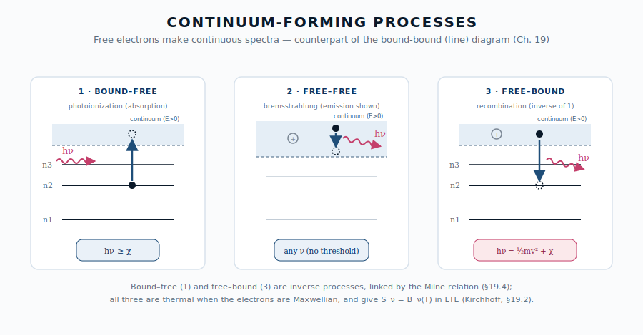

::: {.chapter-overview}
**この章の主題**：第15章で「振動数依存不透明度」を、第17章で電離ガスの自由-自由放射を、いずれも吸収係数 $\alpha_\nu$ と放射率 $j_\nu$ を **与えられたもの** として使った。本章はその出どころに降りる。希薄プラズマや恒星大気の **連続スペクトル** を作るのは、自由電子が絡む三つの素過程 ― **自由-自由**（制動放射）、**束縛-自由**（光電離）、その逆過程である **自由-束縛**（再結合） ― である。これらを放出と吸収の両面で、Kirchhoff の法則と Milne 関係、そして Saha の電離平衡で結び、観測される連続吸収端・電波ターンオーバー・X 線の指数カットオフ・再結合連続光を逆引きする。最後に、再結合が連続光だけでなく **線スペクトル**（再結合線）も生むことを示し、第VII部への橋とする。
:::

## この章の中心地図 {#sec-continuum-micro-map .unnumbered}



::: {.callout-note}
**方針**：本章の中心地図は、連続の吸収・放射係数を素過程に分解した形

$$
\alpha_\nu^{\mathrm{cont}} = \underbrace{n_e n_i\,\bar\sigma_{\mathrm{ff}}(\nu,T)}_{\text{自由-自由}} \;+\; \underbrace{\textstyle\sum_i n_i\,\sigma_{\mathrm{bf}}^{(i)}(\nu)}_{\text{束縛-自由}}, \qquad S_\nu \overset{\mathrm{LTE}}{=} B_\nu(T)
$$

である。占有数 $n_e, n_i, n_X$ は **Saha–Boltzmann**（§19.5）が決め、放出 $j_\nu$ と吸収 $\alpha_\nu$ は **Kirchhoff（LTE）／詳細つり合い（Milne）** で結ばれる。「中心地図プランク関数のどの因子が、どの素過程から来るか」を素過程の側から裏打ちするのが本章である。
:::

## この章で答える問い {#sec-continuum-micro-questions .unnumbered}

::: {.callout-question}
- 恒星スペクトルの紫外側の段差（Balmer jump など）は、何の素過程が作るのか。なぜ「端」が立つのか。
- HII 領域の電波連続光が、低振動数で黒体に漸近し高振動数で平坦になるのはなぜか（第17章 §17.6 の微視的根拠）。
- 銀河団の X 線連続光が $e^{-h\nu/k_BT}$ で切れるのはなぜか。
- 太陽光球の可視連続光を、なぜ豊富な中性水素そのものではなく **微量の H⁻** が担うのか。
- 同じ再結合が、なぜ連続光（自由-束縛）と輝線（束縛-束縛カスケード）の **両方** を生むのか。
:::

## 到達目標 {#sec-continuum-micro-goals .unnumbered}

この章を読み終えると、読者は次のことができるようになる：

- 自由-自由・束縛-自由・再結合（自由-束縛）の三過程を、エネルギー準位図の上で区別して説明できる。
- 光電離断面積 $\sigma_{\mathrm{bf}}(\nu)$ のしきい値と連続吸収端の関係、$\sim\nu^{-3}$ 減衰を述べられる。
- Milne 関係（詳細つり合い）で $\sigma_{\mathrm{bf}}$ と再結合断面積を結び、再結合係数 $\alpha_{\mathrm{rec}}(T)$ の意味と温度依存を説明できる。
- Saha 式を使って電離度から連続の $\alpha_\nu, j_\nu$ を自己無撞着に決める道筋を述べられる。
- 連続吸収端・電波ターンオーバー・X 線カットオフ・再結合連続光を、観測から逆引きできる。

---

## 19.1 連続を作る三素過程 ― 全体像 {#sec-continuum-three-processes}

[本文目安：B2]

第VII部で扱う線スペクトルは、原子の **束縛準位の間** の遷移（**束縛-束縛**、bound-bound）である。離散的な準位差 $E_u-E_l$ に対応する振動数 $\nu_0$ にだけ光が出入りするので、スペクトルは **線** になる。

これに対し、電子の片側または両側が **自由状態**（連続エネルギー $E>0$）にある遷移は、連続したエネルギー範囲を取れるので **連続スペクトル** を作る。自由電子が関与する遷移は三種類ある：

- **束縛-自由**（bound-free, bf）：束縛電子が光子を吸って電離する＝**光電離**（photoionization）。しきい値 $h\nu \ge \chi$ で起こる。逆過程（§19.4）は **自由-束縛**（free-bound）＝**再結合**で、光子を放出する。
- **自由-自由**（free-free, ff）：自由電子がイオンの Coulomb 場で曲げられる際に光子を吸収・放出する＝**制動放射**（bremsstrahlung）。束縛準位を経由しないので、任意の振動数で起こる。
- （**束縛-束縛**：線。第VII部。）

{#fig-continuum-processes width=88%}

::: {.callout-note}
**用語**：本章の三過程は、電子が **Maxwell 分布**（温度 $T_e$）にある限りすべて **熱的放射**（第1章 §1.9）である。「熱的」は粒子のエネルギー分布の性質であって、スペクトルが黒体になるかどうか（光学的厚さの問題、§19.6）とは別の条件である ― この区別は第17章 §17.6 で自由-自由放射について見た通りで、本章の三過程すべてに共通する。
:::

## 19.2 自由-自由放射と吸収 ― 熱的制動放射 {#sec-continuum-free-free}

[本文目安：B3]

自由電子がイオンの Coulomb 場で加速度を受けると、古典電磁気（第V部）の通り電磁波を放つ。これが **自由-自由放射**（制動放射）である。電子が Maxwell 分布にあるとき、単位体積・単位振動数あたりの放射率（**放射係数** $j_\nu$ に対応）は

$$
\varepsilon_\nu^{\mathrm{ff}} \;\propto\; n_e\,n_i\,Z^2\,T_e^{-1/2}\,e^{-h\nu/k_BT_e}\,\bar g_{\mathrm{ff}}(\nu,T_e)
$$ {#eq-ff-emissivity}

の形をとる。$Z$ はイオンの電荷、$\bar g_{\mathrm{ff}}$ は **Gaunt 因子**（量子補正、$\nu,T_e$ にゆるやかに依存し $O(1)$）。指数因子 $e^{-h\nu/k_BT_e}$ は、振動数 $\nu$ の光子を出すには電子が少なくとも $h\nu$ の運動エネルギーを持たねばならず、その割合が Maxwell 分布で抑えられることを表す。

対応する **吸収係数** は、第17章 §17.6 で見たように

$$
\alpha_\nu^{\mathrm{ff}} \;\propto\; n_e\,n_i\,Z^2\,T_e^{-3/2}\,\nu^{-2}\,\bar g_{\mathrm{ff}}\,\bigl(1-e^{-h\nu/k_BT_e}\bigr)
$$ {#eq-ff-absorption-micro}

括弧の $(1-e^{-h\nu/k_BT_e})$ は **誘導放出補正**（第11章・第20章 §20.2 と同じ因子）である。@eq-ff-emissivity と @eq-ff-absorption-micro の比をとると、$n_e,n_i$ も $\bar g_{\mathrm{ff}}$ も消えて

$$
\frac{\varepsilon_\nu^{\mathrm{ff}}}{\alpha_\nu^{\mathrm{ff}}} = \frac{2h\nu^3}{c^2}\frac{1}{e^{h\nu/k_BT_e}-1} = B_\nu(T_e)
$$ {#eq-ff-kirchhoff}

となり、**Kirchhoff の法則** $S_\nu=B_\nu(T_e)$ が素過程のレベルで確かめられる（第3章・第5章）。すなわち自由-自由放射の源泉関数は、つねに電子温度の黒体である。

観測スペクトルの形を決めるのは、ここから先の **光学的厚さ** $\tau_\nu=\int\alpha_\nu^{\mathrm{ff}}\,ds$ である。@eq-ff-absorption-micro の $\nu^{-2}$ により、

- **低振動数（電波）**：$\alpha_\nu^{\mathrm{ff}}$ が大きく光学的に厚い → $I_\nu\to B_\nu(T_e)$。HII 領域の電波連続光が黒体に漸近する（第17章 §17.6 のターンオーバー）。
- **高振動数・高温・希薄（X 線）**：光学的に薄く、観測される $F_\nu\propto e^{-h\nu/k_BT_e}$ の **指数カットオフ**。銀河団の高温ガス（$T_e\sim10^7$–$10^8$ K）が典型（第18章）。

::: {.callout-tip appearance="simple"}
**問い**：自由-自由放射は全帯域で「熱的」なのに、なぜ全帯域で単一の黒体スペクトルには **ならない** のか？

**短答**：黒体になるのは光学的に厚い帯（低 $\nu$）だけ。高 $\nu$ では光学的に薄く $I_\nu\approx\tau_\nu B_\nu \ll B_\nu$ となって黒体から下にずれ、$e^{-h\nu/k_BT_e}$ で切れる。「熱的（Maxwell 分布）」と「黒体（光学的に厚い熱平衡放射場）」は別条件である（第17章 §17.6）。
:::

## 19.3 束縛-自由 ― 光電離断面積と連続吸収端（H⁻ を含む） {#sec-continuum-bound-free}

[本文目安：B3]

束縛電子が $h\nu\ge\chi$ の光子を吸って自由になる過程が **光電離**（束縛-自由吸収）である。下準位 $n$ の電離エネルギーを $\chi_n$ とすると、吸収はしきい振動数

$$
\nu_{\mathrm{th}} = \chi_n/h
$$ {#eq-bf-threshold}

で **急に立ち上がり**、それ以上の振動数では水素様原子で

$$
\sigma_{\mathrm{bf}}(\nu) \;\propto\; \frac{Z^4}{n^5}\,\nu^{-3}\,g_{\mathrm{bf}}(\nu,n) \qquad (\nu\ge\nu_{\mathrm{th}})
$$ {#eq-bf-cross-section}

と $\nu^{-3}$ で減衰する（Kramers の断面積、$g_{\mathrm{bf}}$ は束縛-自由 Gaunt 因子）。しきい値での不連続な立ち上がりと $\nu^{-3}$ の減衰が、観測される **連続吸収端**（continuum edge）を作る。水素では

- **Lyman 端**（$n=1$、$\lambda=912$ Å、紫外）
- **Balmer 端**（$n=2$、$\lambda=3646$ Å、可視と紫外の境）
- **Paschen 端**（$n=3$、$\lambda=8204$ Å、近赤外）

と、下準位が浅くなるほど端の波長が長くなる。これが第15章 §15.3 で「振動数依存不透明度」として与えた連続吸収端の **微視的な起源** である。各準位の占有数 $n_i$（Boltzmann／Saha、§19.5）が、どの端がどれだけ立つかを決める。

### H⁻ ― 低温星の可視連続不透明度の主役

水素の束縛-自由端はいずれも紫外〜近赤外にあり、**可視のど真ん中には水素中性原子の端がない**。それなら太陽（$T_{\mathrm{eff}}\simeq5800$ K）の光球は可視で透明なはずだが、実際は可視全域で不透明である。担い手は中性水素そのものではなく、**負水素イオン H⁻** ― 水素原子に電子がもう一つゆるく束縛したイオン ― である。

H⁻ の束縛エネルギーはわずか $0.754$ eV しかない。したがって束縛-自由しきい波長は

$$
\lambda_{\mathrm{th}}^{\mathrm{H}^-} = \frac{hc}{0.754\ \mathrm{eV}} \simeq 1.64\ \mu\mathrm{m}
$$ {#eq-hminus-threshold}

で、$1.64\ \mu$m より短い **可視〜近赤外の全域** で光電離吸収が効く（吸収のピークは $\sim0.85\ \mu$m）。さらに長波長側では H⁻ の **自由-自由** 吸収（§19.2 と同型）が連続して効く。

H⁻ が低温星で卓越するのには、Saha 平衡（§19.5）が効いている：

- **中性水素が豊富** であること（H⁻ の素材）。高温星では水素が電離して中性 H が枯れ、H⁻ も消える。
- **自由電子の供給** があること。低温星では水素はほとんど電離しないので、自由電子は **電離ポテンシャルの低い金属**（Na, K, Ca, Mg, Fe など）の電離が供給する。したがって H⁻ 不透明度は電子密度 $n_e$（≒金属量と Saha）に比例して増える。

高温星（O・B 型）では水素・ヘリウムの束縛-自由／自由-自由と **電子散乱**（第15章 §15.5）に主役が交代する。「中性水素が主成分なのに、可視の連続不透明度は微量イオン H⁻ が担う」という逆転は、連続スペクトルの逆引きが Saha 平衡と分かちがたく結びついていることを示す好例である。

::: {.callout-note}
**対応（観測）**：太陽スペクトルの連続光のなだらかな形（可視で最大、紫外・赤外へ向けて落ちる）は、H⁻ の吸収係数の波長依存（$\sim0.85\ \mu$m にピーク）でよく説明される。恒星大気モデル（第15章 §15.3、Mihalas 1978）では H⁻ が G・K 型星の連続不透明度の標準的な第一成分として組み込まれている。
:::

## 19.4 再結合 ― 束縛-自由の逆過程と Milne 関係 {#sec-continuum-recombination}

[本文目安：B3]

光電離（束縛-自由）の **逆過程** が **再結合**（recombination）である：自由電子がイオンに捕まって準位 $n$ に落ち、余ったエネルギーを光子として放つ。

$$
e^- + X^+ \;\longrightarrow\; X(n) + h\nu
$$ {#eq-recombination-reaction}

捕まる前の電子の運動エネルギーを $\tfrac12 m_e v^2$ とすると、放出光子のエネルギーは

$$
h\nu = \tfrac12 m_e v^2 + \chi_n
$$ {#eq-fb-photon-energy}

である。電子は連続的な速度分布（Maxwell）を持つので、放出される光子も **連続スペクトル** になる ― これが **自由-束縛放射**（free-bound emission）＝**再結合連続光**（recombination continuum）である。ただし $h\nu$ は最小でも $\chi_n$（$v\to0$）なので、再結合連続光は各準位のしきい $\chi_n$ で **下端（放出端）** を持ち、そこから高振動数へ裾を引く。吸収側の連続吸収端（§19.3）と同じ位置に、今度は **放出の端** が立つ。

### Milne 関係 ― 詳細つり合いが結ぶ吸収と放出

熱平衡では、光電離（吸収）と再結合（放出）が振動数ごとに釣り合う（**詳細つり合い**、第6章）。この釣り合いから、再結合断面積 $\sigma_{\mathrm{rec}}(v)$ と光電離断面積 $\sigma_{\mathrm{bf}}(\nu)$ が直接結ばれる ― **Milne 関係**：

$$
\sigma_{\mathrm{rec}}(v) = \frac{g_n}{2\,g_{+}}\,\frac{(h\nu)^2}{m_e^2 c^2 v^2}\,\sigma_{\mathrm{bf}}(\nu)
$$ {#eq-milne-relation}

$g_n, g_{+}$ は再結合後の準位とイオンの統計重率、因子 $2$ は自由電子のスピン状態数。これは第11章で Einstein 係数 $A,B$ を詳細つり合いで結んだのと **同じ論法** の連続版である：放出の量（$A$ や $\sigma_{\mathrm{rec}}$）を、吸収の量（$B$ や $\sigma_{\mathrm{bf}}$）から熱平衡の要請だけで決める。

準位 $n$ への再結合率を Maxwell 分布で平均したものが **再結合係数**

$$
\alpha_n(T) = \langle \sigma_{\mathrm{rec}} v\rangle = \int_0^\infty \sigma_{\mathrm{rec}}(v)\,v\,f_{\mathrm{Maxwell}}(v,T)\,dv
$$ {#eq-recombination-coefficient}

で、単位は $\mathrm{cm^3\,s^{-1}}$。Milne 関係から $\sigma_{\mathrm{rec}}\propto v^{-2}\sigma_{\mathrm{bf}}$ であり、Maxwell 平均をとると $\alpha_n(T)\propto T^{-1/2}$ 程度（係数の精密値は Gaunt 因子と準位和に依存し、全準位和の場合 $\alpha_A\propto T^{-0.7\sim-0.8}$）の **温度の減少関数** になる。高温ほど電子が速く通り過ぎて捕まりにくい、という直観に合う。

::: {.callout-note}
**用語**：全準位（$n\ge1$）への再結合を足したものを **case A**、基底状態（$n=1$）への直接再結合で出る Lyman 連続光が周囲に再吸収されて実質効かない極限を **case B** と呼ぶ（§19.7 で線スペクトルとして再登場）。星雲では多くの場合 case B が適切である。
:::

## 19.5 Saha 平衡と連続放射の自己無撞着 {#sec-continuum-saha}

[本文目安：B3]

§19.2–19.4 の各係数は、いずれも $n_e$（電子）、$n_i$（イオン）、$n_X$（中性原子の各準位）という **占有数** に比例する。これらを決めるのが、電離反応 $X \rightleftharpoons X^+ + e^-$ の熱平衡条件 ― **Saha の式** である：

$$
\frac{n_{X^+}\,n_e}{n_X} = \left(\frac{2\pi m_e k_B T}{h^2}\right)^{3/2} 2\,\frac{g_{X^+}}{g_X}\,e^{-\chi/k_BT}
$$ {#eq-saha-maintext}

（導出と記号は付録 A.3.3 を参照。$\chi$ は電離エネルギー、右辺の $2$ は自由電子のスピン。）Saha の式は **Boltzmann 分布**（第7章 §7.3、準位間の占有比）の電離版であり、両者を合わせた **Saha–Boltzmann** が、

$$
\text{温度 }T \;\longrightarrow\; \text{電離度・各準位占有 }n_e,n_i,n_X \;\longrightarrow\; \alpha_\nu^{\mathrm{ff}},\ \sigma_{\mathrm{bf}}\text{ の重み},\ \varepsilon_\nu^{\mathrm{rec}}
$$

という連鎖で、連続の吸収・放射係数を **自己無撞着** に与える。LTE が成り立つ限り、この連鎖の出力はつねに $S_\nu=B_\nu(T)$（Kirchhoff、@eq-ff-kirchhoff）に帰着する ― 素過程が何であっても源泉関数は局所温度の黒体になる、というのが LTE 連続放射の要点である。

::: {.callout-note}
**注意（観測）**：恒星大気では H⁻ 不透明度（§19.3）が $n_e$ に比例し、その $n_e$ は金属の Saha 電離で決まる。したがって連続スペクトルの形そのものが、間接的に金属量・表面重力（$\log g$）の情報を運ぶ。連続と線の双方を Saha–Boltzmann で一貫して解くのが現代の恒星大気モデルである（第15章 §15.3、第21章 §21.4）。
:::

## 19.6 観測への逆引き {#sec-continuum-inverse}

[本文目安：B2]

本章の三過程は、連続スペクトルの特徴的な形から物理量を読み出す道具になる：

- **連続吸収端**（束縛-自由、§19.3）：恒星大気の **Balmer jump** の大きさから有効温度・表面重力を、端の有無から組成・電離段階を逆引きする。
- **電波の折れ曲がり**（自由-自由、§19.2）：低振動数の $F_\nu\propto\nu^2$ への飽和から **電子温度 $T_e$** を、ターンオーバー振動数から **発光量度 $\mathrm{EM}=\int n_e^2\,ds$** を読む（第17章 §17.6、演習 17-5）。
- **X 線の指数カットオフ**（自由-自由、§19.2）：$F_\nu\propto e^{-h\nu/k_BT_e}$ の傾きから銀河団高温ガスの $T_e\sim10^7$–$10^8$ K を測る（第18章）。
- **再結合連続光のジャンプ**（自由-束縛、§19.4）：星雲の **Balmer 連続光ジャンプ** の大きさは $T_e$ に依存し、輝線とは独立な電子温度診断を与える。

::: {.callout-note}
**対応（観測）**：恒星大気では Balmer 端は **吸収側の段差**（端より青で不透明度増）として、星雲では同じ $3646$ Å に **再結合連続光の放出ジャンプ** として現れる。同じしきい値が、幾何条件（背景光の有無）で吸収にも放出にも見える ― これは線スペクトルで同じ遷移が吸収線にも輝線にもなる対比（[第20章 §20.3](../part7/20-where-lines.qmd#sec-where-lines-emission)）と同じ論理である。
:::

## 19.7 再結合は線も生む ― 連続と線をつなぐ電離 {#sec-continuum-bridge}

[本文目安：B2]

再結合（§19.4）で電子がいったん高い準位 $n$ に捕まると、そこからは **束縛-束縛遷移** を次々と下って基底状態へ落ちる（**再結合カスケード**）。各ステップが線光子を出すので、再結合は連続光（自由-束縛）だけでなく **再結合線**（recombination lines）も生む。HII 領域で輝く Hα など Balmer 輝線は、この再結合カスケードの産物である。

$$
e^- + \mathrm{H}^+ \;\longrightarrow\; \mathrm{H}(n)\ \underbrace{+\,h\nu_{\mathrm{fb}}}_{\text{連続（§19.4）}} \;\overset{\text{カスケード}}{\longrightarrow}\; \text{Balmer・Paschen 輝線（束縛-束縛）}
$$

すなわち **電離と再結合は、連続スペクトル（自由-自由・束縛-自由）と線スペクトル（束縛-束縛）の両方を同時に統べる**。case A／case B（§19.4）の区別は、Lyman 線光子が再吸収されるかどうかという **線** の問題が **連続** の再結合率に跳ね返る、両者の結合の一例である。

ここから先 ― 束縛-束縛遷移の振動数・強度・選択則・線形 ― が第VII部の主題である。本章で整えた電離・再結合の枠組みは、第21章（線形成の Einstein 係数）・第22章（原子準位と選択則）・第24章（電離度診断と再結合線）で線スペクトルの言葉に翻訳され、最終的に第VIII部（第26章）の QED で連続と線が同じ Hamiltonian の二側面として統合される。

## 19.8 使えるようになった道具 {#sec-continuum-micro-tools .unnumbered}

::: {.callout-note}
- 連続を作る三素過程（自由-自由・束縛-自由・自由-束縛）の準位図による区別
- 自由-自由の放出 @eq-ff-emissivity と吸収 @eq-ff-absorption-micro、Kirchhoff $S_\nu=B_\nu(T_e)$、電波ターンオーバーと X 線カットオフの起源
- 光電離断面積 $\sigma_{\mathrm{bf}}\propto\nu^{-3}$ としきい値が作る連続吸収端（Lyman/Balmer/Paschen）
- H⁻ が低温星の可視連続不透明度を担う仕組みと Saha 依存
- Milne 関係による $\sigma_{\mathrm{bf}}\leftrightarrow\sigma_{\mathrm{rec}}$、再結合係数 $\alpha_n(T)\propto T^{-1/2}$ 級
- Saha–Boltzmann による占有数 → 連続係数の自己無撞着な決定
- 再結合連続光と再結合線が同一過程から出ること（連続↔線の橋）
:::

---

## この章で何がわかったか {#sec-continuum-micro-summary .unnumbered}

::: {.callout-summary}
**中心地図に戻る**

中心地図プランク関数 $B_\nu(T)$ を作る連続の吸収・放射係数は、自由電子が絡む三つの素過程に分解できる：

- **自由-自由**（制動放射）：$\alpha_\nu\propto n_e n_i\,\nu^{-2}T^{-3/2}$。低 $\nu$ で黒体（電波）、高 $\nu$ で指数カットオフ（X 線）。
- **束縛-自由**（光電離）：$\sigma_{\mathrm{bf}}\propto\nu^{-3}$ としきい値が連続吸収端を作る。可視は H⁻ が主役。
- **自由-束縛**（再結合）：束縛-自由の逆過程。Milne 関係で結ばれ、再結合連続光と再結合線を生む。

これらを束ねるのが Saha–Boltzmann（占有数）と Kirchhoff／Milne（放出と吸収の関係）で、LTE では源泉関数はつねに $S_\nu=B_\nu(T)$ に帰着する。電離・再結合は連続と線の両方を統べ、次の第VII部（線スペクトル）への橋となる。
:::

## 演習問題 {#sec-continuum-micro-exercises .unnumbered}

以下の問題は、本文で省いた式の導出を補う問題（[tag:導出補完]）と、本文で得た道具を別の角度から使って理解を深める問題（[tag:理解を深める]）から成る。各問の **模範解答** は折りたたみを展開して確認できる（オンライン版）。まず自力で解いてから開くこと。

### 問題 19-1　電波 HII 領域のターンオーバー（自由-自由の逆引き） {#ex-19-1 .unnumbered}

[★ 難易度：☆☆ ] [tag:理解を深める]

§19.2・第17章 §17.6 の自由-自由吸収 $\alpha_\nu^{\mathrm{ff}}\propto n_e n_i T_e^{-3/2}\nu^{-2}$ を使う。等温スラブ（電子温度 $T_e$、LTE）の射出強度は $I_\nu=B_\nu(T_e)(1-e^{-\tau_\nu})$。

1. 光学的に厚い極限（低 $\nu$）で $I_\nu\to B_\nu(T_e)$ となること、電波帯（Rayleigh–Jeans）で $F_\nu\propto\nu^2$ になることを示せ。
2. 光学的に薄い極限（高 $\nu$）で $F_\nu$ がほぼ平坦（$\propto\nu^{-0.1}$）になることを、$\tau_\nu\propto\nu^{-2.1}$ から示せ。
3. ターンオーバー振動数 $\nu_t$（$\tau_{\nu_t}\simeq1$）から何が読めるか述べよ。

**関連**：[§19.2 自由-自由](#sec-continuum-free-free)／電波の漸近は[第17章 §17.6](../part6/17-stars-planets-dust.qmd#sec-free-free-ionized)（[演習 17-5](../part6/17-stars-planets-dust.qmd#ex-17-5)）、光学的に厚い極限は[§5.6](../part2/05-radiative-transfer.qmd#sec-radiative-transfer-thick)。

::: {.callout-derive collapse="true"}
## 模範解答（問題 19-1）

**(1)** $\tau_\nu\gg1$ で $1-e^{-\tau_\nu}\to1$ ゆえ $I_\nu\to B_\nu(T_e)$。電波帯 $h\nu\ll k_BT_e$ では $B_\nu\simeq2\nu^2k_BT_e/c^2\propto\nu^2$、よって $F_\nu\propto\nu^2$。観測される輝度温度は $T_b\to T_e$ に飽和する。

**(2)** $\tau_\nu\ll1$ で $1-e^{-\tau_\nu}\simeq\tau_\nu\propto\nu^{-2.1}$。$F_\nu\propto\nu^2\cdot\nu^{-2.1}=\nu^{-0.1}$ でほぼ平坦。

**(3)** $\nu_t$ は $\tau_{\nu_t}\simeq1$ で決まり、$\tau_\nu\propto\mathrm{EM}\,\nu^{-2.1}T_e^{-1.35}$ なので、飽和値から $T_e$、$\nu_t$ から発光量度 $\mathrm{EM}=\int n_e^2 ds$（密度 × 経路長）が読める。

**答え**：低 $\nu$ で $F_\nu\propto\nu^2$（$T_b\to T_e$）、高 $\nu$ で $\propto\nu^{-0.1}$。飽和から $T_e$、$\nu_t$ から $\mathrm{EM}$。
:::

### 問題 19-2　Balmer 連続光ジャンプ ― 吸収端と放出端 {#ex-19-2 .unnumbered}

[★ 難易度：☆☆ ] [tag:理解を深める]

§19.3・§19.4 の束縛-自由。水素 $n=2$ の電離エネルギーは $\chi_2=13.6/2^2=3.40$ eV。

1. Balmer 端の波長 $\lambda=hc/\chi_2$ を求め、$3646$ Å に一致することを確かめよ。
2. 恒星大気では Balmer 端より **短波長側で連続光が暗くなる**（吸収段差）のに、星雲では同じ波長に **明るいジャンプ**（放出）が出る。なぜ符号が逆に見えるか、背景光の有無で説明せよ。
3. 星雲の Balmer 連続光ジャンプが電子温度 $T_e$ の診断になる理由を一言で述べよ。

**関連**：[§19.3 束縛-自由](#sec-continuum-bound-free)、[§19.4 再結合](#sec-continuum-recombination)／吸収線と輝線の幾何は[第20章 §20.3](../part7/20-where-lines.qmd#sec-where-lines-emission)、線源泉関数は[第21章 §21.3](../part7/21-line-formation.qmd#sec-line-source-function)。

::: {.callout-derive collapse="true"}
## 模範解答（問題 19-2）

**(1)** $\lambda=hc/\chi_2=(1.24\times10^4\ \mathrm{eV\,\AA})/3.40\ \mathrm{eV}=3647$ Å。Balmer 端（$3646$ Å）に一致。

**(2)** 恒星大気は背後に明るい連続光源（深層）があり、Balmer 端より青では $n=2$ からの光電離吸収（§19.3）で不透明度が跳ね上がるため、より浅い（冷たい）層しか見えず暗くなる＝吸収段差。星雲は背景連続光がなく、$n=2$ への再結合（§19.4）で出る自由-束縛放射そのものを見るため、しきい $3646$ Å の高振動数側に放出のジャンプが立つ。同じしきい値が幾何条件で吸収にも放出にも見える。

**(3)** 再結合連続光の形（ジャンプ高さと裾の傾き）は電子の Maxwell 分布の温度を反映するので、$T_e$ に依存する。輝線比とは独立な温度診断になる。

**答え**：$3647$ Å。背景光ありで吸収段差、なしで再結合の放出ジャンプ。ジャンプ形が $T_e$ 依存。
:::

### 問題 19-3　Milne 関係と再結合係数の温度依存 {#ex-19-3 .unnumbered}

[★ 難易度：☆☆☆ ] [tag:導出補完]

§19.4 の Milne 関係 $\sigma_{\mathrm{rec}}(v)\propto (h\nu)^2/(v^2)\,\sigma_{\mathrm{bf}}(\nu)$ と $h\nu=\tfrac12 m_e v^2+\chi_n$ を使う。

1. しきい近傍（$\tfrac12 m_e v^2\ll\chi_n$）で $h\nu\simeq\chi_n$ とみなすと、$\sigma_{\mathrm{rec}}\propto v^{-2}\sigma_{\mathrm{bf}}(\nu_{\mathrm{th}})$ となることを示せ。
2. 再結合係数 $\alpha_n(T)=\langle\sigma_{\mathrm{rec}}v\rangle$ を Maxwell 分布で平均すると、$\alpha_n(T)\propto T^{-1/2}$ 級になることを、$\sigma_{\mathrm{rec}}v\propto v^{-1}$ と $\langle v^{-1}\rangle\propto T^{-1/2}$ から示せ。
3. 高温ほど再結合係数が小さい物理的理由を一言で述べよ。

**関連**：[§19.4 再結合](#sec-continuum-recombination)／詳細つり合いの論法は[第11章 §11.3](../part4/11-einstein-method.qmd#sec-einstein-method-detailed-balance)、Maxwell 分布は[第7章 §7.3](../part3/07-statistical-mechanics.qmd#sec-statistical-mechanics-boltzmann)。

::: {.callout-derive collapse="true"}
## 模範解答（問題 19-3）

**(1)** Milne 関係 $\sigma_{\mathrm{rec}}\propto (h\nu)^2 v^{-2}\sigma_{\mathrm{bf}}$ で、しきい近傍 $h\nu\simeq\chi_n$（定数）とすれば $\sigma_{\mathrm{rec}}\propto v^{-2}\sigma_{\mathrm{bf}}(\nu_{\mathrm{th}})$。

**(2)** $\sigma_{\mathrm{rec}}v\propto v^{-2}\cdot v=v^{-1}$。Maxwell 平均 $\langle v^{-1}\rangle=\int v^{-1}f(v)dv$ は $f(v)\propto v^2 e^{-m_ev^2/2k_BT}$ で、変数を $x=v/\sqrt{k_BT/m_e}$ にとると $\langle v^{-1}\rangle\propto(k_BT)^{-1/2}$。よって $\alpha_n(T)\propto T^{-1/2}$。

**(3)** 高温では電子の典型速度が大きく、イオンの近くを速く通り過ぎて捕まりにくい（相互作用時間が短い）ため、再結合係数が小さくなる。

**答え**：$\sigma_{\mathrm{rec}}\propto v^{-2}\sigma_{\mathrm{bf}}$、$\alpha_n\propto T^{-1/2}$。高温ほど速く通り過ぎ捕まりにくい。
:::

### 問題 19-4　X 線制動放射で銀河団温度 {#ex-19-4 .unnumbered}

[★ 難易度：☆☆ ] [tag:理解を深める]

§19.2 の高振動数（光学的に薄い）極限 $F_\nu\propto e^{-h\nu/k_BT_e}$ を使う。$k_B=8.617\times10^{-5}$ eV/K。

1. 銀河団 X 線スペクトルの指数カットオフが $h\nu\sim8$ keV 付近で効くとき、電子温度 $T_e$ を概算せよ。
2. この $T_e$ が $10^7$–$10^8$ K の範囲にあることを確かめ、なぜ銀河団ガスが「X 線で光る」のかを述べよ。
3. 同じ自由-自由放射なのに、電波 HII 領域（問題 19-1）とは見え方が全く違う理由を、光学的厚さの観点から一言で述べよ。

**関連**：[§19.2 自由-自由](#sec-continuum-free-free)／高温降着・銀河団は[第18章](../part6/18-accretion-high-energy.qmd)。

::: {.callout-derive collapse="true"}
## 模範解答（問題 19-4）

**(1)** カットオフは $h\nu\sim k_BT_e$ で効く。$k_BT_e\sim8$ keV $\Rightarrow T_e\sim8\times10^3\,\mathrm{eV}/(8.617\times10^{-5}\,\mathrm{eV/K})\simeq9\times10^7$ K。

**(2)** $9\times10^7$ K は $10^7$–$10^8$ K の範囲。これだけ高温だと熱的制動放射のピークが X 線帯に来るので、銀河団ガスは X 線で明るく光る。

**(3)** 電波 HII 領域は低 $\nu$ で **光学的に厚く** 黒体に漸近するが、銀河団 X 線は高温・希薄で全帯域 **光学的に薄い** ため、放射率の形（指数カットオフ）がそのまま観測される。同じ熱的自由-自由でも光学的厚さで見え方が変わる。

**答え**：$T_e\sim9\times10^7$ K（$10^7$–$10^8$ K）。高温ゆえ X 線で光る。電波は厚い／X 線は薄いの違い。
:::

### 問題 19-5　H⁻ のしきい値と太陽光球の連続不透明度 {#ex-19-5 .unnumbered}

[★ 難易度：☆☆ ] [tag:理解を深める]

§19.3 の H⁻。束縛エネルギー $0.754$ eV。$hc=1.24\times10^4$ eV·Å。

1. H⁻ の束縛-自由しきい波長 $\lambda_{\mathrm{th}}=hc/0.754\ \mathrm{eV}$ を求め、$1.64\ \mu$m になることを確かめよ。
2. 中性水素（$n=1$ の Lyman 端 $912$ Å、$n=2$ の Balmer 端 $3646$ Å）の束縛-自由端はいずれも可視中央にない。それでも太陽光球が可視全域で不透明なのはなぜか、H⁻ で説明せよ。
3. H⁻ が低温星でのみ効き、高温星（O・B 型）では効かない理由を、Saha 平衡（中性 H と自由電子の供給）から述べよ。

**関連**：[§19.3 H⁻](#sec-continuum-bound-free)、[§19.5 Saha](#sec-continuum-saha)／恒星大気の振動数依存不透明度は[第15章 §15.3](../part6/15-non-blackbody.qmd#sec-non-blackbody-frequency-opacity)。

::: {.callout-derive collapse="true"}
## 模範解答（問題 19-5）

**(1)** $\lambda_{\mathrm{th}}=1.24\times10^4\ \mathrm{eV\,\AA}/0.754\ \mathrm{eV}=1.64\times10^4$ Å $=1.64\ \mu$m。

**(2)** $1.64\ \mu$m より短い可視〜近赤外の全域で H⁻ の光電離吸収が効く（ピーク $\sim0.85\ \mu$m）。中性 H の束縛-自由端は紫外（Lyman/Balmer）にしかないので可視を説明できないが、H⁻ が可視連続不透明度を担うため光球は可視で不透明になる。さらに長波長では H⁻ 自由-自由が続く。

**(3)** H⁻ には (i) 素材の中性 H と (ii) 余分な電子の供給源（自由電子）が要る。低温星では水素はほとんど中性で豊富、自由電子は電離ポテンシャルの低い金属の電離が供給する。高温星では水素が電離して中性 H が枯れ、H⁻ も作れない（自由電子は豊富でも素材がない）。よって主役は H・He の束縛-自由／自由-自由と電子散乱に移る。

**答え**：$1.64\ \mu$m。H⁻ が可視連続不透明度を担う。低温星は中性 H 豊富＋金属由来電子で H⁻ が効くが、高温星は H 電離で素材が枯れる。
:::

## さらに学ぶための参考文献 {#sec-continuum-micro-further .unnumbered}

- Rybicki & Lightman, *Radiative Processes in Astrophysics* (Wiley, 1979) — 自由-自由・束縛-自由・Milne 関係の標準的導出。
- Osterbrock & Ferland, *Astrophysics of Gaseous Nebulae and Active Galactic Nuclei* (2nd ed., 2006) — 再結合・case A/B・再結合連続光と再結合線。
- Mihalas, *Stellar Atmospheres* (W.H. Freeman, 2nd ed., 1978) — H⁻ を含む恒星大気の連続不透明度。
- Gray, *The Observation and Analysis of Stellar Photospheres* (3rd ed., 2005) — 連続不透明度の実務的な扱い。
