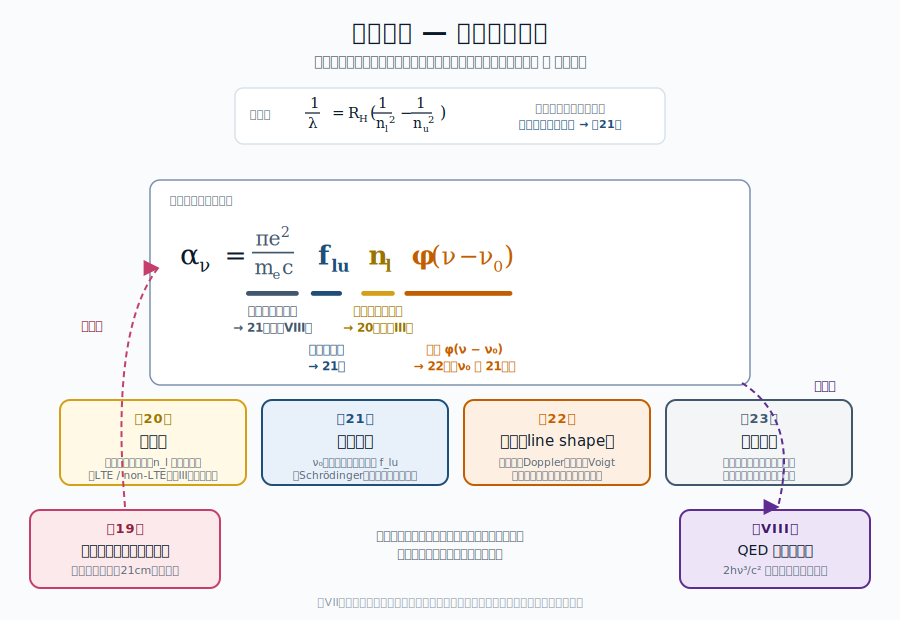
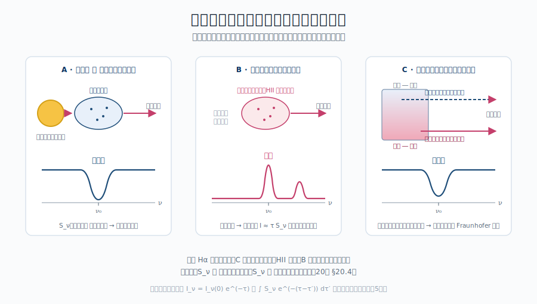

::: {.chapter-overview}
**この章の主題**：第VII部は本書のもう一つの主柱 ― **線スペクトル** ― の逆引きを始める。第1章が連続スペクトル（黒体放射）の観測動機を集めたのと対をなす本章では、太陽・恒星・星雲・電波源・AGN といった**線スペクトルが現れる天体**の実例を一覧する。線スペクトルが「宇宙物理の二本目の主柱」であることを、観測の側から確立する。
:::

## この章の中心地図 {#sec-where-lines-map .unnumbered}

{#fig-hydrogen-map width=90%}



::: {.callout-note}
**方針**：第VII部の中心地図は **水素線吸収係数** $\alpha_\nu = (\pi e^2/m_e c) f_{lu} n_l \phi(\nu-\nu_0)$。本章ではまだ式の中身に踏み込まず、観測される線スペクトルの **「ファクト」** を提示する。第20-22章で各因子（$f_{lu}$, $n_l$, $\phi$）を逆引きする。
:::

## この章で答える問い {#sec-where-lines-questions .unnumbered}

::: {.callout-question}
- なぜ太陽光のスペクトルには細い暗線（Fraunhofer 線）が見えるのか（→ 第20章、§19.1）
- 同じ水素から、ある天体では吸収線、別の天体では輝線が見えるのはなぜか（→ §20.4 線源泉関数）
- 21 cm 線は何の遷移で、なぜ宇宙物理で特別な役割を持つのか（→ §21.5 超微細構造の磁気双極子遷移、§23.5）
- 分子線は原子線とどう違い、何を診断するのに使えるのか（→ §21.6 分子の回転・振動準位）
- AGN・クェーサーの幅広い輝線は、何を語っているのか（→ §22.5 速度場、§18.5 ブラックホール近傍）
:::

## 到達目標 {#sec-where-lines-goals .unnumbered}

この章を読み終えると、読者は次のことができるようになる：

- 宇宙のさまざまな天体に現れる線スペクトル（Fraunhofer 線・輝線・21 cm・分子線・AGN 線）を例示できる
- 同じ遷移から吸収線にも輝線にもなる条件を、放射輸送の観点から説明できる
- 線スペクトルが連続スペクトルと並んで、宇宙物理の二本目の主柱であることを位置づけられる

---

## 19.1 太陽の Fraunhofer 線 ― 線スペクトル発見の起点 {#sec-where-lines-fraunhofer}

[本文目安：高校-B1]

1814 年、Joseph von Fraunhofer は太陽光をプリズムで分解し、連続スペクトルの中に **数百本の細い暗線** を発見した。彼はそれぞれの線に A, B, C, ... と名付け、後にこれらが地球上の元素の吸収線と一致することが判明する：

- **D 線** ($\lambda \simeq 589$ nm)：ナトリウム
- **C 線** ($\lambda = 656$ nm, H$\alpha$)：水素
- **K 線、H 線** ($\lambda \simeq 393, 397$ nm)：イオン化カルシウム

このとき同時に、線スペクトルが **宇宙物理の中核観測量** になることが運命づけられた：「太陽が **何で出来ているか**」を直接観測する手段が、連続スペクトルとは別の経路で確立されたからである。

::: {.callout-note}
**対応（観測）**：Fraunhofer 線は **太陽の表層（光球と彩層）の物質組成** を直接告げる。地上の元素と一致するということは、太陽も同じ元素から出来ているという、宇宙物理の根幹的事実の発見だった。同じ手法で恒星・銀河・QSO に対して **元素組成** を測ることが、本部のクライマックス（第23章）の応用に繋がる
:::

## 19.2 恒星の吸収線とスペクトル分類 {#sec-where-lines-stellar-classification}

[本文目安：B2]

太陽以外の恒星も、それぞれの温度に応じて異なる吸収線パターンを示す。これがスペクトル分類 **OBAFGKM** の物理的基盤：

| 型 | $T_\text{eff}$ (K) | 主な強い線 | 物理 |
|---|---|---|---|
| O | $\gtrsim 30{,}000$ | He II 線、N III 輝線 | He$^+$（He II）線が現れるほど高温 |
| B | $10{,}000$〜$30{,}000$ | He I、強い水素線 | 水素は大部分電離せず励起 |
| A | $7{,}500$〜$10{,}000$ | H 線がピーク | 水素励起が最大効率 |
| F | $6{,}000$〜$7{,}500$ | Ca II H,K 線が現れる | 水素励起がやや弱まる |
| G | $5{,}200$〜$6{,}000$ | Ca II 強く、金属線 | 太陽はここ |
| K | $3{,}700$〜$5{,}200$ | 金属線、分子帯（CN 等） | 低温で分子も出始める |
| M | $\lesssim 3{,}700$ | TiO バンド、強い分子線 | 分子線が支配 |

水素のバルマー線（H$\alpha$, H$\beta$, ...）の **強さは A 型でピーク** になる ― これが Saha-Boltzmann 分布の効果（第VII部の中心地図 $n_l$ 因子）。低温では水素励起準位の占有が低く、高温では水素が電離してしまう。

::: {.callout-tip appearance="simple"}
**問い**：「水素は宇宙で最も多い元素」なのに、なぜ水素吸収線は **A 型恒星でだけ最強** になり、太陽（G 型）では H$\alpha$ が比較的弱いのか？

**短答**：水素線が見えるためには、基底状態（$n=1$）ではなく **$n=2$（励起状態）に電子がいる必要がある**（バルマー線は $n=2 \to n \ge 3$ の遷移）。占有確率 $\propto e^{-13.6\,\text{eV} \cdot 3/4 / kT}$ が大きいには高温が必要だが、温度が高すぎると水素が電離して水素原子そのものが消える。両者のバランスから、水素線強度は $T \simeq 10{,}000$ K（A 型）で最大になる。

**もう一歩**：これは第7章 §7.3（Boltzmann 分布）で予告した「中心地図の $n_l$ 因子が観測スペクトルに直接効く」の具体例。Saha-Boltzmann から定量化される
:::

## 19.3 星雲の輝線スペクトル ― 吸収線とは何が違うのか {#sec-where-lines-emission}

[本文目安：B2-B3]

{#fig-line-geometry width=92%}

恒星のスペクトルが **連続光に重なった吸収線** であるのに対し、星雲（HII 領域、惑星状星雲、超新星残骸など）では **連続光がほとんどなく、輝線が主役** になる。

代表例：

- **HII 領域**（オリオン大星雲など）：H$\alpha$, H$\beta$, [O III] $\lambda$5007, [N II], [S II] 等の **輝線スペクトル**
- **惑星状星雲**（環状星雲など）：似た輝線＋[O III] が極端に強い
- **超新星残骸**：水素・酸素・硫黄等の輝線、衝撃波と関連した特殊な輪郭

これらの天体が **輝線スペクトル** を示すのは、次の二条件の組合せ：

1. **励起源**（多くは隣の高温星の紫外光、または衝撃波）が原子を励起・電離させる
2. 励起された原子が **自発放出** で下準位に落ちるとき、その線振動数だけが選択的に強く出る

連続光は、星雲ガス自体が比較的低密度・低温で熱平衡的な連続放射を作れないため、相対的に弱い。

::: {.callout-note}
**用語**：**禁制線**（**forbidden line**）― [O III] $\lambda$5007 のように、四角括弧で囲んだ線。原子物理の選択則（第21章 §21.5）では本来「禁じられた」遷移だが、地上では衝突で先に脱励起されるため見えない一方、**極低密度** の星雲環境では時間が許されて自発放出が起こる。HII 領域の代表線である [O III] が「禁制線」を冠するのは、**星雲が地上では実現できない希薄環境であることの直接観測的証拠**

**対応（観測）**：禁制線は **通常の実験室条件（高密度）では衝突脱励起で潰されて見えにくい遷移**。ただし極低密度の系では地球上でも観測される ― 例えば **オーロラの $[\text{O I}]$ $\lambda$5577**（緑光）は地球超高層大気の典型的な禁制線で、EBIT 等の希薄プラズマ実験室でも測られる。むしろ「禁制線が出る $\Leftrightarrow$ 低密度」という関係を読みとる手段として、星雲・上層大気・宇宙環境の共通の道具になる。第23章 §23.3 で電子密度・温度の診断に活躍する
:::

## 19.4 21 cm 線 ― 中性水素の宇宙論的トレーサー {#sec-where-lines-21cm}

[本文目安：B3]

水素原子の基底状態 ($n=1$) には、電子スピン ↑ と陽子スピン ↑ が **平行か反平行か** で微小なエネルギー差がある（**超微細構造**, **hyperfine structure**）。エネルギー差はわずか $\Delta E \simeq 5.9 \times 10^{-6}$ eV、対応する振動数は

$$
\nu_{21\text{cm}} = 1420.405\,\text{MHz} \quad (\lambda = 21.106\,\text{cm})
$$ {#eq-21cm-frequency}

これが **21 cm 線**（**21 cm line**, **HI line**）。

宇宙物理での 21 cm 線の特別な役割：

- **広がっている**：宇宙の中性水素はどこにでもある（銀河系内の星間ガス、銀河ハロー、銀河間媒質）
- **電波で観測**：可視光と違って塵に吸収されない → 銀河系の遠くまで見える
- **回転曲線**：銀河の中性水素分布を 21 cm 線で測れば、**ダークマターの存在の歴史的証拠**となった回転曲線が得られる
- **宇宙再電離期**：高赤方偏移 $z \sim 6$〜$20$ の中性水素分布が、宇宙再電離期の探査ツール（SKA 等が目指す）

::: {.callout-tip appearance="simple"}
**問い**：21 cm 線の自発放出確率 $A_{ul} \simeq 2.9 \times 10^{-15}$ s$^{-1}$ は、可視光の水素線（例：Ly$\alpha$ の $A \simeq 6.3 \times 10^8$ s$^{-1}$）より $\sim 10^{23}$ 倍も小さい。それでも観測できるのはなぜか？

**短答**：圧倒的に多くの **中性水素が宇宙に存在する** から。第VII部の中心地図 $\alpha_\nu = (\pi e^2/m_e c) f_{lu} n_l \phi(\nu-\nu_0)$ の $n_l$ が非常に大きいので、$f_{lu}$ が極端に小さくても観測可能な吸収（または輝線）として現れる。

**もう一歩**：個別の水素原子では一千万年に一度しか脱励起しない遷移も、宇宙的スケールの大量の中性水素が積算すれば、地上で測れる電波信号になる。「弱い遷移＋膨大な物質量」の組合せが 21 cm 線を宇宙物理ツールにしている
:::

## 19.5 分子線 ― 電波・サブミリの主役 {#sec-where-lines-molecular}

[本文目安：B3]

分子は原子と違って **回転・振動の準位** を持つので、線スペクトルがはるかに豊か。代表例：

- **CO (一酸化炭素)** $J=1 \to 0$ at 115 GHz：分子雲のトレーサー、星間で最重要
- **H$_2$O** maser 22 GHz：星形成領域・銀河中心
- **OH** maser 1.6 GHz：星間ガス・恒星質量放出
- **NH$_3$, HCN, HCO+, CS, ...** ：暗黒分子雲の温度・密度診断

分子の特徴：

- **低エネルギー遷移**：回転準位の間隔は典型的に $h\nu \sim k_B \cdot 10$ K 程度 → 電波・サブミリ
- **多数の線**：選択則と回転状態数の組合せで、複雑な線スペクトル
- **化学のトレーサー**：どの分子が見えるかが化学組成と物理条件を反映

::: {.callout-note}
**対応（観測）**：星間分子線は **暗黒分子雲（星形成の場）の物理条件** を測る現代天文学の主要観測対象。ALMA、IRAM、NOEMA、JCMT 等のサブミリ・ミリ波望遠鏡の主要ターゲット。線スペクトルの「もう一つの主柱」性が明示される領域である
:::

## 19.6 AGN・クェーサーの線 ― 広線と狭線の物語 {#sec-where-lines-agn}

[本文目安：B3]

活動銀河中心核（AGN）やクェーサー（QSO）のスペクトルには、印象的な **二種類の輝線** が現れる：

- **広線（broad emission line）**：FWHM $\sim 1000$〜$10{,}000$ km/s。Hα, Hβ, C IV $\lambda$1549, Mg II $\lambda$2798 等
- **狭線（narrow emission line）**：FWHM $\sim 100$〜$1000$ km/s。[O III] $\lambda$5007, [N II], [S II] 等

両者の **線幅** から、放射領域の速度場（運動学）が逆引きできる：

- 広線領域（BLR）：中心ブラックホールの近く（$\sim 0.01$〜$1$ pc）、高速ケプラー回転または乱流
- 狭線領域（NLR）：もっと外側（$\sim 100$〜$1000$ pc）、ホスト銀河スケールの速度

::: {.callout-note}
**対応（観測）**：QSO の **広線** から、ブラックホール質量を測る（**reverberation mapping**：連続光変動と広線変動の遅れから BLR サイズを測る → ケプラー速度と組合せて中心質量）。これは現代宇宙論の標準ツール。線スペクトルの幅を観測すれば、$10^9 M_\odot$ の超大質量ブラックホールの質量が決まる、というのは線スペクトルの威力の絶頂例
:::

## 19.7 線スペクトルの逆引きへ向けて {#sec-where-lines-toward-inverse}

[本文目安：B2]

第19章で見た事実をまとめると、宇宙の線スペクトルは次の **多様な情報** を運んでいる：

| 観測量 | 物理量（逆引き先） | 章 |
|---|---|---|
| 線が出ている振動数 | 原子・分子のエネルギー準位 | 第21章 |
| 吸収線 or 輝線 | 線形成（源泉関数と局所放射場） | 第20章 |
| 線の強度・等価幅 | 占有数 $n_l$、振動子強度 $f_{lu}$ | 第20-21章 |
| 線の輪郭・幅 | 温度・速度場・密度・磁場 | 第22章 |
| 線比 | 電離度・電子密度・化学組成 | 第23章 |

第20-23章で、これら **観測量 → 物理量** の逆引き経路を一つずつ整備する。これは第I-VI部で連続スペクトルに対して行ったのと **対応する構造の作業** である。

::: {.callout-note}
**使えるようになった道具**（本章では観測例の把握、本格的道具立ては第20-23章）：

- 線スペクトルが宇宙のあらゆる場所で観測されるという基本ファクト
- 吸収線・輝線・禁制線・21 cm 線・分子線・AGN 線という観測カテゴリ
- 線スペクトルから読み取れる物理量カタログ（逆引き先一覧）
- 第VII部の中心地図 $\alpha_\nu$ の各因子（$f_{lu}, n_l, \phi$）の役割の予告
:::

---

## この章で何がわかったか {#sec-where-lines-summary .unnumbered}

::: {.callout-summary}
**中心地図に戻る**

本章は第VII部の **観測動機の章**。連続スペクトルが第1章で「宇宙のあちこちで見える熱的連続光」だったように、線スペクトルも宇宙のあちこちで観測される ― 太陽・恒星・星雲・電波源・AGN。

第VII部の中心地図 $\alpha_\nu = (\pi e^2/m_e c) f_{lu} n_l \phi(\nu-\nu_0)$ には次の章で踏み込む：

- 第20章：線形成の物理 ― 吸収線と輝線の出る条件
- 第21章：原子物理 ― 線振動数と $f_{lu}$ の起源
- 第22章：線形 ― $\phi(\nu-\nu_0)$ の物理機構
- 第23章：観測応用 ― 線スペクトルからの物理量読み取りの実践
:::

## 演習問題 {#sec-where-lines-exercises .unnumbered}

以下の問題は、本文で省いた式の導出を補う問題（[tag:導出補完]）と、本文で得た道具を別の角度から使って理解を深める問題（[tag:理解を深める]）から成る。各問の **模範解答** は折りたたみを展開して確認できる（オンライン版）。まず自力で解いてから開くこと。

### 問題 19-1　21 cm 線 ― 極端に弱い遷移がなぜ観測できるか {#ex-19-1 .unnumbered}

[★ 難易度：☆☆ ] [tag:理解を深める]

§19.4 は 21 cm 線の自発放出率 $A_{ul}\simeq2.9\times10^{-15}$ s$^{-1}$ が Ly$\alpha$（$A\simeq6.3\times10^8$ s$^{-1}$）より約 $10^{23}$ 倍小さいと述べた。中心地図 $\alpha_\nu=(\pi e^2/m_ec)f_{lu}n_l\phi$ で考える。

1. 個々の原子では一千万年に一度しか脱励起しない遷移が、観測可能な信号になる理由を、$\alpha_\nu$ のどの因子で説明するか述べよ。
2. 励起寿命 $\tau=1/A_{ul}$ を年単位で求めよ。
3. 21 cm 線が宇宙物理で特別な役割を持つ理由を3つ挙げよ（観測波長帯・ダスト・対象天体の観点から）。

**関連**：[§19.4 21 cm 線](#sec-where-lines-21cm)／中心地図の $n_l$ は[§20.3](../part7/20-line-formation.qmd#sec-line-source-function)、超微細構造の M1 遷移は[§25.5](../part8/25-qed-minimum.qmd#sec-qed-minimum-selection)、宇宙論応用は[§23.5](../part7/23-line-applications.qmd#sec-line-applications-cosmology)。

::: {.callout-derive collapse="true"}
## 模範解答（問題 19-1）

**(1)** 中心地図 $\alpha_\nu=(\pi e^2/m_ec)f_{lu}\,n_l\,\phi$ の **$n_l$（下準位占有数＝柱密度）**。21 cm の振動子強度 $f_{lu}$（$\propto A_{ul}$）は極端に小さいが、宇宙には中性水素が膨大に存在し $n_l$ が桁外れに大きい。両者の積として観測可能な吸収・輝線になる。「弱い遷移＋膨大な物質量」の組合せ。

**(2)** $\tau=1/A_{ul}=1/(2.9\times10^{-15})=3.4\times10^{14}$ s。年に直すと $3.4\times10^{14}/(3.16\times10^7)\simeq1.1\times10^7$ 年（約一千万年）。

**(3)** ① 電波（21 cm）なのでダストに吸収されず銀河系の遠くまで見通せる。② 中性水素は宇宙のどこにでもある（星間ガス・ハロー・銀河間媒質）。③ 銀河回転曲線（ダークマターの証拠）や高赤方偏移の宇宙再電離期（SKA の標的）を探れる。

**答え**：$n_l$（膨大な中性水素）が小さな $f_{lu}$ を補う。$\tau\simeq1.1\times10^7$ 年。ダスト透過・遍在・回転曲線/再電離で特別。
:::

### 問題 19-2　禁制線は「低密度の証拠」 {#ex-19-2 .unnumbered}

[★ 難易度：☆☆ ] [tag:理解を深める]

§19.3 は [O III] $\lambda$5007 等の禁制線が星雲で強く見える一方、地上実験室では見えにくいと述べた。

1. 禁制線が地上の高密度環境で見えにくい理由を、衝突脱励起と自発放出の競合から述べよ。
2. 極低密度の星雲（$n_e\sim10^2$–$10^4$ cm$^{-3}$）でなぜ自発放出が間に合うのか。臨界密度の概念に触れて述べよ。
3. 「禁制線が出ている」という観測事実が、その天体について何を語るか一言で述べよ。

**関連**：[§19.3 星雲の輝線](#sec-where-lines-emission)／選択則と禁制線の次数は[§21.5](../part7/21-atomic-physics.qmd#sec-atomic-selection-rules)（[演習 21-3](../part7/21-atomic-physics.qmd#ex-21-3)）、密度診断は[§23.3](../part7/23-line-applications.qmd#sec-line-applications-diagnostics)（[演習 23-2](../part7/23-line-applications.qmd#ex-23-2)）。

::: {.callout-derive collapse="true"}
## 模範解答（問題 19-2）

**(1)** 禁制線の上準位は自発放出率 $A_{ul}$ が極端に小さい（長寿命）。高密度では、上準位の原子が自発放出で光子を出す前に、他粒子との衝突で脱励起されてしまう（衝突脱励起）。その結果、線として放出されず見えない。

**(2)** 衝突脱励起率は密度 $n_e$ に比例。自発放出率 $A_{ul}$ と衝突脱励起率が拮抗する密度が**臨界密度** $n_\mathrm{crit}\sim A_{ul}/\langle\sigma v\rangle$。星雲は $n_e$ が臨界密度より低いので、衝突より先に自発放出が起こり、禁制線が放出される。

**(3)** 禁制線が観測される＝その天体の密度が臨界密度より低い、すなわち**極低密度環境である**ことの直接の証拠。地上では実現できない希薄さの指標になる。

**答え**：高密度では衝突脱励起が自発放出に勝ち禁制線が潰れる。星雲は臨界密度以下で自発放出が間に合う。禁制線の存在＝低密度の証拠。
:::

### 問題 19-3　AGN 広線からブラックホール質量 {#ex-19-3 .unnumbered}

[★ 難易度：☆☆ ] [tag:理解を深める]

§19.6 は AGN の広線幅から中心ブラックホール質量が測れると述べた（reverberation mapping）。広線領域（BLR）の運動をケプラー回転（ビリアル）とみなす：$M_\mathrm{BH}\simeq\dfrac{v^2 R}{G}$。

1. 広線の FWHM から速度 $v$ を、reverberation mapping から BLR 半径 $R$ を得る手順を一言で述べよ。
2. $v=5000$ km/s、$R=20$ 光日として $M_\mathrm{BH}$ を太陽質量単位で概算せよ（1 光日 $=2.59\times10^{13}$ m、$G=6.67\times10^{-11}$、$M_\odot=1.99\times10^{30}$ kg）。
3. 狭線（FWHM $\sim$ 数百 km/s）は同じ手法で中心質量を測れない。なぜか述べよ。

**関連**：[§19.6 AGN・クェーサーの線](#sec-where-lines-agn)／ブラックホール近傍の相対論的効果は[§18.5](../part6/18-accretion-high-energy.qmd#sec-black-hole-effects)（[第VI部 演習](../part6/18-accretion-high-energy.qmd)）、線幅は[§22.5](../part7/22-line-shape.qmd#sec-line-shape-macro)。

::: {.callout-derive collapse="true"}
## 模範解答（問題 19-3）

**(1)** 広線の FWHM（ドップラー幅）から BLR ガスの速度分散 $v$ を得る。reverberation mapping は連続光の変動と広線の変動の時間遅れ $\Delta t$ から $R=c\,\Delta t$（光路差）で BLR 半径を測る。両者を $M=v^2R/G$ に入れる。

**(2)** $v=5\times10^6$ m/s、$R=20\times2.59\times10^{13}=5.18\times10^{14}$ m。$M=\dfrac{(5\times10^6)^2\times5.18\times10^{14}}{6.67\times10^{-11}}=\dfrac{2.5\times10^{13}\times5.18\times10^{14}}{6.67\times10^{-11}}=\dfrac{1.30\times10^{28}}{6.67\times10^{-11}}=1.94\times10^{38}$ kg。太陽質量で $1.94\times10^{38}/1.99\times10^{30}\simeq9.7\times10^7\ M_\odot$（約 $10^8\ M_\odot$）。

**(3)** 狭線領域（NLR）は中心から $\sim100$–$1000$ pc も外側にあり、その速度はホスト銀河スケールの運動（中心ブラックホールの重力が支配しない）を反映する。よって NLR 速度に $M=v^2R/G$ を当てても中心ブラックホール質量にはならない。中心質量を測るには中心近傍の BLR が必要。

**答え**：FWHM→$v$、時間遅れ→$R=c\Delta t$。$M_\mathrm{BH}\simeq10^8\,M_\odot$。狭線は中心重力圏外なので使えない。
:::

## さらに学ぶための参考文献 {#sec-where-lines-further .unnumbered}

- Osterbrock & Ferland, *Astrophysics of Gaseous Nebulae and Active Galactic Nuclei* (University Science Books, 2nd ed., 2006) — 星雲と AGN の線スペクトル
- Gray, *The Observation and Analysis of Stellar Photospheres* (Cambridge, 3rd ed., 2005) — 恒星吸収線の標準書
- Draine, *Physics of the Interstellar and Intergalactic Medium* (Princeton, 2011) — 21 cm 線・分子線・ISM の線スペクトル
- Netzer, *The Physics and Evolution of Active Galactic Nuclei* (Cambridge, 2013) — AGN の広線・狭線、reverberation mapping
