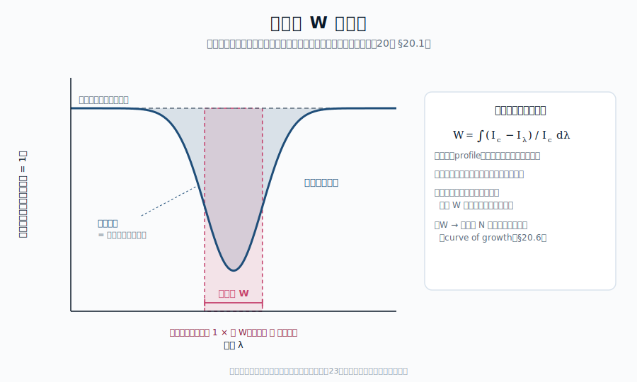
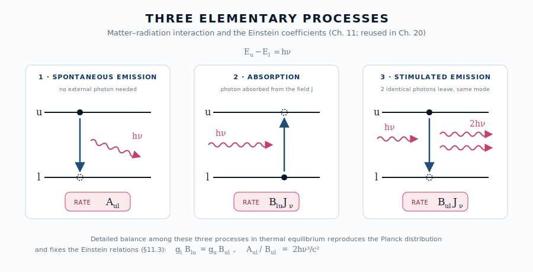

::: {.chapter-overview}
**この章の主題**：第20章で見たさまざまな線スペクトルは、すべて「**原子・分子の離散的遷移と、その場の放射場との相互作用**」の結果として理解できる。本章では、第11章で導入した **Einstein 係数** $A_{ul}, B_{lu}, B_{ul}$ を線スペクトルの主役として再登場させ、**線吸収・線輝線・線ソース関数** を逆引きで体系化する。これは連続スペクトルの第4-5章（放射輸送とソース関数）の **線スペクトル版** にあたる。
:::

## この章の中心地図 {#sec-line-formation-map .unnumbered}



::: {.callout-note}
**方針**：本章では中心地図 $\alpha_\nu = (\pi e^2/m_e c) f_{lu} n_l \phi(\nu-\nu_0)$ の **$n_l$ 因子** と **線形成（吸収 or 輝線）の選択** に焦点を当てる。$f_{lu}$ は第22章、$\phi(\nu-\nu_0)$ は第23章で別途扱う。
:::

## この章で答える問い {#sec-line-formation-questions .unnumbered}

::: {.callout-question}
- 同じ水素 H$\alpha$ 線が、太陽では吸収線、HII 領域では輝線になるのはなぜか
- 線の等価幅とは何で、なぜ観測量として有用なのか
- LTE では何が単純で、non-LTE では何が複雑になるのか
- 成長曲線（curve of growth）は何を、どのように測る道具なのか
:::

## 到達目標 {#sec-line-formation-goals .unnumbered}

この章を読み終えると、読者は次のことができるようになる：

- 線の吸収・自発放出・誘導放出を Einstein 係数で表現し、各々の物理的意味を述べられる
- 線ソース関数とプランク関数の関係を、LTE と non-LTE で区別して説明できる
- 線の等価幅と成長曲線（curve of growth）から物理量を読み取る基本手順を理解する

---

## 21.1 線の観測量 ― 等価幅 {#sec-line-equivalent-width}

[本文目安：B2-B3]

吸収線の **観測量** として最も標準的なのが **等価幅**（**equivalent width**, **EW**）。

$$
W_\lambda \equiv \int_\text{line} \frac{I_c - I_\lambda}{I_c} d\lambda
$$ {#eq-equivalent-width}

{#fig-equivalent-width width=85%}

ここで $I_c$ は線がない場合に予想される連続光強度、$I_\lambda$ は実際の観測強度。$W_\lambda$ は **「線によって連続光からどれだけ光が引き抜かれたか」を波長単位で表した量**。物理的には：

- 浅くて広い線と、深くて狭い線が **同じ $W_\lambda$** になる場合がある
- 線輪郭（line profile）の詳細によらない積分量
- 観測しやすく、理論との比較がしやすい

輝線についても同様に、連続光からの **余剰光** の積分として等価幅を定義する。

::: {.callout-warning appearance="simple"}
**注意（観測）**：等価幅は **観測スペクトル分解能の限界以上の線** には鋭敏である。一方、強く飽和した線（線芯が完全に黒）では、追加の物質を加えても等価幅はゆっくりとしか増えない（§21.6 の成長曲線の「飽和域」）。等価幅から物理量を読むには、線がどの「成長領域」にあるかを意識する必要がある。
:::

## 21.2 線の三つの素過程 ― Einstein 係数の再登場 {#sec-line-three-processes}

[本文目安：B3]

第11章 §11.2 で導入した **Einstein 係数**（同じ図を再掲、@fig-einstein-three-processes-line）：

{#fig-einstein-three-processes-line width=88%}

- $A_{ul}$：**自発放出**（**spontaneous emission**）― $u \to l$ で光子放出。確率 [s$^{-1}$]
- $B_{lu}$：**誘導吸収**（**induced absorption**）― $l \to u$ で光子吸収
- $B_{ul}$：**誘導放出**（**stimulated emission**）― $u \to l$、入射光と同じモードへ放出

これらは原子物理（第22章で再導出）と熱平衡条件（第11章 §11.3 の Einstein 関係式）

$$
\frac{A_{ul}}{B_{ul}} = \frac{2h\nu^3}{c^2}, \quad \frac{g_l B_{lu}}{g_u B_{ul}} = 1
$$ {#eq-einstein-relations}

で結ばれる。ここで $g_l, g_u$ は下/上準位の縮重度。これらは **線形成の主役** である。

線吸収係数を Einstein 係数で書き直すと

$$
\alpha_\nu = \frac{h\nu_0}{4\pi} n_l B_{lu} \phi(\nu - \nu_0) \left[1 - \frac{g_l n_u}{g_u n_l}\right]
$$ {#eq-line-absorption-einstein}

右辺の括弧内が **誘導放出補正**。$n_u > 0$ なら吸収を弱める効果を表す。

::: {.callout-tip appearance="simple"}
**問い**：誘導放出補正 $[1 - g_l n_u/(g_u n_l)]$ が **ゼロ** になるのはどんな条件か？ **負** になるのはどんなとき？ 物理的意味は？

**短答**：

- ゼロ：$g_l n_u/g_u = n_l$ ― 上下準位の占有が同等。「これ以上吸収できない」
- 負：$n_u/g_u > n_l/g_l$ ― **準位反転**（**population inversion**）。負の吸収係数 = **増幅**（メーザー、レーザー）

**もう一歩**：銀河中心の H$_2$O メーザー（22 GHz）、星形成領域の OH メーザー（1.6 GHz）はこの **天然のレーザー** 現象。観測すれば、$n_u/g_u > n_l/g_l$ を実現する非平衡ポンプ機構（衝突、放射ポンプ）の存在が逆引きされる
:::

## 21.3 線ソース関数 ― 連続スペクトルから線スペクトルへ {#sec-line-source-function}

[本文目安：B3]

第5章 §5.4 で定義した **ソース関数** $S_\nu$ は、線スペクトルでは

$$
S_\nu^\text{line} = \frac{j_\nu^\text{line}}{\alpha_\nu^\text{line}}
$$ {#eq-line-source-function}

の形で構成される。ここで $j_\nu^\text{line}$ は線の **放出係数**（**emission coefficient**）で、本書では **自発放出のみ** をその寄与とする。一方、$\alpha_\nu^\text{line}$ は線吸収係数で、**誘導放出を「負の吸収」として吸収係数の中に繰り込む流儀**（@eq-line-absorption-einstein の補正項 $[1 - g_l n_u/(g_u n_l)]$）を採用する。すなわち本書では一貫して、誘導放出は吸収係数側の補正として扱い、放出係数 $j_\nu^\text{line}$ には含めない。Einstein 係数を使うと、$\phi(\nu-\nu_0)$ が両者で共通になる前提のもとで

$$
S_\nu^\text{line} = \frac{A_{ul} n_u}{B_{lu} n_l - B_{ul} n_u} = \frac{2h\nu_0^3/c^2}{(g_u n_l)/(g_l n_u) - 1}
$$ {#eq-line-S-explicit}

となる（分子が自発放出 $A_{ul} n_u$、分母が誘導放出を差し引いた正味の吸収 $B_{lu} n_l - B_{ul} n_u$）。これは形式的に **プランク関数と同じ構造** だが、$h\nu/k_BT$ の代わりに $\ln[(g_u n_l)/(g_l n_u)]$ が指数因子に入っている。これを **「励起温度」**（**excitation temperature**）$T_\text{ex}$ を使って

$$
\frac{g_u n_l}{g_l n_u} = e^{h\nu_0/k_B T_\text{ex}}
$$ {#eq-excitation-temperature}

と書き直すと、$S_\nu^\text{line} = B_{\nu_0}(T_\text{ex})$。すなわち **線ソース関数は、励起温度に対応する黒体スペクトル** である。

::: {.callout-note}
**用語**：**励起温度** $T_\text{ex}$ は、観測者が観測される線の強度から **逆引き** で求める「上下準位の占有比を Boltzmann 分布で書いたときの温度」である。物理的に物質と熱平衡している温度とは限らない（LTE / non-LTE の区別、§21.4-§21.5）。

**観測との対応**：観測される線の輝度温度から $T_\text{ex}$ を測れる ― これが線スペクトルから物理状態を逆引きする最初のステップである。
:::

## 21.4 LTE 線形成 ― 線ソース関数 ≈ $B_\nu(T_\text{kin})$ {#sec-LTE-line-formation}

[本文目安：B3]

**LTE**（局所熱平衡、第6章 §6.5）が成り立つ環境では、占有数 $n_l, n_u$ は局所の **キネティック温度** $T_\text{kin}$（粒子の運動エネルギー由来の温度）に対する Boltzmann 分布で書ける：

$$
\frac{n_u}{g_u} = \frac{n_l}{g_l} e^{-h\nu_0/k_B T_\text{kin}}
$$ {#eq-boltzmann}

すると $T_\text{ex} = T_\text{kin}$ となり、線ソース関数は **キネティック温度のプランク関数** になる：

$$
S_\nu^\text{line, LTE} = B_\nu(T_\text{kin})
$$ {#eq-LTE-source-function}

これが「LTE の良い」点 ― **線スペクトルが連続スペクトルと同じ温度** で記述できる。例えば、恒星大気の Eddington-Barbier 近似（第15章 §15.3）が線スペクトルにも適用できる：観測される線輝度 = 線で光学的深さ 2/3 になる層の温度 $T_\text{kin}$ のプランク関数値。

::: {.callout-tip appearance="simple"}
**問い**：LTE で、線が **吸収線として** 観測される条件は何か？

**短答**：観測する視線方向に、**温度が深さとともに上がる** 温度勾配がある場合（恒星大気の通常）。線の中心では浅い表面しか見えず（$T$ が低い）、連続光は深い層から（$T$ が高い）。差し引き、線が **連続光より暗く** 見える → 吸収線。

逆に、温度が深さとともに **下がる** 場合（彩層・コロナ）や、観測対象がガス雲そのもの（背景の連続光がない）では、輝線として現れる。**吸収線 ↔ 輝線は、温度構造と背景光の組合せ** で決まる
:::

{#fig-line-geometry-lte width=88%}

## 21.5 non-LTE 線形成 ― いつ・なぜ LTE が破綻するか {#sec-non-LTE-line-formation}

[本文目安：B3-B4]

実際には LTE が破綻する状況が多い：

- 希薄ガス（衝突率が低い）
- 強い放射場（放射過程が衝突過程より速い）
- 急激な温度勾配（局所平衡が追いつかない）

このとき、占有数 $n_l, n_u$ は Boltzmann 分布から外れ、**励起温度 $T_\text{ex}$ がキネティック温度 $T_\text{kin}$ と乖離する**。線ソース関数は $B_\nu(T_\text{ex})$ のままだが、$T_\text{ex}$ が物理温度を反映しない。

non-LTE 線形成を扱う数値的枠組み：

1. **占有数の方程式**：各準位への入力（励起・吸収）＝各準位からの出力（脱励起・放出）の収支
2. **放射輸送方程式**：占有数で決まる $S_\nu$ と $\alpha_\nu$ から、放射場を解く
3. **両者の反復**：放射場と占有数が **自己無撞着** になるまで反復

これが non-LTE radiative transfer の標準枠組み。

::: {.callout-note appearance="simple"}
**いつ LTE か ― 二準位原子と臨界密度**：抽象論を、最も簡単な **二準位原子** で数にしてみる。上準位 $u$ から下準位 $l$ への脱励起には二つの経路がある ― **衝突脱励起**（電子との衝突、率 $n_e q_{ul}$。$q_{ul}$ は脱励起の速度係数）と **自発放出**（率 $A_{ul}$）。両者が拮抗する電子密度を **臨界密度**（**critical density**）と呼ぶ：

$$
n_\text{crit} \equiv \frac{A_{ul}}{q_{ul}}
$$ {#eq-critical-density}

- $n_e \gg n_\text{crit}$：衝突が放射より速く、占有数は衝突で熱平衡化する → **LTE**（$T_\text{ex}\to T_\text{kin}$）。
- $n_e \ll n_\text{crit}$：自発放出が先に脱励起してしまい、上準位が熱平衡値より枯れる → **non-LTE**（$T_\text{ex} < T_\text{kin}$、サブサーマル）。

つまり「衝突率 vs 放射率」の大小が LTE/non-LTE を分ける ― review2 が抽象的と感じた統計平衡の中身は、この一本の不等式に凝縮できる。許容線（大きい $A_{ul}$）は $n_\text{crit}$ が高く non-LTE になりやすい一方、**禁制線**（小さい $A_{ul}$、第22章 §22.5）は $n_\text{crit}$ が低く、希薄な星雲でも LTE 的に振る舞いやすい。この臨界密度の差を逆手に取って電子密度を測るのが、第24章 §24.3 の [S II] $\lambda$6716/$\lambda$6731 **線比診断**（多準位の具体例）である。
:::

::: {.callout-warning appearance="simple"}
**注意（観測）**：「LTE 解析からの偏差」は、観測者が誤った結論に至る源。一例として、**恒星大気の Fe I 線** を LTE で解析すると、紫外側で **Fe の over-ionization（過電離）** により占有数が Saha 予測を下回り、組成決定で 0.1〜0.4 dex のずれが生じることが知られている（Asplund 2005 のレビュー）。non-LTE 補正は現代の線スペクトル解析の必須道具となっている
:::

::: {.callout-note}
**用語の整理**（第6章 §6.5 と整合）：

- **LTE**：物質側の占有数が局所キネティック温度の Boltzmann/Saha 分布 → 線ソース関数 = $B_\nu(T_\text{kin})$
- **non-LTE**：物質側の占有数が局所温度の Boltzmann から外れる → 線ソース関数 ≠ $B_\nu(T_\text{kin})$、しかし依然として $= B_\nu(T_\text{ex})$
- **熱的 vs 非熱的**：粒子のエネルギー分布が Maxwell-Boltzmann か否か。LTE / non-LTE とは別の軸（第15章 §15.1）
:::

## 21.6 成長曲線（curve of growth） ― 等価幅から柱密度を測る {#sec-curve-of-growth}

[本文目安：B3]

弱い吸収線から強い吸収線まで、観測される **等価幅** $W$ と **柱密度** $N \equiv \int n_l\, ds$ の関係は、**成長曲線**（**curve of growth**、等価幅曲線とも）として知られる：

$$
W(N) = \begin{cases}
\propto N & \text{(線形領域)} \\
\propto \sqrt{\ln N} & \text{(飽和領域)} \\
\propto \sqrt{N} & \text{(減衰翼領域)}
\end{cases}
$$ {#eq-curve-of-growth}

物理的解釈：

- **線形領域**：吸収線の光学的深さ $\tau < 1$。等価幅は柱密度に比例
- **飽和領域**：線芯が完全に黒（$\tau \gg 1$）。中心が「これ以上吸収できない」、ただ広がるだけ
- **減衰翼領域**：自然幅・衝突幅が支配（第23章）。Lorentz 翼の $\propto \sqrt{N}$ 依存

::: {.callout-note}
**観測との対応**：恒星・QSO 吸収線スペクトルの解析で、成長曲線は **観測等価幅 → 柱密度** を求める基本道具である。化学組成、QSO 視線方向の星間吸収系の柱密度測定などに使われる。第24章 §24.2 で本格的に応用する。
:::

## 21.7 使えるようになった道具 {#sec-line-formation-tools .unnumbered}

::: {.callout-note}
- 等価幅 $W_\lambda$ ― 線の最も基本的観測量
- Einstein 係数による吸収・輝線・誘導放出の統一記述
- 線ソース関数 $S_\nu^\text{line} = B_\nu(T_\text{ex})$ と励起温度の概念
- LTE と non-LTE の区別、いつどちらが使えるか
- 成長曲線（curve of growth）― $W \to N$ の換算手段
:::

---

## この章で何がわかったか {#sec-line-formation-summary .unnumbered}

::: {.callout-summary}
**中心地図に戻る**

本章で、中心地図 $\alpha_\nu$ の **$n_l$ 因子** と **線形成の選択（吸収 or 輝線）** が物理的に解読された：

- $n_l$ は LTE では Boltzmann/Saha、non-LTE では statistical equilibrium で決まる
- 線が吸収か輝線かは、線ソース関数 $S_\nu^\text{line} = B_\nu(T_\text{ex})$ と背景の連続光輝度の比較で決まる
- 等価幅 $W$ と柱密度 $N$ は成長曲線（curve of growth）で結ばれる

次章では中心地図のもう一つの因子 ― **振動子強度 $f_{lu}$** ― を、原子物理から逆引きする。
:::

## 演習問題 {#sec-line-formation-exercises .unnumbered}

以下の問題は、本文で省いた式の導出を補う問題（[tag:導出補完]）と、本文で得た道具を別の角度から使って理解を深める問題（[tag:理解を深める]）から成る。各問の **解答例** は章末「解答例」にまとめてある（オンライン版では各問のボタンから開く）。まず自力で解いてから開くこと。

### 問題 21-1　線ソース関数が Bν(Tex) になる {#ex-21-1 .unnumbered}

[★ 難易度：☆☆ ] [tag:導出補完]

§21.3 は線ソース関数を励起温度 $T_\mathrm{ex}$ のプランク関数に書き換えた。導出を埋める。$S_\nu^\mathrm{line}=\dfrac{A_{ul}n_u}{B_{lu}n_l-B_{ul}n_u}$、Einstein 関係 $A_{ul}/B_{ul}=2h\nu_0^3/c^2$、$g_lB_{lu}=g_uB_{ul}$。

1. Einstein 関係を使って $S_\nu^\mathrm{line}=\dfrac{2h\nu_0^3/c^2}{(g_un_l)/(g_ln_u)-1}$ を導け。
2. 励起温度を $\dfrac{g_un_l}{g_ln_u}=e^{h\nu_0/k_BT_\mathrm{ex}}$ で定義し、$S_\nu^\mathrm{line}=B_{\nu_0}(T_\mathrm{ex})$ を示せ。
3. $T_\mathrm{ex}$ が物理的なキネティック温度と一致するのはどんな条件か（LTE）。一致しない場合（non-LTE）に $S_\nu$ がプランク関数でなくなるわけではない理由を述べよ。

**関連**：[§21.3 線ソース関数](#sec-line-source-function)／Einstein 関係の導出は[演習 11-1](../part4/11-einstein-method.qmd#ex-11-1)、ソース関数の基礎は[演習 5-5](../part2/05-radiative-transfer.qmd#ex-5-5)、LTE は[§21.4](#sec-LTE-line-formation)。

::: {.content-visible when-format="html"}
[解答例を見る（問題 21-1）](#sol-21-1){.btn .btn-outline-secondary .btn-sm data-bs-toggle="offcanvas" role="button"}
:::

### 問題 21-2　誘導放出補正と準位反転（メーザー） {#ex-21-2 .unnumbered}

[★ 難易度：☆☆ ] [tag:導出補完]

§21.2 の線吸収係数 $\alpha_\nu=\dfrac{h\nu_0}{4\pi}n_lB_{lu}\phi\left[1-\dfrac{g_ln_u}{g_un_l}\right]$ の誘導放出補正 $[1-g_ln_u/(g_un_l)]$ を読み解く。

1. 補正項がゼロになる条件（$n_u/g_u=n_l/g_l$）の物理的意味を述べよ。
2. 補正項が負になる条件（$n_u/g_u>n_l/g_l$）を求め、そのとき $\alpha_\nu<0$（負の吸収＝増幅）になることを示せ。これが何の現象か。
3. 宇宙メーザー（H$_2$O 22 GHz、OH 1.6 GHz）が観測されることから、何が逆引きできるか述べよ。

**関連**：[§21.2 線の三つの素過程](#sec-line-three-processes)／誘導放出は[§11.2](../part4/11-einstein-method.qmd#sec-einstein-method-three-processes)、自発/誘導放出の比は[演習 11-2](../part4/11-einstein-method.qmd#ex-11-2)。

::: {.content-visible when-format="html"}
[解答例を見る（問題 21-2）](#sol-21-2){.btn .btn-outline-secondary .btn-sm data-bs-toggle="offcanvas" role="button"}
:::

### 問題 21-3　等価幅と成長曲線の三領域 {#ex-21-3 .unnumbered}

[★ 難易度：☆☆ ] [tag:理解を深める]

§21.1・20.6 の等価幅 $W_\lambda=\int\frac{I_c-I_\lambda}{I_c}d\lambda$ と成長曲線（curve of growth）を読む。

1. 等価幅が「線の輪郭の詳細によらない積分量」である利点を述べよ。浅く広い線と深く狭い線が同じ $W$ になりうる理由は。
2. 成長曲線の三領域（線形 $W\propto N$、飽和 $W\propto\sqrt{\ln N}$、減衰翼 $W\propto\sqrt{N}$）が、それぞれ光学的深さ $\tau$ のどんな状態に対応するか述べよ。
3. 飽和領域の線から柱密度 $N$ を精度よく決めるのが難しい理由を述べよ。組成解析で複数の強さの線を使う理由と結びつけよ。

**関連**：[§21.1 等価幅](#sec-line-equivalent-width)、[§21.6 成長曲線](#sec-curve-of-growth)／組成解析は[§24.2](../part7/24-line-applications.qmd#sec-line-applications-abundance)、減衰翼は[§23.1](../part7/23-line-shape.qmd#sec-line-shape-natural)。

::: {.content-visible when-format="html"}
[解答例を見る（問題 21-3）](#sol-21-3){.btn .btn-outline-secondary .btn-sm data-bs-toggle="offcanvas" role="button"}
:::

### 問題 21-4　LTE で吸収線になる条件 ― 温度勾配と背景光 {#ex-21-4 .unnumbered}

[★ 難易度：☆☆ ] [tag:理解を深める]

§21.4 は線が吸収か輝線かが温度構造と背景光で決まると述べた。LTE（$S_\nu=B_\nu(T)$）で考える。

1. 恒星大気のように温度が深さとともに上がる場合、線中心と連続光がそれぞれどの深さ（温度）を見ているか述べ、なぜ吸収線になるか説明せよ。
2. 彩層・コロナのように温度が外側で上がる、あるいは背景連続光がないガス雲では、なぜ輝線になるか述べよ。
3. 線の Eddington-Barbier（線で $\tau_\nu=2/3$ になる層の $B_\nu$）が、線中心と連続でなぜ違う温度を与えるか、線中心の方が $\alpha_\nu$ が大きいことと結びつけて述べよ。

**関連**：[§21.4 LTE 線形成](#sec-LTE-line-formation)／吸収線か輝線かは[演習 5-3](../part2/05-radiative-transfer.qmd#ex-5-3)、Eddington-Barbier は[演習 15-1](../part6/15-non-blackbody.qmd#ex-15-1)。

::: {.content-visible when-format="html"}
[解答例を見る（問題 21-4）](#sol-21-4){.btn .btn-outline-secondary .btn-sm data-bs-toggle="offcanvas" role="button"}
:::

## 解答例 {#sec-line-formation-solutions .unnumbered}

各問の「解答例を見る」ボタンを押すと、右側のパネルに解答例が表示され、問題文と見比べられる（背景は暗くならず本文はそのまま読める）。印刷版・EPUB版では下に順に掲載される。

::: {.content-visible when-format="html"}
[問題 21-1](#sol-21-1){.btn .btn-outline-primary .btn-sm data-bs-toggle="offcanvas" role="button"} [問題 21-2](#sol-21-2){.btn .btn-outline-primary .btn-sm data-bs-toggle="offcanvas" role="button"} [問題 21-3](#sol-21-3){.btn .btn-outline-primary .btn-sm data-bs-toggle="offcanvas" role="button"} [問題 21-4](#sol-21-4){.btn .btn-outline-primary .btn-sm data-bs-toggle="offcanvas" role="button"}
:::

::: {#sol-21-1 .offcanvas .offcanvas-end tabindex="-1" data-bs-backdrop="false" data-bs-scroll="true" aria-labelledby="sol-21-1-label"}
::: {.offcanvas-header}
[**解答例（問題 21-1）**]{#sol-21-1-label .offcanvas-title}
[ ]{.btn-close data-bs-dismiss="offcanvas" aria-label="閉じる"}
:::
::: {.offcanvas-body}
**(1)** 分子分母を $B_{ul}n_u$ で割る。$g_lB_{lu}=g_uB_{ul}$ より $B_{lu}=（g_u/g_l)B_{ul}$：

$$S_\nu^\mathrm{line}=\frac{A_{ul}n_u}{B_{lu}n_l-B_{ul}n_u}=\frac{A_{ul}/B_{ul}}{\dfrac{B_{lu}n_l}{B_{ul}n_u}-1}=\frac{2h\nu_0^3/c^2}{\dfrac{g_un_l}{g_ln_u}-1}.$$

**(2)** $\dfrac{g_un_l}{g_ln_u}=e^{h\nu_0/k_BT_\mathrm{ex}}$ を代入すると分母が $e^{h\nu_0/k_BT_\mathrm{ex}}-1$ となり

$$S_\nu^\mathrm{line}=\frac{2h\nu_0^3/c^2}{e^{h\nu_0/k_BT_\mathrm{ex}}-1}=B_{\nu_0}(T_\mathrm{ex}).$$

**(3)** 占有数が局所キネティック温度 $T_\mathrm{kin}$ の Boltzmann 分布で書ける（LTE）とき $T_\mathrm{ex}=T_\mathrm{kin}$。non-LTE では占有数が Boltzmann から外れて $T_\mathrm{ex}\ne T_\mathrm{kin}$ になるが、$T_\mathrm{ex}$ を「占有比を Boltzmann 形で書いたときの温度」と**定義**する限り、$S_\nu=B_\nu(T_\mathrm{ex})$ は形式的に常に成り立つ。ただし $T_\mathrm{ex}$ は物理温度を反映しない。

**答え**：$S_\nu^\mathrm{line}=\dfrac{2h\nu_0^3/c^2}{(g_un_l)/(g_ln_u)-1}=B_{\nu_0}(T_\mathrm{ex})$。LTE で $T_\mathrm{ex}=T_\mathrm{kin}$、non-LTE でも定義上 $B_\nu(T_\mathrm{ex})$ の形は保たれる。
:::
:::

::: {#sol-21-2 .offcanvas .offcanvas-end tabindex="-1" data-bs-backdrop="false" data-bs-scroll="true" aria-labelledby="sol-21-2-label"}
::: {.offcanvas-header}
[**解答例（問題 21-2）**]{#sol-21-2-label .offcanvas-title}
[ ]{.btn-close data-bs-dismiss="offcanvas" aria-label="閉じる"}
:::
::: {.offcanvas-body}
**(1)** $\dfrac{g_ln_u}{g_un_l}=1$ すなわち $\dfrac{n_u}{g_u}=\dfrac{n_l}{g_l}$ で補正がゼロ。上下準位の縮重度あたりの占有が等しく、誘導放出が誘導吸収を完全に打ち消す。「これ以上正味で吸収できない」状態。

**(2)** $\dfrac{g_ln_u}{g_un_l}>1$ すなわち $\dfrac{n_u}{g_u}>\dfrac{n_l}{g_l}$（**準位反転**）のとき補正項が負になり $\alpha_\nu<0$。負の吸収係数は、光が媒質を通るほど強められる＝**増幅**。これがメーザー／レーザーの原理。

**(3)** 宇宙メーザーが見える＝準位反転 $n_u/g_u>n_l/g_l$ が実現している＝熱平衡では起こらない**非平衡なポンプ機構**（衝突ポンプ・放射ポンプ）が働いていることが逆引きできる。星形成領域・恒星質量放出・銀河中心の特殊な物理環境を示す。

**答え**：補正ゼロ＝占有が等しい。負＝準位反転（$n_u/g_u>n_l/g_l$）→$\alpha_\nu<0$＝増幅＝メーザー。観測は非平衡ポンプ機構の証拠。
:::
:::

::: {#sol-21-3 .offcanvas .offcanvas-end tabindex="-1" data-bs-backdrop="false" data-bs-scroll="true" aria-labelledby="sol-21-3-label"}
::: {.offcanvas-header}
[**解答例（問題 21-3）**]{#sol-21-3-label .offcanvas-title}
[ ]{.btn-close data-bs-dismiss="offcanvas" aria-label="閉じる"}
:::
::: {.offcanvas-body}
**(1)** 等価幅は「線が連続光から引き抜いた光の総量」を波長幅で表した積分量で、装置の分解能で輪郭がぼやけても保存される。同じ総吸収量なら、浅く広い線も深く狭い線も面積が等しく同じ $W$ になる。観測しやすく理論と比べやすい。

**(2)** 線形領域：$\tau<1$（光学的に薄い）、吸収量が柱密度に比例 $W\propto N$。飽和領域：線芯 $\tau\gg1$（完全に黒）で中心はこれ以上吸収できず、$W$ は $\sqrt{\ln N}$ でしか増えない。減衰翼領域：Lorentz 翼（自然幅・衝突幅）が支配し $W\propto\sqrt{N}$。

**(3)** 飽和領域では $W$ が $N$ にほとんど鈍感（$\sqrt{\ln N}$）なので、$W$ の小さな測定誤差が $N$ の大きな誤差になる。だから組成解析では弱い線（線形領域）・中間・強い線（減衰翼）を組み合わせ、成長曲線全体を観測点で押さえて $N$ を精度よく決める。

**答え**：$W$ は輪郭によらぬ積分量。線形($\tau<1$)→飽和($\tau\gg1$)→減衰翼。飽和域は $N$ に鈍感ゆえ複数の強さの線が必要。
:::
:::

::: {#sol-21-4 .offcanvas .offcanvas-end tabindex="-1" data-bs-backdrop="false" data-bs-scroll="true" aria-labelledby="sol-21-4-label"}
::: {.offcanvas-header}
[**解答例（問題 21-4）**]{#sol-21-4-label .offcanvas-title}
[ ]{.btn-close data-bs-dismiss="offcanvas" aria-label="閉じる"}
:::
::: {.offcanvas-body}
**(1)** 線中心は $\alpha_\nu$ が大きく光学的厚さがすぐ1に達するので**浅い（外側＝低温）層**を見る。連続光は $\alpha_\nu$ が小さく**深い（高温）層**まで見通せる。LTE で $S_\nu=B_\nu(T)$ ゆえ、線中心は低温のプランク関数値（暗い）、連続は高温（明るい）。差し引き線中心が連続より暗く＝吸収線。

**(2)** 温度が外側で上がる（彩層・コロナ）と、線中心が見る浅い層の方が高温になり、線中心が連続より明るく＝輝線。あるいは背景連続光がないガス雲では、ガス自身の放出 $\tau S_\nu$ だけが見え、線中心で強い輝線になる。

**(3)** Eddington-Barbier 近似では、各振動数で $\tau_\nu=2/3$ になる層の $B_\nu(T)$ が出てくる。線中心は $\alpha_\nu$ が大きいので $\tau_\nu=2/3$ に達する幾何的深さが浅い（連続より外側＝別の温度の層）。よって線中心と連続が異なる温度を映し、温度勾配の向きで吸収/輝線が決まる。

**答え**：線中心＝浅い層（$\alpha_\nu$ 大）、連続＝深い層。温度が深さで上がれば吸収線、外側で上がる/背景光なしなら輝線。Eddington-Barbier で別温度を映す。
:::
:::

## さらに学ぶための参考文献 {#sec-line-formation-further .unnumbered}

- Mihalas, *Stellar Atmospheres* (Freeman, 2nd ed., 1978) — 線形成と non-LTE の古典
- Hubeny & Mihalas, *Theory of Stellar Atmospheres* (Princeton, 2014) — 現代版、non-LTE radiative transfer の標準書
- Rutten, *Radiative Transfer in Stellar Atmospheres* (Lecture notes, Utrecht) — 線形成の入門的講義ノート
- Spitzer, *Physical Processes in the Interstellar Medium* (Wiley, 1978) — 成長曲線（curve of growth）の標準扱い
