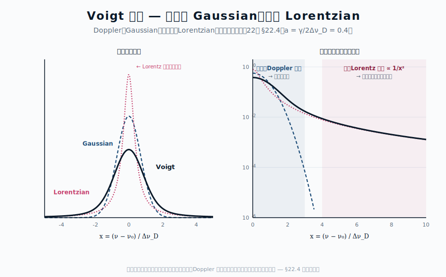

::: {.chapter-overview}
**この章の主題**：中心地図 $\alpha_\nu = (\pi e^2/m_e c) f_{lu} n_l \phi(\nu-\nu_0)$ の最後の因子 ― **線輪郭関数 $\phi(\nu-\nu_0)$**（line profile、line shape ともいう）― を逆引きする。観測される線は決して数学的なデルタ関数ではなく、有限の幅を持つ。**自然幅・Doppler 拡がり・衝突拡がり**、そしてそれらの合成である **Voigt プロファイル** の物理を整理し、観測される **線輪郭から物理条件**（温度・密度・速度場・磁場）を逆引きする道具を整える。
:::

## この章の中心地図 {#sec-line-shape-map .unnumbered}



::: {.callout-note}
**方針**：本章は中心地図の $\phi(\nu-\nu_0)$ の中身を見る。第22章で得た $\nu_0, f_{lu}$ と組み合わせて、観測される線輪郭が物理量の関数として書ける。観測 → 物理量の逆引きが完成する。
:::

## この章で答える問い {#sec-line-shape-questions .unnumbered}

::: {.callout-question}
- 線の幅は何で決まるのか ― 量子論、運動学、衝突のどれが支配するか
- なぜ線の中心は Gaussian、翼は Lorentzian という Voigt 形になるのか
- 観測される線輪郭から、温度・密度・速度場・磁場をどうやって読み取るのか
- マクロな速度場（自転、対流、乱流）の効果は、ミクロな線幅とどう区別されるのか
:::

## 到達目標 {#sec-line-shape-goals .unnumbered}

この章を読み終えると、読者は次のことができるようになる：

- 自然幅・Doppler 幅・衝突幅の物理的起源と振動数依存を説明できる
- Voigt プロファイルを Doppler（コア）と Lorentz（翼）の合成として描ける
- 観測される線輪郭から、温度・密度・速度場・磁場を逆引きする手順を組み立てられる

---

## 23.1 自然幅 ― Lorentzian の起源 {#sec-line-shape-natural}

[本文目安：B3-B4]

第11章 §11.2 と第12章で見たように、励起準位 $u$ には有限の寿命がある。重要なのは、この寿命を決めるのは **上準位 $u$ から到達可能なすべての下準位 $l'$ への自発放出率の総和** である点である：

$$
\Gamma_u = \sum_{l'} A_{ul'}
$$ {#eq-total-decay-rate}

すなわち上準位の全崩壊率 $\Gamma_u$ は、注目している遷移 $u \to l$ の単一の $A_{ul}$ ではなく、$u$ から落ちうるすべての経路の和である。上準位の寿命は $\tau_u = 1/\Gamma_u$ で与えられる。励起状態の量子振幅が $e^{-\Gamma_u t/2}$ で減衰することから、エネルギー準位そのものが Lorentzian の形でエネルギー幅を持つ。観測される線 $u \to l$ のうち、この遷移が全崩壊に占める割合は **分岐比**（**branching ratio**）$A_{ul}/\Gamma_u$ で与えられ、線の強度を決める。

::: {.callout-note}
**記号の規約**（混同しやすいので注意）：

- $A_{ul}$ ：遷移 $u \to l$ の自発放出率。次元 [s$^{-1}$]
- $\Gamma_u \equiv \sum_{l'} A_{ul'}$ ：上準位の **全崩壊率**（全下準位への和）。自然幅を決めるのはこれ。下準位 $l$ も励起準位なら、その崩壊率 $\Gamma_l$ も加わり $\Gamma_\text{nat} = \Gamma_u + \Gamma_l$ となる
- $\Gamma_\text{nat}$ ：**角振動数単位** の自然幅（**FWHM**, $\omega$ 軸）。基底状態への遷移など下準位が安定な場合は $\Gamma_\text{nat} = \Gamma_u$
- $\gamma_\text{nat} \equiv \Gamma_\text{nat}/(2\pi)$ ：**振動数単位** の自然幅（**FWHM**, $\nu$ 軸、Hz）
- HWHM（半値半幅）はこれらの半分：$\Gamma_\text{nat}/2$（$\omega$）、$\gamma_\text{nat}/2 = \Gamma_\text{nat}/(4\pi)$（$\nu$）

単一の下準位しか持たない遷移（例：基底状態への共鳴線）では $\Gamma_u = A_{ul}$ となり、$\Gamma_\text{nat} = A_{ul}$ と簡約される。これらは「**寿命 $\tau_u$ → 振幅減衰 → エネルギー Lorentzian の幅**」という一連の関係から出るもので、$\Delta E \cdot \tau_u \gtrsim \hbar$ という不確定性原理の不等式は **オーダー推定** にすぎず、厳密には等号にならない（古典的減衰振動子の Fourier 変換が Lorentzian になることが厳密な起源、付録 §A.8.2 参照）。
:::

これに対応する規格化された線輪郭関数（**Lorentzian**）は

$$
\phi_L(\nu - \nu_0) = \frac{1}{\pi} \frac{\gamma_\text{nat}/2}{(\nu - \nu_0)^2 + (\gamma_\text{nat}/2)^2}
$$ {#eq-lorentzian}

特徴：

- 中心 $\nu = \nu_0$ で最大、$|\nu - \nu_0| = \gamma_\text{nat}/2$（HWHM）で半値
- **翼**（wing）が遠くまでべき的に減衰（$\propto 1/(\Delta\nu)^2$）― これが Voigt 線の遠方を決める
- $\int \phi_L\, d\nu = 1$（規格化）

第12章で扱った **古典的調和振動子の減衰モデル** が同じ Lorentzian を与えることが、振動子強度モデルの古典-量子対応を示す。

::: {.callout-note}
**観測との対応**：水素 Ly$\alpha$（$\lambda = 121.6$ nm）は上準位 $2p$ から基底状態 $1s$ への単一経路で崩壊するため $\Gamma_u = A_{ul} = 6.27 \times 10^8$ s$^{-1}$ となり、自然幅は波長単位で $\Delta\lambda_\text{nat} = \lambda^2 \Gamma_\text{nat}/(2\pi c) \simeq 4.9 \times 10^{-5}$ Å である。多くの場合、自然幅は他の拡がり（Doppler、衝突）に比べて小さいが、**線の翼**（damping wing）には自然幅の Lorentzian の寄与が現れる。QSO の Ly$\alpha$ 強吸収系（damped Ly$\alpha$ system）で観測される **減衰翼** がその例である。
:::

## 23.2 Doppler 拡がり ― Gaussian の起源 {#sec-line-shape-doppler}

[本文目安：B2-B3]

ガスの粒子は熱運動で **視線方向に速度** を持つ。各粒子は自分の速度に応じて、観測者の系で線中心振動数が **Doppler シフト** する：

$$
\nu = \nu_0 \left(1 + \frac{v_\parallel}{c}\right)
$$ {#eq-doppler-shift}

熱的 Maxwell-Boltzmann 速度分布のもとでは、視線速度成分 $v_\parallel$ も Gaussian 分布になる。これを線輪郭として積分すると、

$$
\phi_D(\nu - \nu_0) = \frac{1}{\Delta\nu_D \sqrt{\pi}} \exp\left[-\frac{(\nu - \nu_0)^2}{\Delta\nu_D^2}\right]
$$ {#eq-gaussian-doppler}

ここで **Doppler 幅**

$$
\Delta\nu_D = \frac{\nu_0}{c} \sqrt{\frac{2k_B T}{m}}
$$ {#eq-doppler-width}

$m$ は原子・分子質量。

特徴：

- 中心が Gaussian で **狭くて深い**
- 翼が **指数的に急減衰**（$\propto e^{-(\Delta\nu)^2}$）
- 質量に依存：軽い水素は重い鉄より広い Doppler 幅

::: {.callout-tip appearance="simple"}
**問い**：温度 $T = 10^4$ K の HII 領域における、水素 H$\alpha$ の Doppler 幅（FWHM）を km/s で求めよ。

**短答**：$\Delta v_D \simeq \sqrt{2k_B T/m_p} \simeq 12.8$ km/s（標準偏差）、FWHM = $2\sqrt{\ln 2} \cdot \Delta v_D \simeq 21$ km/s。

**もう一歩**：同じ温度の鉄（$m = 56 m_p$）の線幅は $\sqrt{56} \simeq 7.5$ 倍狭い。観測される線幅の元素質量依存性から **熱的拡がり vs 他の拡がり** を区別できる ― これは観測解析の鍵
:::

## 23.3 衝突拡がり ― Lorentzian の追加 {#sec-line-shape-pressure}

[本文目安：B3]

ガスが密になると、原子は **他の粒子との衝突** で励起準位の位相が乱される。これは励起準位の有効寿命を短くし、自然幅と同形の **Lorentzian 拡がり** を加える：

$$
\Gamma_\text{coll} = 2\sum_i n_i \langle \sigma_i v_i \rangle
$$ {#eq-collision-width}

ここで $n_i$ は衝突相手の数密度、$\sigma_i v_i$ は衝突断面積×相対速度の平均。

**特徴**：

- $\Gamma_\text{coll}$ は **密度に比例** → 高密度天体（恒星深部、巨星大気）で大きい
- Lorentzian の形は自然幅と同じ ― 両者は **合算** して扱える
- 圧力に依存することから「圧力 broadening」とも呼ばれる

::: {.callout-note}
**観測との対応**：恒星の **重力（圧力）の感度線** ― 例えば水素線の自然幅 + 衝突幅の合算が重力に強く依存する。Mg I b 線や Na D 線の翼の形を解析することで、**恒星の表面重力 $\log g$** が決まる。これは恒星の質量・半径推定の基本パラメータである。
:::

## 23.4 Voigt プロファイル ― 二つの拡がりの合成 {#sec-line-shape-voigt}

[本文目安：B3-B4]

{#fig-voigt-profile width=92%}

自然幅 + 衝突幅（合算した Lorentzian、幅 $\gamma$）と Doppler 拡がり（Gaussian、幅 $\Delta\nu_D$）の **両方** が効くのが現実である。線輪郭は両者の **畳み込み** になる：

$$
\phi_V(\nu - \nu_0) = \phi_L \otimes \phi_D = \int \phi_L(\nu - \nu' - \nu_0) \phi_D(\nu' - \nu_0) d\nu'
$$ {#eq-voigt-convolution}

これが **Voigt プロファイル**。閉形式では書けないが、無次元パラメータ

$$
a = \frac{\gamma}{2\Delta\nu_D}, \quad x = \frac{\nu - \nu_0}{\Delta\nu_D}
$$

を使って Voigt 関数 $H(a, x)$ で表される。

**振る舞いの二相**：

| 領域 | 支配 | 振る舞い |
|---|---|---|
| $|x| < $ 数 | Doppler コア | Gaussian（急減衰） |
| $|x| \gg 1$ | Lorentz 翼 | $\propto 1/x^2$（緩減衰） |

::: {.callout-tip appearance="simple"}
**問い**：Voigt プロファイルで、**コア（Doppler）** が支配する範囲を観測者はどう判別できるか？

**短答**：典型的に $|x| < 3$（$|\Delta\nu| < 3 \Delta\nu_D$）でコアが支配。$|x| > 5$ になると、Doppler の Gaussian は $e^{-25} \simeq 10^{-11}$ で消え、Lorentz 翼が浮かび上がる。

**もう一歩**：観測者は line core と line wing を別々の物理プローブとして使う：

- Core：温度（Doppler 幅）、視線速度（中心シフト）
- Wing：自然幅 + 衝突幅 → 圧力、密度
- 両者を **同時にフィット** することで、温度と密度を独立に決められる
:::

## 23.5 マクロな速度場 ― 自転、対流、乱流 {#sec-line-shape-macro}

[本文目安：B2-B3]

ミクロな熱運動（Doppler 拡がり）のほかに、**マクロな速度場** も線幅に寄与する：

- **恒星自転**：表面の一方が近づき他方が遠ざかる → 線が **平頂化**
- **対流**（granulation）：恒星表面の上下流 → 線の **非対称化**（線芯青方シフト）
- **乱流**（micro/macroturbulence）：等方ランダム速度 → 線幅の **追加 Gaussian 成分**
- **吹き出し風**（stellar wind）：青翼が吸収（P Cygni 形）

これらマクロ速度場は **熱的線幅と等価な Gaussian** として加算的に効く：

$$
\Delta\nu_\text{D,total}^2 = \Delta\nu_\text{D,thermal}^2 + \Delta\nu_\text{D,turb}^2 + \ldots
$$ {#eq-velocity-quadrature-sum}

熱的成分と乱流成分の分離は、**元素質量に対する依存性** から行える：熱は $1/\sqrt{m}$ 依存、乱流は元素質量によらない。

::: {.callout-warning appearance="simple"}
**注意**：上の「Gaussian の二乗和」が正当化できるのは、速度場のスケールが光子の **平均自由行程より小さい** 場合 ― すなわち **マイクロ乱流**（**microturbulence**）。この場合は線吸収係数 $\alpha_\nu$ 自体に乱流成分が織り込まれ、$\Delta\nu_D$ の単純な拡張で書ける。

一方、速度場のスケールが平均自由行程より大きい **マクロ乱流**（**macroturbulence**）では、線形成は局所的に進み、最後に **射出スペクトルへの畳み込み** として速度場が効く。両者の数学的扱いは異なる（前者は線吸収係数の修正、後者は出てきたスペクトルの畳み込み）。Gray (2005) 第 17-18 章の扱いを参照
:::

::: {.callout-note}
**観測との対応**：太陽の吸収線解析では、$\xi_\text{turb} \simeq 1$〜$2$ km/s のマイクロ乱流と、$\zeta_\text{macro} \simeq 3$〜$5$ km/s のマクロ乱流が経験的に必要である。これは対流による速度場の積分量で、3D 数値流体シミュレーションと整合が取れている。
:::

## 23.6 磁場の効果 ― Zeeman 効果 {#sec-line-shape-zeeman}

[本文目安：B3]

磁場 $\mathbf{B}$ の下では、原子のエネルギー準位が磁気量子数 $m_J$ に応じて分裂する：**Zeeman 効果**。

$$
\Delta E_\text{Zeeman} = g_J \mu_B B m_J
$$ {#eq-zeeman-energy}

ここで $g_J$ は Landé $g$ 因子、$\mu_B = e\hbar/2m_e$ は Bohr 磁子。

観測される線輪郭への影響：

- 弱磁場：単一線が **三本** に分裂（ノーマル Zeeman）または複数本に分裂（アノーマラス Zeeman）
- 線分裂は **円偏光** を伴う（縦磁場成分）または **直線偏光**（横磁場成分）
- 分解できない場合でも、線が **広がって見える**（Zeeman broadening）

::: {.callout-note}
**観測との対応**：太陽黒点の磁場は Fe I $\lambda$6173 線の Zeeman 分裂から測られる。星形成領域での磁場は OH メーザーや CN 線の Zeeman 効果で測られる ― **線スペクトルが磁場の数少ない直接観測手段** であることは、第VII部の応用の重要側面である。
:::

## 23.7 使えるようになった道具 {#sec-line-shape-tools .unnumbered}

::: {.callout-note}
- 自然幅 ― Lorentzian、$\gamma_\text{nat} = \Gamma_\text{nat}/(2\pi)$（$\Gamma_\text{nat} = \sum_{l'} A_{ul'}$ ＝上準位の全崩壊率）
- Doppler 幅 ― Gaussian、$\Delta\nu_D = \nu_0 \sqrt{2k_BT/m}/c$
- 衝突幅 ― Lorentzian、密度・圧力に比例
- Voigt プロファイル ― コア（温度）と翼（密度）を独立にプローブ
- マクロ速度場 ― 自転・対流・乱流、元素質量依存性で分離
- Zeeman 効果 ― 線スペクトルから磁場を直接測る
:::

---

## この章で何がわかったか {#sec-line-shape-summary .unnumbered}

::: {.callout-summary}
**中心地図に戻る**

本章で、中心地図 $\alpha_\nu = (\pi e^2/m_e c) f_{lu} n_l \phi(\nu-\nu_0)$ の最後の因子 $\phi(\nu-\nu_0)$ が物理的に解読された：

- 自然幅は不確定性原理から → Lorentzian
- Doppler 幅は熱運動の Maxwell-Boltzmann 分布から → Gaussian
- 衝突幅は密度・圧力から → 追加 Lorentzian
- Voigt プロファイルが両者の畳み込み

これで中心地図のすべての因子（$\pi e^2/m_e c$, $f_{lu}$, $n_l$, $\phi$）が逆引きされた（前因子 $\pi e^2/m_e c$ は §22.4b の古典 Lorentz 振動子からの導出で完結）。**線スペクトルから物理を読む** ための道具立てが揃った。

次章では、これらの道具を **実際の観測解析** にどう動員するか ― 視線速度、化学組成、温度・密度診断、宇宙論的応用 ― を見る。
:::

## 演習問題 {#sec-line-shape-exercises .unnumbered}

以下の問題は、本文で省いた式の導出を補う問題（[tag:導出補完]）と、本文で得た道具を別の角度から使って理解を深める問題（[tag:理解を深める]）から成る。各問の **模範解答** は折りたたみを展開して確認できる（オンライン版）。まず自力で解いてから開くこと。

### 問題 23-1　Doppler 幅 ― 熱運動の Gaussian {#ex-23-1 .unnumbered}

[★ 難易度：☆☆ ] [tag:導出補完]

§23.2 の Doppler 幅 $\Delta\nu_D=\dfrac{\nu_0}{c}\sqrt{\dfrac{2k_BT}{m}}$。HII 領域（$T=10^4$ K）の水素 H$\alpha$ について。

1. 速度の標準偏差に相当する $\Delta v_D=\sqrt{2k_BT/m_p}$ を km/s で求めよ（$m_p=1.67\times10^{-27}$ kg）。
2. FWHM $=2\sqrt{\ln2}\,\Delta v_D$ を求めよ。
3. 同じ温度の鉄（$m=56\,m_p$）の Doppler 幅は水素の何倍か。観測線幅の元素質量依存性から熱的拡がりと他の拡がりをどう区別できるか述べよ。

**関連**：[§23.2 Doppler 拡がり](#sec-line-shape-doppler)／Maxwell 分布は[第III部 演習](../part3/07-statistical-mechanics.qmd)、マクロ速度場は[§23.5](#sec-line-shape-macro)（[演習 23-4](#ex-23-4)）。

::: {.callout-derive collapse="true"}
## 模範解答（問題 23-1）

**(1)** $\Delta v_D=\sqrt{2k_BT/m_p}=\sqrt{2\times1.381\times10^{-23}\times10^4/1.67\times10^{-27}}=\sqrt{1.654\times10^8}=1.29\times10^4$ m/s $=12.9$ km/s。

**(2)** FWHM $=2\sqrt{\ln2}\times12.9=2\times0.833\times12.9=21.4$ km/s。

**(3)** $\Delta\nu_D\propto1/\sqrt{m}$ ゆえ鉄は $\sqrt{56}\simeq7.5$ 倍狭い。観測で「重い元素の線ほど狭い」なら熱的拡がりが支配（質量依存）。一方、乱流・自転などマクロ速度場は元素質量に依らないので、異なる質量の元素の線幅を比べると、熱的成分と非熱的（質量無依存）成分を分離できる。

**答え**：$\Delta v_D=12.9$ km/s、FWHM $=21.4$ km/s。鉄は $\sqrt{56}\simeq7.5$ 倍狭い。質量依存性で熱的と乱流を分離。
:::

### 問題 23-2　自然幅 ― 寿命から Lorentzian {#ex-23-2 .unnumbered}

[★ 難易度：☆☆ ] [tag:導出補完]

§23.1 の自然幅。励起寿命 $\tau_u=1/A_{ul}$、振動数単位の自然幅 $\gamma_\mathrm{nat}=A_{ul}/(2\pi)$。Ly$\alpha$（$\lambda=121.6$ nm、$A_{ul}=6.27\times10^8$ s$^{-1}$）について。

1. 励起寿命 $\tau_u$ と自然幅 $\gamma_\mathrm{nat}$（Hz）を求めよ。
2. 波長単位の自然幅 $\Delta\lambda_\mathrm{nat}=\dfrac{\lambda^2 A_{ul}}{2\pi c}$ を Å 単位で求め、$4.9\times10^{-5}$ Å を確かめよ。
3. 自然幅 Lorentzian の「翼」が $1/(\Delta\nu)^2$ でべき的に伸びることが、QSO の damped Ly$\alpha$ 系の減衰翼として観測される。なぜ自然幅は線中心より翼で重要なのか述べよ。

**関連**：[§23.1 自然幅](#sec-line-shape-natural)／$A_{ul}$ と自然幅は[演習 11-4](../part4/11-einstein-method.qmd#ex-11-4)、真空揺らぎとの関係は[§26.4](../part8/26-qed-minimum.qmd#sec-qed-minimum-natural-width)（[第VIII部 演習](../part8/26-qed-minimum.qmd)）。

::: {.callout-derive collapse="true"}
## 模範解答（問題 23-2）

**(1)** $\tau_u=1/A_{ul}=1/(6.27\times10^8)=1.6\times10^{-9}$ s（1.6 ns）。$\gamma_\mathrm{nat}=A_{ul}/(2\pi)=6.27\times10^8/6.283=9.98\times10^7\simeq10^8$ Hz。

**(2)** $\Delta\lambda_\mathrm{nat}=\dfrac{\lambda^2 A_{ul}}{2\pi c}=\dfrac{(1.216\times10^{-7})^2\times6.27\times10^8}{2\pi\times3\times10^8}=\dfrac{1.479\times10^{-14}\times6.27\times10^8}{1.885\times10^9}=\dfrac{9.27\times10^{-6}}{1.885\times10^9}=4.9\times10^{-15}$ m $=4.9\times10^{-5}$ Å。✓

**(3)** 線中心は Doppler の Gaussian コアが支配し（指数減衰で狭い）、自然幅 Lorentzian は埋もれる。しかし Lorentzian の翼は $1/(\Delta\nu)^2$ でべき的に緩く伸びるため、中心から十分離れた翼では Gaussian（$e^{-(\Delta\nu)^2}$）が先に消えて Lorentzian が浮かび上がる。よって自然幅は線翼（damping wing）で重要。

**答え**：$\tau_u=1.6$ ns、$\gamma_\mathrm{nat}\simeq10^8$ Hz、$\Delta\lambda_\mathrm{nat}=4.9\times10^{-5}$ Å。Lorentzian 翼が $1/\Delta\nu^2$ で伸びるため翼で支配的。
:::

### 問題 23-3　Voigt プロファイル ― コアと翼を別プローブに {#ex-23-3 .unnumbered}

[★ 難易度：☆☆ ] [tag:理解を深める]

§23.4 の Voigt プロファイルは Gaussian（Doppler）と Lorentzian（自然幅＋衝突幅）の畳み込み。無次元パラメータ $a=\gamma/(2\Delta\nu_D)$、$x=(\nu-\nu_0)/\Delta\nu_D$。

1. コア（$|x|<$ 数）と翼（$|x|\gg1$）で、それぞれ Gaussian と Lorentzian のどちらが支配するか述べよ。$|x|>5$ で Doppler 成分が $e^{-25}\sim10^{-11}$ に消えることを確かめよ。
2. コアと翼が、観測者にとってそれぞれどんな物理量（温度・速度／密度・圧力）のプローブになるか述べよ。
3. コアと翼を同時にフィットすることで、温度と密度を独立に決められる理由を述べよ。

**関連**：[§23.4 Voigt プロファイル](#sec-line-shape-voigt)、[§23.3 衝突拡がり](#sec-line-shape-pressure)／恒星の $\log g$ 決定は[§23.3](#sec-line-shape-pressure)、curve of growth の減衰翼は[演習 21-3](../part7/21-line-formation.qmd#ex-21-3)。

::: {.callout-derive collapse="true"}
## 模範解答（問題 23-3）

**(1)** コア（$|x|<3$ 程度）は Gaussian（Doppler）が支配。翼（$|x|\gg1$）は Lorentzian が支配。$|x|=5$ で Gaussian は $e^{-x^2}=e^{-25}\simeq1.4\times10^{-11}$ とほぼ消え、$1/x^2$ で緩く減衰する Lorentz 翼だけが残る。

**(2)** コア：Doppler 幅 $\Delta\nu_D\propto\sqrt{T/m}$ から**温度**、中心シフトから**視線速度**。翼：Lorentzian 幅 $\gamma=$ 自然幅＋衝突幅で、衝突幅が**密度・圧力**に比例するので翼の形から**密度・圧力**。

**(3)** コアは温度に、翼は密度・圧力に主に依存し、両者は線輪郭の異なる部分に別々に効く。観測されたコアと翼を同時にフィットすると、温度（コア幅）と密度（翼の広がり）を分離して独立に決められる。恒星の表面重力 $\log g$ は翼の解析から得られる。

**答え**：コア＝Gaussian（温度・速度）、翼＝Lorentzian（密度・圧力）。$|x|>5$ で Gaussian は $10^{-11}$ に消え翼が浮かぶ。同時フィットで温度と密度を分離。
:::

### 問題 23-4　熱的幅と乱流の分離、Zeeman で磁場 {#ex-23-4 .unnumbered}

[★ 難易度：☆☆ ] [tag:理解を深める]

§23.5・22.6 のマクロ速度場と磁場。Gaussian 成分の二乗和 $\Delta\nu_{D,\mathrm{total}}^2=\Delta\nu_{D,\mathrm{thermal}}^2+\Delta\nu_{D,\mathrm{turb}}^2$、Zeeman 分裂 $\Delta E=g_J\mu_B B m_J$。

1. 熱的成分（$\propto1/\sqrt m$）と乱流成分（元素質量に依らない）が、異なる質量の元素の線幅比較でどう分離できるか述べよ。
2. マイクロ乱流とマクロ乱流で数学的扱いが異なる理由（速度場のスケールと光子平均自由行程の大小）を一言で述べよ。
3. Zeeman 分裂が線スペクトルから磁場を測る数少ない直接手段である理由を述べ、観測例（太陽黒点・星形成領域）を1つ挙げよ。

**関連**：[§23.5 マクロな速度場](#sec-line-shape-macro)、[§23.6 Zeeman 効果](#sec-line-shape-zeeman)／偏光は[演習 13-4](../part5/13-electromagnetic-waves.qmd#ex-13-4)。

::: {.callout-derive collapse="true"}
## 模範解答（問題 23-4）

**(1)** 熱的 Doppler 幅は $\Delta v_\mathrm{th}\propto1/\sqrt m$ で重い元素ほど狭い。乱流は等方ランダム速度で元素質量に依らず一定。複数の元素（軽い H と重い Fe など）の線幅を測り、$\Delta v^2=\Delta v_\mathrm{th}^2(m)+\xi_\mathrm{turb}^2$ を質量に対してプロットすると、質量依存部分（熱的）と一定部分（乱流 $\xi_\mathrm{turb}$）に分離できる。

**(2)** 速度場のスケールが光子の平均自由行程より**小さい**＝マイクロ乱流：線吸収係数 $\alpha_\nu$ 自体に織り込まれ、$\Delta\nu_D$ の単純拡張で扱える。**大きい**＝マクロ乱流：線形成は局所的に進み、最後に射出スペクトルへの畳み込みとして効く。扱う段階が違う。

**(3)** 磁場は放射スペクトルに直接の連続的痕跡を残しにくいが、Zeeman 効果は準位を $m_J$ に応じて分裂させ（分裂幅 $\propto B$）、円偏光・直線偏光を伴うので、線の分裂・偏光から磁場の強度と方向を直接測れる。例：太陽黒点（Fe I $\lambda$6173）、星形成領域（OH メーザー・CN 線）。

**答え**：熱的（$\propto1/\sqrt m$）と乱流（質量無依存）は元素質量比較で分離。マイクロ/マクロは平均自由行程との大小で扱いが違う。Zeeman 分裂・偏光が磁場の直接手段（太陽黒点など）。
:::

## さらに学ぶための参考文献 {#sec-line-shape-further .unnumbered}

- Sobelman et al., *Excitation of Atoms and Broadening of Spectral Lines* (Springer, 2nd ed., 1995) — 線輪郭の系統的扱い
- Gray, *The Observation and Analysis of Stellar Photospheres* (Cambridge, 3rd ed., 2005) — 恒星線輪郭と速度場
- del Toro Iniesta, *Introduction to Spectropolarimetry* (Cambridge, 2003) — Zeeman 効果と偏光分光
- Mihalas, *Stellar Atmospheres* (Freeman, 2nd ed., 1978) — Voigt プロファイルの解析応用
